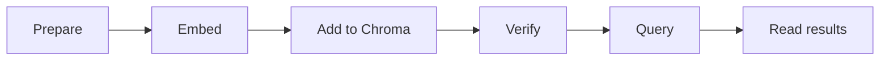

# Implementing Vector Search Systems

## Context of This Session

In the previous session, you built the **mental model** for vector databases. You learned why **embeddings** turn text into numbers, why **traditional SQL** is not built for fast nearest-meaning search at scale, and how **vector indexing** and **ANN** make similarity search practical when data grows.

You traced the pipeline on paper: **chunk → embed → store → query → top-k**. Today you **run the storage and retrieval half** of that pipeline in code — using **Chroma** on your laptop.

**In this session, you will:**

- Briefly recall the **embed → store → query → top-k** flow and meet **Chroma** as today's tool
- Learn **Chroma terminology** — client, collection, id, document, metadata, embedding — mapped to **SQL** ideas you already know
- **Set up** Chroma with a persistent local client and create your first **collection**
- **Add data** — generate embeddings and store vectors with text and metadata using **upsert**
- **Verify** what landed using **count**, **peek**, and **get**
- **Retrieve data** — embed a user question and run **top-k** similarity search with **query**
- **Interpret** returned chunks, ranks, and distance scores — including one misleading match

This session is **hands-on implementation only**. We assume vector-database **concepts** from the previous session — we will **not** re-teach indexing theory or ANN in depth. **Metadata filtering**, **updating collections**, and **retrieval tuning** belong to the **RAG track** starting next — today you master Chroma **setup, add, and retrieve**.

---

## Bridge — From Concepts to Code with Chroma

You already know *what* similarity search does. Today you learn *which tool* stores and searches vectors in a beginner-friendly way.

### Quick Recall — The Pipeline You Will Implement Today

Picture a student support bot for an online shopping app. The user types: *"I want my money back after sending the shoes back."* No stored FAQ uses those exact words — but the **meaning** is about returns and refunds.

Today's lab covers all seven steps of the storage-and-retrieval pipeline:

1. **Prepare** — Write short text chunks with a unique **id** and optional **metadata**.
2. **Embed documents** — Run each chunk through an embedding model; get a **vector** (list of numbers).
3. **Store in Chroma** — Save id, text, metadata, and vector in a **collection**.
4. **Verify** — Confirm rows actually landed before you demo search.
5. **Embed query** — Encode the user's question with the **same model**.
6. **Query** — Ask Chroma for the **top-k** nearest vectors.
7. **Read results** — Inspect ranked text, metadata, and optional distance scores.


- **Official Definition:** **Top-k retrieval** returns the **k** stored items whose embedding vectors are nearest to the query vector, ranked by similarity or distance.
- **In Simple Words:** *"Give me the three best matches by meaning"* — not the entire database sorted.
- **Real-Life Example:** At a **Kirana shop**, you say *"Bhaiya, kuch thanda de do"* without naming a brand. The shopkeeper still hands you a cold drink — that is **intent**, not exact wording.

**Same model rule (non-negotiable):** The **identical** embedding model and version must encode both stored documents and every new query. Mixing models is like measuring one side in centimetres and the other in inches — distances become meaningless.

### Simple Activity — Map the Pipeline Before You Code

In your notebook, draw six boxes:



**Prepare → Embed → Add to Chroma → Verify → Query → Read results**. Under **Add to Chroma**, leave space for four labels: **id**, **document**, **metadata**, **embedding**. This map is your checklist while you type the lab script.

---

## Chroma Terminology — Learn the Vocabulary First

Before typing code, learn what Chroma **calls** things. If you have used **SQL** in earlier sessions, this table maps Chroma terms to what you already know.

### Chroma vs SQL — Concept Map

| Chroma term | What it holds | SQL analogy |
|---|---|---|
| **Client** | Your connection to Chroma (`PersistentClient`, in-memory `Client`) | Database **connection** / engine handle |
| **Collection** | Named bucket of stored records | **Table** (e.g. `support_knowledge_base`) |
| **Record / row** | One searchable item in a collection | One **row** in a table |
| **id** | Unique key for that record | **Primary key** |
| **document** | The original human-readable text | Text **column** you show to users |
| **metadata** | Key–value tags (category, source, page) | Extra **columns** for filtering or display |
| **embedding** | Numeric vector representing meaning | Not native in classic SQL — you add a vector column (e.g. with pgvector) |
| **upsert** | Insert new or replace by id | `INSERT ... ON CONFLICT UPDATE` (conceptually) |
| **query** | Similarity search by vector | No direct SQL equivalent for meaning search — needs vector extensions |
| **get** | Fetch records by id (exact lookup) | `SELECT ... WHERE id = ...` |


- **Official Definition:** A **Chroma collection** is a named container that stores records, each consisting of an **id**, optional **document** text, optional **metadata**, and an **embedding** vector used for similarity search.
- **In Simple Words:** A **collection** is one labelled shelf; each **record** on that shelf has a name tag (**id**), the FAQ sentence (**document**), sticky notes (**metadata**), and a hidden coordinate (**embedding**) for meaning-based search.
- **Real-Life Example:** A coaching centre **cupboard** (collection) holds labelled **folders** (records). Each folder has a number (**id**), notes inside (**document**), a subject sticker (**metadata**), and a secret map coordinate only the librarian uses to find similar folders (**embedding**).

### Three Ways to Connect to Chroma

| Client type | Code pattern | When to use |
|---|---|---|
| **In-memory** | `chromadb.Client()` | Quick experiments — data disappears when the program ends |
| **Persistent (local disk)** | `chromadb.PersistentClient(path="./chroma_store")` | **Today's lab** — data survives after you close the notebook |
| **HTTP client** | Connect to a running Chroma server | Team deployments — not needed in class today |

- **Official Definition:** **PersistentClient** stores Chroma data in a folder on your machine so collections survive across runs.
- **In Simple Words:** Like saving a Word file to your **Documents** folder instead of typing only in an unsaved Notepad window.
- **Real-Life Example:** Your `./chroma_store` folder is the almirah; closing Python does not empty it — next run, you reconnect to the same shelf.

### What Goes Inside One Stored Record?

Every row you **add** to Chroma can include up to four pieces:

| Piece | Required? | Purpose |
|---|---|---|
| **id** | Yes (you supply it) | Unique name — upsert, get, and debugging all use this |
| **document** | Recommended | Original text returned in search results |
| **metadata** | Optional | Tags like `category`, `source` — stored now; advanced filtering comes in later RAG sessions |
| **embedding** | Required for our lab | Vector from your embedding model — Chroma searches by this |


**Common doubt:** *"Can Chroma embed text for me automatically?"* — Yes, if you attach an **embedding_function** when creating the collection. In this course lab, we set **`embedding_function=None`** and pass embeddings ourselves so you see every step clearly.

### What Is a Method?

In today's lab you will write lines like `collection.count()` and `collection.query(...)`. The word **method** appears often — here is what it means.

- **Official Definition:** A **method** is a **function that belongs to an object** (a structured thing in code, like a Chroma **collection**). You call it using a **dot**: `object.method()`.
- **In Simple Words:** Think of an object as a **toolbox**. A **method** is one tool inside that box — `count()` is the tool that counts rows; `query()` is the tool that searches by meaning.
- **Real-Life Example:** Your **WhatsApp chat** is like an object; **"Search messages"** is a method — you tap it and the app runs that one action for you.

**Pattern to remember:** `collection.count()` → the **collection** object runs its built-in **count** action.

### Key Chroma Methods You Will Use Today

| Method | Job | SQL feel |
|---|---|---|
| `get_or_create_collection(...)` | Open or create a named collection | `CREATE TABLE IF NOT EXISTS` |
| `collection.upsert(...)` | Add or update records by id | Insert or update by primary key |
| `collection.count()` | How many records exist? | `COUNT(*)` |
| `collection.peek()` | Show a sample of stored rows | `SELECT * LIMIT 5` |
| `collection.get(ids=[...])` | Fetch exact records by id | `SELECT ... WHERE id = ...` |
| `collection.query(...)` | Top-k similarity search by vector | No classic SQL equivalent |


**add vs upsert — know the difference:**

- **`add`** — Inserts new records; if the **id already exists**, Chroma **ignores** the duplicate (does not overwrite).
- **`upsert`** — Inserts if id is new; **updates** if id already exists. Safer when FAQ text changes later.

For today's first ingest, either works. We use **upsert** because it matches how living knowledge bases are maintained in production.

### Simple Activity — Terminology Match

In your notebook, copy the concept map table without the answers column. Fill the **Chroma term** column from memory: Client, Collection, id, document, metadata, embedding, upsert, query, get. Next to each, write one FAQ example value (e.g. id = `"doc2"`, document = `"Refunds take 5–7 days"`). Check against the table above.

---

## Set Up Your Development Environment

Install the two libraries for today's lab: **Chroma** for storage and retrieval, **Sentence Transformers** for local embeddings.

### Install Commands

```bash
pip install chromadb  # Install the Chroma vector database client for Python
pip install -U sentence-transformers  # Install the library for local embedding models
```

**How the code works:**

- `chromadb` provides `PersistentClient`, `get_or_create_collection`, `upsert`, `get`, and `query`.
- `sentence-transformers` loads a pretrained model (e.g. `all-MiniLM-L6-v2`) and converts text to vectors with `model.encode()`.
- Use **Python 3.10+** in a **virtual environment** (`venv`) when possible — keeps course projects isolated.

### Create Your Project Folder

```bash
mkdir vector_search_lab  # Create a folder for today's lab files
cd vector_search_lab  # Move into that folder — chroma_store will appear here
```

**How the code works:**

- Chroma's `PersistentClient(path="./chroma_store")` creates a **`chroma_store`** subfolder in your current working directory.
- Keeping the lab in one folder makes it easy to zip and share, or delete and restart cleanly.

### Simple Activity — Environment Check

Run `python --version` and confirm 3.10 or higher. Run both `pip install` commands. In Python, execute `import chromadb` and `from sentence_transformers import SentenceTransformer` — both should succeed. Write in your notebook: *"Environment ready — Chroma + Sentence Transformers."*

---

## Prepare Sample Data

Good retrieval starts with **clean, small chunks** — one idea per row.

Each record needs:

| Field | Purpose | Example |
|---|---|---|
| **id** | Unique key | `"doc2"` |
| **text** | Sentence stored and returned in results | `"Refunds are processed within 5 to 7 business days..."` |
| **metadata** | Tags stored alongside the row | `{"category": "returns", "source": "policy"}` |

- **Official Definition:** **Metadata** is structured key–value information stored with each record (e.g. category, source file).
- **In Simple Words:** A **label on the folder** — you store it today; later RAG sessions will use it for smarter filtering.
- **Real-Life Example:** An Amazon seller tags each FAQ with **Returns**, **Shipping**, or **Account** so support staff know which team owns it.

Our running example is an **e-commerce support knowledge base** — six short FAQ sentences you will reuse in every code block below.

```python
records = [  # Master list — each dict becomes one row in the Chroma collection
    {  # Record 1 — return window
        "id": "doc1",  # Unique primary key for this FAQ row
        "text": "Customers can return products within 30 days of delivery.",  # Human-readable FAQ text
        "metadata": {"category": "returns", "source": "policy"},  # Tags stored with the row
    },
    {  # Record 2 — refund timing
        "id": "doc2",  # Second unique primary key
        "text": "Refunds are processed within 5 to 7 business days after the return is approved.",  # Refund FAQ text
        "metadata": {"category": "returns", "source": "policy"},  # Returns category tag
    },
    {  # Record 3 — free shipping threshold
        "id": "doc3",  # Third unique primary key
        "text": "Orders above 499 rupees qualify for free shipping.",  # Shipping FAQ text
        "metadata": {"category": "shipping", "source": "faq"},  # Shipping category tag
    },
    {  # Record 4 — password reset
        "id": "doc4",  # Fourth unique primary key
        "text": "You can reset your password from the account settings page.",  # Account FAQ text
        "metadata": {"category": "account", "source": "help_center"},  # Account category tag
    },
    {  # Record 5 — express delivery window
        "id": "doc5",  # Fifth unique primary key
        "text": "Express delivery orders usually arrive within 24 to 48 hours.",  # Express delivery FAQ text
        "metadata": {"category": "shipping", "source": "faq"},  # Shipping category tag
    },
    {  # Record 6 — failed payment help
        "id": "doc6",  # Sixth unique primary key
        "text": "If your payment fails, try another card or use UPI.",  # Payment FAQ text
        "metadata": {"category": "payments", "source": "help_center"},  # Payments category tag
    },
]
```

**How the code works:**

- Each dict is one **record** — same shape as one **row** in a SQL table.
- Lists `documents`, `ids`, and `metadatas` are built from this master list — **index alignment** matters (position 0 everywhere = same record).

### Simple Activity — Draft Two Rows in Your Domain

Copy the structure above. Replace **two** FAQ sentences with topics you care about (coaching, travel booking, internal wiki). Keep id + text + metadata. Write one user question you expect to match each new sentence — you will test that after the retrieve step.

---

## Create the Chroma Client and Collection

Step one of **add data**: connect to Chroma and open a named **collection** — your empty shelf ready for records.

```python
import chromadb  # Import Chroma — vector database client for Python
from sentence_transformers import SentenceTransformer  # Import embedding model loader
from pprint import pprint  # Pretty-print for readable verify output later

client = chromadb.PersistentClient(path="./chroma_store")  # Local disk storage — survives restarts

collection = client.get_or_create_collection(  # Open existing collection or create new one
    name="support_knowledge_base",  # Collection name — like a SQL table name
    embedding_function=None,  # We supply embeddings manually in this lab — Chroma won't auto-embed
)

print("Collection ready:", collection.name)  # Confirm which collection you connected to
print("Current record count:", collection.count())  # Should be 0 on first run
```

**How the code works:**

- **`PersistentClient(path=...)`** creates `./chroma_store` on disk if it does not exist.
- **`get_or_create_collection`** is idempotent — safe to run twice; you reconnect instead of duplicating.
- **`embedding_function=None`** tells Chroma: *you must pass `embeddings=` on upsert and `query_embeddings=` on query* — no hidden magic.
- **`collection.count()`** on a fresh lab should print **0** before you upsert anything.

**Common mistake:** Running the script from different folders creates **different** `./chroma_store` paths. Always `cd` into the same lab folder.

### Simple Activity — Inspect an Empty Collection

Run the client + collection block only. Record in your notebook: collection name, count, and full path to `chroma_store` on your machine. One sentence: what would count be if you had run a successful upsert yesterday in the same folder?

---

## Add Data to Your Chroma Collection

Step two: turn text into **embeddings**, then **upsert** ids, documents, metadata, and vectors into the collection.

### upsert() — Add or Update Records

The **`upsert`** method writes records into your collection. It takes parallel lists of **ids**, **documents**, **metadatas**, and **embeddings** — one entry in each list = one row. If an **id** is new, Chroma **inserts** it; if the **id** already exists, Chroma **updates** that row.

```python
model = SentenceTransformer("all-MiniLM-L6-v2")  # Load embedding model — same one for all queries later

documents = [record["text"] for record in records]  # Plain text list — parallel to ids below
ids = [record["id"] for record in records]  # Unique id per row — required for upsert
metadatas = [record["metadata"] for record in records]  # Metadata dict per row — optional but useful

document_embeddings = model.encode(  # Convert all six FAQ strings to vectors in one batch call
    documents, convert_to_numpy=True  # Returns numpy array — efficient for multiple texts
).tolist()  # Chroma expects Python lists, not numpy arrays

collection.upsert(  # Insert all six records — insert new ids, update if id already existed
    ids=ids,  # Unique keys — one per record
    documents=documents,  # Original text — returned later in query results
    metadatas=metadatas,  # Tags like category and source
    embeddings=document_embeddings,  # Vectors — what Chroma searches by meaning
)

print("Upsert complete.")  # Confirm add step finished
print("Total records now:", collection.count())  # Should print 6 after first successful run
```

**How the code works:**

- **`SentenceTransformer("all-MiniLM-L6-v2")`** downloads a small open model on first run — ~80 MB, suitable for classroom laptops.
- **`model.encode(documents, ...)`** returns one vector per input string; `.tolist()` converts for Chroma's API.
- **`collection.upsert(...)`** writes all four parallel lists — index `2` in each list is always the **same** FAQ row.
- After upsert, **`count()`** should equal **6**. If not, stop and debug before querying.

**Why we embed outside Chroma:** You see the full **embed → store** path explicitly. The **RAG pipeline** sessions will reuse this same pattern when chunking real policy PDFs.

### Simple Activity — Trace One Record Through Add

Pick **doc3** (free shipping). In your notebook write: (1) the document text, (2) one metadata key-value, (3) one sentence explaining what `model.encode` does to that text before upsert. After running upsert, note whether `count()` is 6.

---

## Verify What You Stored

Never demo search without confirming **add** worked. Chroma gives three inspection tools — from quick stats to exact id lookup.

### count() — Row Count

The **`count()`** method returns a single number — how many records are stored in the collection right now. After upserting six FAQs, you expect **6**. If the number is wrong, fix storage before running any search.

```python
total = collection.count()  # Returns integer — number of records in this collection
print("Total records:", total)  # Expect 6 for our six-record FAQ lab
```

**How the code works:**

- One number answers *"Did all my rows land?"*
- Wrong count → every query result is untrustworthy until you fix ingest.

### peek() — Sample Rows

The **`peek()`** method shows a **small sample** of what is stored — ids, document text, and metadata — without you writing a search query. Use it to eyeball that FAQ sentences landed correctly after upsert.

```python
print("\nPeek at stored data:")  # Header for notebook output
pprint(collection.peek())  # Shows a small sample — ids, documents, metadata fields
```

**How the code works:**

- **`peek()`** is for eyeballing — you see real text and metadata without writing a query.
- Use it after first upsert to confirm FAQ sentences are not garbled or empty.

### get() — Exact Fetch by id

The **`get()`** method fetches records when you **already know the id** — exact lookup, not meaning-based search. Pass a list of ids: `get(ids=["doc4"])` returns only that row's document and metadata. In SQL terms, this is like `SELECT ... WHERE id = 'doc4'`.

```python
one_row = collection.get(ids=["doc4"])  # Exact lookup by primary key — not similarity search
print("\nExact fetch for doc4:")  # Label output
pprint(one_row)  # Shows document + metadata for that id only
```

**How the code works:**

- **`get`** is **exact match by id** — like SQL `WHERE id = 'doc4'`.
- **`query`** is **similarity by meaning** — different operation, different purpose.
- Comparing **get** vs **query** builds correct mental models before the RAG track adds a retriever on top.

| Method | Search type | Use when |
|---|---|---|
| **get(ids=[...])** | Exact id lookup | You know the key; debugging one row |
| **query(query_embeddings=...)** | Nearest-meaning vectors | User typed a natural-language question |


### Simple Activity — Verification Log

After upsert, fill this in your notebook:

- Expected count: **6**
- Actual `count()`: ___
- One id from `peek()`: ___
- One metadata value from `peek()`: ___
- `get(ids=["doc1"])` document text (first line): ___
- Pass / fail: ___

If fail, delete `./chroma_store`, rerun from client creation, and note what changed.

---

## Retrieve Data with Similarity Search

Step three: embed the **user question** with the **same model**, then call **`query`** for top-k nearest records.

### query() — Search by Meaning (Top-k)

The **`query()`** method finds the **nearest stored vectors** to your query vector — meaning-based search, not exact word match. You pass **`query_embeddings`** (the question already converted to numbers) and **`n_results`** (how many top matches to return, e.g. 3). Chroma returns ranked ids, documents, metadata, and optional distances.

```python
user_query = "I want to return my shoes and get my money back"  # Plain-English user question

query_embedding = model.encode(  # MUST be same SentenceTransformer model as document ingest
    [user_query], convert_to_numpy=True  # Batch of one — keeps same API shape as batch encode
).tolist()  # Convert to list-of-lists for Chroma query_embeddings parameter

results = collection.query(  # Similarity search — find nearest vectors to query_embedding
    query_embeddings=query_embedding,  # Query vector — not raw string text
    n_results=3,  # Top-k: return the 3 closest matches by meaning
)

print("\nQuery:", user_query)  # Echo the question for readable output
print("Top 3 matches:\n")  # Section header

for i in range(len(results["ids"][0])):  # Loop ranks 0, 1, 2 — best to third-best
    print(f"Rank {i + 1}")  # Human-friendly rank label (1-based)
    print("  ID:", results["ids"][0][i])  # Which stored row matched
    print("  Document:", results["documents"][0][i])  # FAQ text to show the user
    print("  Metadata:", results["metadatas"][0][i])  # Stored tags for this row
    if results.get("distances"):  # Distances included when collection metric returns them
        print("  Distance:", results["distances"][0][i])  # Lower usually means closer meaning
    print()  # Blank line between ranks
```

**How the code works:**

- **`query_embeddings`** must be the same shape you used at upsert time — list of vectors, same model dimension.
- **`n_results=3`** is **top-k** — three best matches, not the whole collection ranked.
- Results are **aligned lists**: `results["ids"][0][0]`, `results["documents"][0][0]`, and `results["metadatas"][0][0]` describe the **same** record (Rank 1).
- **`distances`** — smaller values usually mean closer in embedding space (depends on Chroma's distance metric for the collection).

**Common doubt:** *"Why not pass the raw string to query?"* — With `embedding_function=None`, Chroma has no text encoder attached. **You** embed; Chroma **searches vectors**.

### Try a Second Query — Same Collection, Different Intent

```python
second_query = "How do I change my login password?"  # Different user intent — account topic

second_embedding = model.encode(  # Same model again — never swap mid-lab
    [second_query], convert_to_numpy=True  # Encode password question to vector
).tolist()  # List shape Chroma expects for query_embeddings

second_results = collection.query(  # Same collection — different query vector
    query_embeddings=second_embedding,  # Password question as numbers
    n_results=2,  # Top-2 for a shorter result set this time
)

print("Query:", second_query)  # Echo second question
for i in range(len(second_results["ids"][0])):  # Loop each rank in top-2 results
    print(f"Rank {i + 1}:", second_results["documents"][0][i])  # Print document text per rank
```

**How the code works:**

- Same **collection**, same **model**, new **query** — only the query vector changes.
- You should see **doc4** (password reset) rank highly — different words, similar meaning.
- This is the core skill the **next RAG architecture lab** will wrap inside a retriever component.

### Simple Activity — Predict Before You Run

Before executing the shoe-return query, write which **three ids** you expect at Rank 1–3. Run the code. Compare prediction to output. One sentence: why did returns/refund docs beat shipping or payment docs?

---

## Interpret Query Results — Ranks, Distances, and One Wrong Match

Reading output correctly matters as much as writing the code.

### Understanding the Result Object

| Field | Meaning |
|---|---|
| **Rank order** | Index 0 = best semantic match |
| **documents** | Text to display or pass forward in a pipeline |
| **metadatas** | Tags you stored at upsert time |
| **distances** | Closeness score — **lower often = nearer** for distance metrics |


- **Official Definition:** **Similarity search** ranks stored embedding vectors by proximity to the query vector.
- **In Simple Words:** Chroma finds which stored **meaning-coordinates** are closest to your question's coordinates.
- **Real-Life Example:** Google Maps lists **nearest** metro stations first — not every station alphabetically.

**Rank 1 ≠ always the business-correct answer.** Rank 1 means **closest vector** in the collection — usually right when data is clean and the same model is used.

### When Ranking Looks Wrong — One Example to Study

**User query:** *"When will my order reach me?"*

**What you hope for:** Shipping FAQs — doc3 (free shipping threshold) or doc5 (express delivery).

**What can happen:** Rank 1 might be doc6 (*"If your payment fails, try another card or use UPI"*) because both mention **order** in broad language, or because no chunk clearly states standard delivery timing.

**What this teaches today (interpretation only):**

- Similarity returned the **mathematically nearest** vector — not necessarily the FAQ your support team wanted.
- **Missing or vague chunks** in the collection cause weak matches — fix by **adding better data**, not by blaming Chroma.
- Checking **top-k > 1** helps — Rank 2 or 3 may still contain a useful shipping line when Rank 1 misleads.

**Deferred to RAG sessions:** Metadata filtering (`where={"category": "shipping"}`), updating the collection with new FAQs, and tuning **k** are covered when you build and evaluate full **RAG pipelines** — not in today's Chroma fundamentals lab.

### Simple Activity — Results Journal

Run the shoe-return query. For each rank, note: id, category from metadata, one phrase linking to user intent. Run the password query. Note which doc wins Rank 1. Two sentences: what is the difference between **get(ids=["doc4"])** and **query** for the password question?

---

## What Comes Next — Your Chroma Lab Feeds the RAG Track

You built the **storage and retrieval foundation** that the next four sessions stack on top of.

| Upcoming focus | How today's lab connects |
|---|---|
| **Introduction to RAG** | Explains *why* retrieved chunks ground LLM answers — your `query()` output is that retrieved context |
| **RAG Architecture and Pipeline** | Reuses **this Chroma collection** as the **retriever**; adds an LLM **generator** on top |
| **Building a RAG Pipeline** | Loads real PDFs, chunks them, embeds, **stores in Chroma**, then queries — same upsert/query pattern at scale |
| **Evaluating and Improving RAG** | Tunes top-k, **metadata filters**, chunking, and adds new policies to the collection |

Today's script is not a chatbot yet — it is the **retriever shelf** every RAG assistant in this course will read from.

### Simple Activity — Draw the Next Layer

Draw two boxes: **Today's lab (Chroma query → top-k text)** and **Future RAG lab (same retrieval → LLM writes answer)**. Label one arrow: *"Retrieved documents become prompt context."* One sentence: what breaks if the Chroma collection is empty?

---

## Key Takeaways

- **Chroma vocabulary:** **Client** connects you to storage; **collection** holds records; each record has **id**, **document**, **metadata**, and **embedding** — analogous to a SQL **table** and **rows**, plus a vector column for meaning search.
- **Setup:** `PersistentClient(path=...)` keeps data on disk; `get_or_create_collection(name=..., embedding_function=None)` opens your shelf; **`embedding_function=None`** means you pass vectors explicitly on add and query.
- **Add data:** `model.encode()` → `collection.upsert(ids, documents, metadatas, embeddings)` — always the **same embedding model** for documents and queries.
- **Verify:** `count()`, `peek()`, and **`get(ids=...)`** confirm ingest; **`get`** is exact id lookup, **`query`** is meaning-based search.
- **Retrieve:** `collection.query(query_embeddings=..., n_results=k)` returns ranked ids, documents, metadata, and optional distances — the core operation RAG retrievers wrap in the upcoming sessions.

In the **next** session you will learn **why** grounding matters for LLMs and how retrieval-augmented generation uses the Chroma skills you practiced today.

---

## Important Commands, Libraries, and Terminologies

| Term / Command | Type | Meaning |
|---|---|---|
| `pip install chromadb` | Setup | Install Chroma vector database client |
| `pip install -U sentence-transformers` | Setup | Install local embedding model library |
| `chromadb.PersistentClient(path="...")` | Code | Chroma client with on-disk persistence |
| `chromadb.Client()` | Code | In-memory Chroma client (data not persisted) |
| `get_or_create_collection(name=..., embedding_function=None)` | Code | Open or create a named collection |
| `collection.upsert(...)` | Code | Insert or update records by id with vectors |
| `collection.add(...)` | Code | Insert only — ignores duplicate ids |
| `collection.count()` | Code | Return number of stored records |
| `collection.peek()` | Code | Sample stored rows for quick inspection |
| `collection.get(ids=[...])` | Code | Exact fetch by id — not similarity search |
| `collection.query(query_embeddings=..., n_results=k)` | Code | Top-k similarity search by vector |
| `SentenceTransformer("all-MiniLM-L6-v2")` | Code | Load a small pretrained embedding model |
| `model.encode(texts, convert_to_numpy=True)` | Code | Convert text batch to embedding vectors |
| **Client** | Chroma term | Connection handle to Chroma storage |
| **Collection** | Chroma term | Named bucket of records (≈ SQL table) |
| **id** | Chroma term | Unique primary key per record |
| **document** | Chroma term | Human-readable text stored and returned in results |
| **metadata** | Chroma term | Key–value tags stored with each record |
| **embedding** | Chroma term | Numeric vector representing text meaning |
| **upsert** | Chroma term | Insert new or update existing record by id |
| **Top-k** | Concept | Return the k best matches by vector proximity |
| **Same model rule** | Practice | Identical encoder for documents and every query |
| **Distance** | Concept | Closeness score — lower often means nearer match |
| **Method** | Concept | A function that belongs to an object — called with a dot, e.g. `collection.count()` |
| **get vs query** | Concept | Exact id lookup vs meaning-based similarity search |
