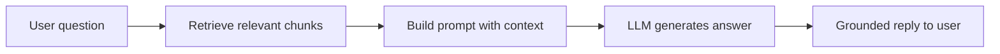

# Introduction to RAG

## Context of This Session

In the previous session, you implemented **vector search** with **Chroma**. You stored FAQ-style text as **embeddings**, ran **top-k** similarity search, and read ranked chunks with distance scores. You saw that meaning-based search can find the right policy sentence even when the customer's words do not match the document word-for-word.

That work answers: *"How do we find the most relevant stored text?"* Today's question is: *"How do we use that text so an LLM gives trustworthy answers instead of confident guesses?"*

**In this session, you will:**

- Recognize when **LLM-only knowledge** is not enough for organization-specific or current information
- Define **Retrieval-Augmented Generation (RAG)** and explain **grounding** as a design strategy
- Compare **ungrounded** and **grounded** answers using one running **e-commerce customer support** scenario
- Connect RAG's **retrieve** step to the **embedding search** pipeline you already built
- Preview where this leads in the **next** sessions — building and improving a real policy-backed assistant

This session is **theory only** — no live coding lab. You will use short flow sketches, comparison tables, and solo notebook activities so the ideas stay concrete before you wire up a full RAG loop.

---

## The Running Example — ShopKart Customer Support

Across the next few sessions, you will follow one company: **ShopKart**, an online store selling electronics, home goods, and accessories. Customers ask about **returns**, **shipping**, **warranty**, and **refunds**. The support assistant must answer from **official policy documents**, not from general internet memory.

### ShopKart Policy Snippets (Your Reference Sheet)

Keep these four short policies in your notebook. They are the "truth" for today's comparisons.

| Policy area | Official text (abbreviated) |
|---|---|
| **Returns** | Unopened items may be returned within **7 calendar days** of delivery. Opened or used items are not eligible unless defective. |
| **Shipping** | Standard delivery takes **3–5 business days** after dispatch. Express delivery (paid) arrives in **1–2 business days** in metro cities only. |
| **Warranty** | Electronics carry a **12-month manufacturer warranty** from the date of delivery. Warranty does not cover physical damage or liquid exposure. |
| **Refunds** | Refunds are credited within **5–7 business days** after the returned item passes warehouse verification. Cash-on-delivery orders are refunded to the original UPI or bank account only. |

- **Official Definition:** A **knowledge base** is a curated set of trusted documents (policies, FAQs, manuals) that an AI system is allowed to use when answering domain-specific questions.
- **In Simple Words:** The **rule book** the chatbot must read before speaking — not whatever the model remembers from old training data.
- **Real-Life Example:** At a **railway enquiry counter**, the clerk checks the latest timetable board instead of guessing departure times from memory.


You will reuse ShopKart in the **next** sessions when you build retrieval and generation in code. Today you learn *why* that book must exist and *how* retrieval changes answer quality.

---

## When LLM Knowledge Is Insufficient

Large Language Models are strong at language — grammar, explanation, tone, and general world knowledge. That strength can hide a weakness: the model does not automatically know **your company's latest rules**.

### What an LLM "Knows" by Default

During training, the model reads huge amounts of public text. It learns patterns like "refund policies often exist" or "warranties are usually one year." It does **not** receive a private copy of ShopKart's 2026 policy PDF unless you give it one at answer time.

Three gaps appear again and again in real products:

| Gap | What goes wrong | ShopKart-style symptom |
|---|---|---|
| **Static knowledge** | Training data has a cutoff; rules change later | Model says "30-day return" when ShopKart updated to **7 days** last month |
| **Missing domain context** | Model never saw your internal docs | Model invents a "free lifetime warranty" ShopKart never offered |
| **Hallucination risk** | Model fills gaps with fluent but false text | Customer is told refund arrives "in 24 hours" — policy says **5–7 business days** |

- **Official Definition:** **Hallucination** (in LLM systems) means the model produces information that sounds plausible but is not supported by facts or provided context.
- **In Simple Words:** The AI **makes up** an answer because it would rather say something confident than say "I don't know."
- **Real-Life Example:** A relative confidently tells you the **exam date** without checking the notice board — same tone, wrong fact.


**Integrated learning point:** Good **English** does not mean good **knowledge**. Always separate *how well it is written* from *whether it is correct for this organization today*.

### Confidence vs Correctness — Do Not Mix Them Up

Customers often trust a bot because the reply is polite and fast. Product teams must judge **correctness** separately.

| Signal the user sees | What the team must verify |
|---|---|
| Polite tone, complete sentences | Does the answer match the live policy PDF? |
| Specific numbers ("7 days", "5–7 business days") | Are those numbers in retrieved evidence? |
| "I understand your frustration" empathy lines | Empathy does not prove eligibility |

- **Official Definition:** **Calibration** (in AI product terms) means aligning the system's stated confidence with how often answers are actually correct on verified test questions.
- **In Simple Words:** The bot should not sound **more sure** than the evidence allows.
- **Real-Life Example:** A **stock tip** on WhatsApp written in perfect Hindi can still be wrong — format impresses; facts need checking.


In policy support, a **grounded** answer may sometimes feel shorter or stricter ("Opened items cannot be returned") but it is more **correct** than a long, comforting guess.

### Organization-Specific, Current, and Verifiable Information

Support bots need answers that are:

- **Organization-specific** — ShopKart's window, not "typical e-commerce" averages
- **Current** — reflects the policy version live on the website today
- **Verifiable** — you can point to the sentence in the policy that supports the reply

An LLM-only chatbot may pass a casual conversation test and still fail a compliance audit because nobody can trace the answer to a source.

### Simple Activity — Spot the Trust Gap

Read this customer question: *"I opened the Bluetooth speaker and don't like the sound. Can I return it within two weeks?"*

In your notebook, write two columns — **Sounds helpful?** and **Matches ShopKart returns policy?** — then draft one fluent LLM-style answer **without** reading the policy table above. After you write it, re-read the **Returns** row in the policy table. Underline every sentence in your draft that the policy does **not** support.

**What you should notice:** The model can sound caring ("We want you happy!") while giving the wrong eligibility rule (opened items, 7-day window).

---

## Why Grounding Matters for Policy Questions

**Grounding** means tying the final answer to **evidence** — usually text retrieved from trusted documents — instead of letting the model freestyle from memory alone.

Without grounding, policy Q&A becomes a **creative writing** problem. With grounding, it becomes a **reading comprehension plus explanation** problem — much safer for customers and for the business.

- **Official Definition:** **Grounding** is the practice of constraining or supporting a model's output with external factual context (retrieved passages, database rows, API results) so the response aligns with verifiable sources.
- **In Simple Words:** **Show your work** — the bot looks up the rule first, then explains it in plain language.
- **Real-Life Example:** A **CA filing your taxes** works from your Form 16 and receipts, not from guessing what your salary "probably" was.


### Connecting Sentence — From Search to Safe Answers

You already know how to **find** similar text with embeddings and top-k search. **RAG** is the idea that those found passages should **ride along** into the LLM's prompt so generation stays tied to facts.

---

## Retrieval-Augmented Generation (RAG) as a Grounding Strategy

**RAG** combines two skills that are weak alone but strong together:

| Piece | Role | ShopKart analogy |
|---|---|---|
| **Retrieval** | Find the most relevant policy chunks for the user's question | Librarian pulls the right page from the policy binder |
| **Generation** | LLM turns retrieved facts into a clear, polite reply | Support agent explains the rule in simple Hindi-English mix |

- **Official Definition:** **Retrieval-Augmented Generation (RAG)** is an architecture where a system retrieves relevant documents (or chunks) for a user query and supplies them as context to a language model, which then generates an answer conditioned on that context.
- **In Simple Words:** **Search first, answer second** — do not ask the model to remember the whole rule book.
- **Real-Life Example:** Open-book exam — you still write the answer yourself, but you are allowed to check the textbook page first.

### The High-Level RAG Flow

Every RAG system you will build in this course follows the same story:




Step by step in plain language:

1. **Query** — Customer asks: *"How long until my refund hits my account?"*
2. **Retrieve** — System embeds the question, searches the vector index, returns top-k chunks (e.g. refund policy + related return verification text).
3. **Context** — Those chunks are pasted into the prompt: *"Use only this evidence when answering."*
4. **Generate** — LLM writes a short, friendly answer that reflects the retrieved lines.

### Conceptual Pipeline Sketch (Not Production Code)

The block below is a **learning sketch** — it shows how pieces connect. You will implement the real version in the **next** session.

```python
# Step 1 — Customer question (plain text)
user_question = "How long until my refund hits my account?"

# Step 2 — Retrieve: embed question, search vector DB, get top-k text chunks
retrieved_chunks = vector_search(query=user_question, top_k=3)
# retrieved_chunks might include ShopKart refund policy sentences

# Step 3 — Build prompt: instructions + evidence + question
prompt = (
    "You are ShopKart support. Answer ONLY using the policy excerpts below.\n"
    f"POLICY EXCERPTS:\n{retrieved_chunks}\n"
    f"CUSTOMER QUESTION:\n{user_question}"
)

# Step 4 — Generate: LLM reads prompt and writes the reply
answer = llm.generate(prompt)
```

**How the sketch works**

- **Line 2** — Stores the real user message; everything else reacts to this text.
- **Line 5** — **Retrieve** uses your **previous** hands-on skill: same embedding model, same collection, **top-k** nearest chunks.
- **Lines 8–13** — **Context** is the grounding lever: the model sees evidence before it speaks.
- **Line 16** — **Generate** produces natural language, but now it is guided by policy text, not blind memory.

**Common doubt:** *"If retrieval is wrong, will RAG still look confident?"* — Yes. RAG **reduces** guessing; it does not **eliminate** every error. Wrong chunk + polished LLM still sounds believable. That is why you will later **evaluate retrieval and generation separately**.

### Simple Activity — Paper RAG for One Question

Pick this question: *"Does express shipping reach my village in Bihar?"*

On one page, draw four boxes: **Question → Retrieved lines (copy from Shipping policy) → Prompt idea → Final answer**. Write the retrieved lines by hand from the policy table. Then write a two-sentence grounded answer. Check: every fact in your answer should appear in the retrieved lines.

---

## Ungrounded vs Grounded Response Quality

The best way to trust RAG is to see the same question answered two ways — once from model memory alone, once from policy evidence.

### Side-by-Side — Return Window

**Customer question:** *"I received my phone case yesterday. How many days do I have to return it if I don't open the box?"*

| Aspect | Ungrounded (LLM-only style) | Grounded (RAG-style, policy-backed) |
|---|---|---|
| **Answer tone** | Friendly, confident | Friendly, confident |
| **Stated rule** | "Most online stores offer **15–30 days**; you should be fine returning within **two weeks**." | "ShopKart allows return of **unopened** items within **7 calendar days** from delivery." |
| **Matches ShopKart policy?** | No — invents a common-industry window | Yes — copies the official window |
| **Risk** | Customer misses the real deadline | Customer can plan within the real deadline |
| **Traceable source?** | No | Yes — Returns policy chunk |

**Why the ungrounded answer fails:** It sounds reasonable because many stores *do* use longer windows. The model averages the internet; ShopKart needs **its** rule.


### Side-by-Side — Shipping Timeline

**Customer question:** *"I ordered with standard shipping yesterday. Will it arrive tomorrow?"*

| Aspect | Ungrounded (LLM-only style) | Grounded (RAG-style, policy-backed) |
|---|---|---|
| **Stated timeline** | "Usually **next-day** delivery if the warehouse is fast." | "**3–5 business days** after dispatch for standard shipping." |
| **Matches ShopKart policy?** | No | Yes |
| **Customer expectation** | May stay home tomorrow waiting | Plans for later in the week |

### Side-by-Side — Warranty on Electronics

**Customer question:** *"My wireless earphones stopped charging after 10 months. Is repair covered?"*

| Aspect | Ungrounded (LLM-only style) | Grounded (RAG-style, policy-backed) |
|---|---|---|
| **Stated coverage** | "Electronics often have **two-year** warranties; you are likely covered." | "**12-month manufacturer warranty** from delivery date; excludes damage not covered by manufacturer defect." |
| **Matches ShopKart policy?** | No — doubles the real period | Yes — states actual term |
| **Business risk** | Promises service ShopKart may deny | Aligns with warranty document |

### Side-by-Side — Refund Speed

**Customer question:** *"I returned a defective kettle last week. When will the money come back?"*

| Aspect | Ungrounded (LLM-only style) | Grounded (RAG-style, policy-backed) |
|---|---|---|
| **Stated refund time** | "Refunds typically post within **48 hours**." | "**5–7 business days** after warehouse verification; COD refunds go to original UPI/bank account." |
| **Matches ShopKart policy?** | No | Yes |
| **Extra detail** | Misses verification step | Mentions verification and COD path |

### How to Judge Trustworthiness (Student Checklist)

When you read any bot reply — in class or in real apps — ask:

- **Evidence:** Can I see which policy sentence supported this?
- **Specificity:** Does it name ShopKart's numbers and conditions, or vague "usually" language?
- **Eligibility:** Does it mention opened vs unopened, metro vs village, warranty exclusions?
- **Honesty:** If evidence is missing, does the bot say "I don't have that policy line" instead of guessing?

### Simple Activity — Side-by-Side Scoring

Copy the four comparison tables into your notebook. For each row, mark **Ungrounded** as *Trustworthy for ShopKart? Yes/No* and **Grounded** the same way. Then write one sentence: *"Grounding improved trust because ___. "*

---

## Relating the Retrieve Step to Vector Search

RAG does not replace vector search — it **uses** it. The **retrieve** step in RAG is exactly the pipeline you practiced: **embed the query → search the collection → return top-k chunks**.

### Mapping Your Vector Search Skills to RAG Roles

| RAG stage | What happens | Your previous hands-on skill |
|---|---|---|
| **Index building** (offline) | Load policies, chunk text, embed, store in Chroma | Add data with **upsert**, verify with **count** / **peek** |
| **Retrieve** (online) | Embed user question, **query** collection, read ranked chunks | **query** with **top_k**, interpret distance scores |
| **Generate** (online) | LLM reads chunks + question, writes answer | Coming in the **next** session |

- **Official Definition:** A **retriever** is the component that, given a query, returns relevant documents or passages from a knowledge store (often via vector similarity search).
- **In Simple Words:** The **search engine** inside RAG — same job as your Chroma top-k call.
- **Real-Life Example:** **Justdial** finds the nearest plumber listings before you call one — retrieval picks candidates; the conversation still needs a human (or LLM) to explain options.


### Why Meaning-Based Search Fits Customer Language

Customers rarely copy policy wording. They say:

- *"Can I get my money back after sending the item back?"* → should retrieve **Refund** and **Returns** chunks
- *"Bhaiya, kitne din mein parcel aayega?"* → should retrieve **Shipping** chunks

Keyword search might miss these if the policy PDF never uses "money back." **Embedding search** matches **intent**, which is why your previous lab used FAQ-style paraphrases.

**Same model rule still applies:** The embedding model that indexed ShopKart policies must embed customer questions too. RAG inherits that rule from vector search.

### What Happens When Retrieval Misses?

| Failure | Symptom | Grounded answer quality |
|---|---|---|
| **Wrong chunk retrieved** | Refund question pulls shipping text | LLM may give a polished but irrelevant timeline |
| **No relevant chunk** | Empty or weak top-k results | LLM may fall back to guessing unless prompts forbid it |
| **Right chunk, ignored by LLM** | Evidence in prompt but answer adds extra "facts" | **Generation** failure — you will diagnose this in a later session |

**Integrated learning point:** RAG quality = **retrieval quality** × **generation discipline**. Fixing only the LLM prompt cannot fix a search that never finds the refund paragraph.


### Simple Activity — Retrieve on Paper

For each customer line below, write which **policy area** (Returns / Shipping / Warranty / Refund) you expect top-k search to surface. Then write one keyword-heavy sentence you hope appears in the retrieved chunk.

1. *"Express delivery to Pune — how fast?"*
2. *"Earbuds got wet — warranty claim?"*
3. *"Return unopened mixer within 5 days?"*

Check your choices against the ShopKart policy table. If you picked the wrong area for any line, note why wording tricked you — that is how you will later tune chunking and metadata.

---

## Common Application Patterns

RAG is not only for ShopKart. The same pattern appears wherever answers must come from **documents you control**.

| Pattern | Who asks | What gets retrieved | Why RAG helps |
|---|---|---|---|
| **Customer support bot** | Shoppers | Policies, FAQs, order help articles | Reduces wrong refund/shipping promises |
| **Document Q&A** | Employees | HR handbooks, SOPs, engineering wikis | Answers cite internal truth, not public blogs |
| **Education assistant** | Students | Course notes, lab sheets | Aligns replies to *this* syllabus, not generic AI tutoring |
| **Agentic workflows** | Software agents | Tool docs, API specs, runbooks | Agent **decides** using fresh context before acting |

- **Official Definition:** **Document Q&A** is a system that accepts natural-language questions and returns answers derived from a specified document corpus, typically via retrieval plus generation.
- **In Simple Words:** **Chat with your PDF pile** — but done safely with search + LLM.
- **Real-Life Example:** Hospital reception tablet that answers visiting hours from the hospital's own notice, not from a random health blog.


### Agentic Systems Need Retrieval Too

An **agent** that plans steps (check inventory, file ticket, send email) still needs up-to-date facts. Without retrieval, the agent may choose the right **tool** but the wrong **parameters** — like opening a return ticket when the item is past the 7-day window.

Think of retrieval as the agent's **lookup habit** before speaking or acting. RAG formalizes that habit for question-answering; later modules extend it to multi-step automation.

---

## Limits of RAG — Honest Expectations

RAG is powerful, but it is not magic. Keep these truths in mind so you do not over-promise to users or managers.

- **RAG reduces hallucination; it does not guarantee zero errors.** If evidence is missing or wrong, the model may still improvise unless prompts and checks stop it.
- **Garbage in, garbage out.** Outdated PDFs in the index produce outdated "grounded" answers — now with extra confidence because they cite a source.
- **Retrieval and generation must both be tested.** A perfect policy chunk helps nothing if the LLM ignores it.
- **Operational work continues after launch.** Policies change, new products launch, and customers invent new phrasing — collections need updates and re-testing.

**Common doubt:** *"If we already have vector search, do we already have RAG?"* — Not until retrieved text is fed to an LLM (or another answer builder) with clear **use-this-evidence** instructions. Search alone returns chunks; RAG turns chunks into a complete reply.

---

## Bridge — What You Will Build Next

You now have the **why** and the **flow**. The **next** session moves from diagrams to a **minimal working RAG loop** for ShopKart: Chroma as **retriever**, an LLM as **generator**, and a prompt that forces answers to follow retrieved policy excerpts.

Later sessions will load real policy files, chunk them carefully, and learn how to **evaluate and improve** retrieval and generation when customers ask tricky questions.

| Milestone | Focus |
|---|---|
| **Today (theory)** | Limits of LLM-only answers; RAG flow; grounded vs ungrounded quality; retrieve = vector search |
| **Next (implementation)** | Minimal RAG architecture — retriever + generator + knowledge sources |
| **Following sessions** | Document loaders, chunking, multi-policy index, evaluation and tuning |

You are not expected to memorize every framework name today. You **are** expected to explain ShopKart's flow in one breath: **question → retrieve policy chunks → add context → generate grounded reply**.

### Simple Activity — One-Minute Elevator Explanation

Record yourself (or speak aloud in study mode) for 60 seconds explaining RAG to a non-tech friend using only the ShopKart example. Include the words **retrieve**, **context**, and **grounded**. Replay and check: did you mention **vector search** as the retrieve engine?

---

## Key Takeaways

- **LLM-only answers** sound fluent but often fail on organization-specific, current, or verifiable policy facts — leading to **hallucination** and customer harm.
- **RAG** grounds replies by **retrieving** trusted chunks first, then **generating** language conditioned on that evidence: **query → retrieve → context → generate**.
- **Ungrounded vs grounded** comparisons on ShopKart show the same polite tone with very different **trustworthiness** when numbers and eligibility rules matter.
- The **retrieve** step is your **embedding + top-k vector search** pipeline; generation quality depends on retrieval quality and clear prompt rules.
- **Next**, you will implement a minimal ShopKart assistant and later learn to test and improve it when retrieval or generation drifts.

---

## Important Commands, Libraries, Terminologies used

| Term / idea | Meaning in one line |
|---|---|
| **RAG (Retrieval-Augmented Generation)** | Search trusted documents first, then let the LLM answer using that context |
| **Grounding** | Tying answers to verifiable evidence instead of model memory alone |
| **Hallucination** | Fluent but unsupported or false model output |
| **Knowledge base** | Curated policies/FAQs/docs the system may cite |
| **Retriever** | Component that finds relevant chunks (often vector top-k search) |
| **Generator** | LLM that turns retrieved context into a natural reply |
| **Context / evidence block** | Policy excerpts placed in the prompt before generation |
| **Chunk** | Small searchable piece of a longer document |
| **Embedding** | Numeric vector representing text meaning |
| **Vector search / top-k** | Find the k nearest meaning matches to the query |
| **Chroma collection** | Named store of ids, documents, metadata, and embeddings (your retriever layer) |
| **Ungrounded answer** | Reply driven mainly by pretrained model knowledge |
| **Grounded answer** | Reply aligned with retrieved policy text |
| **Static knowledge gap** | Model not aware of recent policy changes |
| **Domain context gap** | Model lacks private organizational documents |
| **Document Q&A** | Q&A over a specified document set via RAG-style pipelines |
| **Agentic system** | System that plans/actions; benefits from retrieval before decisions |
