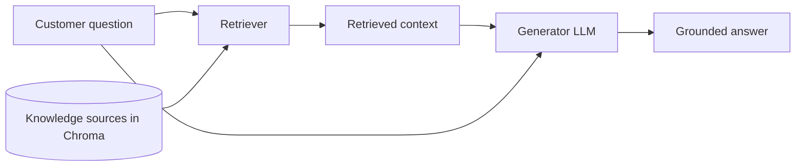
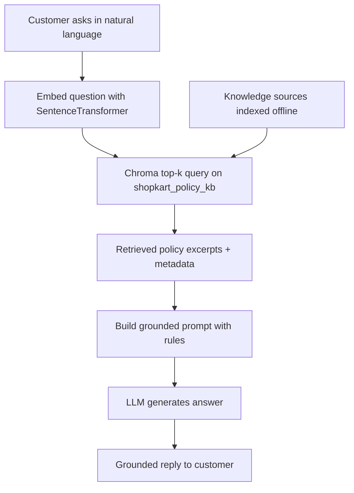

# RAG Architecture and Pipeline

## Context of This Session

In the previous session, you learned **why** **Retrieval-Augmented Generation (RAG)** matters for **ShopKart** customer support. You compared **ungrounded** LLM-style answers with **grounded** policy-backed replies, and you mapped the **retrieve** step to the **embedding + top-k vector search** pipeline you already built with **Chroma**.

That work answered the *theory* question: *"Why should we search first and generate second?"* Today's question is the *implementation* question: *"How do we wire retrieval and generation into one working loop?"*

**In this session, you will:**

- Frame **e-commerce customer support** as a **RAG problem** — purpose, users, knowledge boundaries, and policy documents
- Build **knowledge sources** as searchable policy chunks inside **Chroma**
- Use your **previous Chroma setup** as the **retriever** layer
- Add an **LLM generator** that answers only from retrieved evidence
- Run the full **retrieve → generate** loop and compare it with an **LLM-only baseline**
- Inspect whether **semantic retrieval** matched the customer's **intent**

This session is **hands-on implementation**. You will write one complete Python script that turns ShopKart policy text into grounded support answers.

---

## The Running Example — ShopKart Support Assistant

You continue with **ShopKart**, the online store from the previous session. Customers ask about **returns**, **shipping**, **warranty**, and **refunds**. The assistant must answer from **official policy text**, not from the model's general memory.

### Who Uses This Assistant?

| Stakeholder | What they need |
|---|---|
| **Customer** | Clear, correct answers about eligibility, timelines, and exceptions |
| **Support team** | Fewer wrong promises that create escalations |
| **Business** | Answers traceable to live policy documents |

- **Official Definition:** A **knowledge boundary** is the set of topics and documents an AI system is allowed to use when answering — everything outside that boundary should be refused or escalated.
- **In Simple Words:** The bot is only allowed to speak from the **company rule book**, not from random internet guesses.
- **Real-Life Example:** A **bank phone line** agent who may only quote the bank's published loan brochure — not what they heard from a friend.


### ShopKart Policy Knowledge Base

These four policy areas are your **knowledge sources** for today's lab. Each row becomes one stored chunk in Chroma.

| Policy area | Official text (source of truth) |
|---|---|
| **Returns** | Unopened items may be returned within **7 calendar days** of delivery. Opened or used items are not eligible unless defective. |
| **Shipping** | Standard delivery takes **3–5 business days** after dispatch. Express delivery (paid) arrives in **1–2 business days** in metro cities only. |
| **Warranty** | Electronics carry a **12-month manufacturer warranty** from the date of delivery. Warranty does not cover physical damage or liquid exposure. |
| **Refunds** | Refunds are credited within **5–7 business days** after the returned item passes warehouse verification. Cash-on-delivery orders are refunded to the original UPI or bank account only. |

- **Official Definition:** A **knowledge source** is a trusted document or text record that a RAG system may retrieve from when answering domain-specific questions.
- **In Simple Words:** The **reference material** the retriever is allowed to search — like the policy pages pinned behind a support desk.
- **Real-Life Example:** A coaching centre's **fee refund notice** posted on the office wall — not whatever the receptionist remembers from last year.

**Integrated learning point:** If a customer asks about **returns**, the assistant should pull **Returns** and sometimes **Refunds** text — not **Warranty** alone. Your retriever's job is to find the right shelf before the generator speaks.


### Simple Activity — Map Questions to Policy Areas

In your notebook, match each customer line to the primary policy area (**Returns / Shipping / Warranty / Refunds**):

1. *"I opened the earphones — can I send them back?"*
2. *"Express delivery to Delhi — how fast?"*
3. *"My phone fell in water — is repair free under warranty?"*
4. *"COD order returned — when will money come to my UPI?"*

Write one sentence per line explaining **why** that policy area is the best starting search target.

---

## Three Components of a Minimal RAG Pipeline

Before you open your editor, see how today's code maps to three named roles you will hear in every RAG discussion.



| Component | Job in ShopKart | Today's tool |
|---|---|---|
| **Knowledge sources** | Store official policy text the bot may cite | Python list → Chroma **collection** |
| **Retriever** | Find top-k chunks whose **meaning** matches the question | **Sentence Transformers** + **`collection.query`** |
| **Generator** | Turn retrieved text + question into a polite reply | **Groq chat API** (free, OpenAI-compatible LLM API) |

- **Official Definition:** A **retriever** converts a user query into a search request and returns the most relevant passages from a knowledge store.
- **In Simple Words:** The **smart search** step — it finds policy paragraphs before anyone writes an answer.
- **Real-Life Example:** A **library assistant** who runs a catalog search and places three relevant books on the desk before you read them.

- **Official Definition:** A **generator** is the language model component that produces natural-language output conditioned on the user query and supplied context.
- **In Simple Words:** The **writer** that explains the policy in friendly sentences — but only after the retriever hands over the facts.
- **Real-Life Example:** A trained **support executive** who reads the highlighted policy clause and then types the reply to the customer.

**Connecting sentence:** You already built the **retriever engine** in the previous hands-on session (Chroma + embeddings). Today you **reuse that pattern** and add the **generator** so retrieved chunks become full answers — not just ranked text in a terminal.

**Common doubt:** *"Is vector search alone the same as RAG?"* — No. Search returns chunks; **RAG** also **generates** an answer that should follow those chunks. Until generation happens with clear **use-this-evidence** instructions, you have retrieval — not a complete assistant.


---

## Project Setup

Create a dedicated folder for today's lab. You need the same two libraries from your vector search lab, plus the Groq client for generation.

### Why Groq + BGE (instead of OpenAI)?

- **OpenAI's hosted API is paid** — you must add billing before any call works. To keep this lab **free**, we swap the generator to **Groq**, which offers a **free API tier** and a **fully OpenAI-compatible** chat interface (same `chat.completions.create` shape).
- **Embeddings stay local and free** — instead of a paid OpenAI embedding model, we use the open-source **BGE** model **`BAAI/bge-small-en-v1.5`** from **Hugging Face**, loaded through the same **Sentence Transformers** library you already know.

### Install Commands

```bash
mkdir shopkart_rag_lab  # Create a folder for today's RAG script and Chroma data
cd shopkart_rag_lab  # Work inside this folder so chroma_store path stays consistent
pip install chromadb  # Vector database client — same library as the previous lab
pip install -U sentence-transformers  # Loads the BGE embedding model from Hugging Face
pip install groq  # Groq Python client for the generator step (free, OpenAI-compatible)
```

**How the code works:**

- **`chromadb`** provides **`PersistentClient`**, **`get_or_create_collection`**, **`upsert`**, and **`query`** — your retriever storage layer.
- **`sentence-transformers`** loads **`BAAI/bge-small-en-v1.5`** (a **BGE** model from Hugging Face) so you embed policy text and customer questions on your laptop without a separate paid embedding API.
- **`groq`** sends the grounded prompt to a hosted LLM and returns the final answer text — the Groq client mirrors the OpenAI client, so the code pattern is identical.


### API Key for the Generator

The **retriever** (BGE embeddings) runs locally. The **generator** calls a hosted LLM on **Groq** through an API.

- Create a free key at **console.groq.com** (sign up → API Keys → Create).
- Set an environment variable before running the script: `export GROQ_API_KEY="your-key-here"` on Mac/Linux.
- On Windows PowerShell: `$env:GROQ_API_KEY="your-key-here"`.
- Never paste API keys inside your Python file or commit them to Git.

- **Official Definition:** An **API key** is a secret token that proves your code is allowed to call a provider's hosted model.
- **In Simple Words:** The **password** your script uses to talk to Groq's servers.
- **Real-Life Example:** A **metro smart card** — without it, the gate will not open even if you know which train to take.

### Simple Activity — Environment Checklist

In your notebook, tick each item after you verify it:

- [ ] Python 3.10+ running
- [ ] `import chromadb` succeeds
- [ ] `from sentence_transformers import SentenceTransformer` succeeds
- [ ] `from groq import Groq` succeeds
- [ ] `GROQ_API_KEY` is set in the terminal session you will use to run the script

---

## Step 1 — Define Knowledge Sources as Policy Records

Good RAG starts with **clean, small chunks** — one main idea per row. For ShopKart, four policy paragraphs are enough for a **minimal** pipeline.

Create a file named `shopkart_rag.py` and start with the master policy list:

```python
# shopkart_rag.py — minimal RAG loop for ShopKart customer support

from typing import List, Dict, Any  # Type hints for readable function signatures
import os  # Read environment variables like GROQ_API_KEY
import chromadb  # Vector database for storing and searching policy chunks
from sentence_transformers import SentenceTransformer  # Loads the BGE embedding model for retriever
from groq import Groq  # Client for LLM generation API calls (free, OpenAI-compatible)

# ---------------------------------------------------------------------------
# ShopKart policy records — these are our knowledge sources for this lab
# Each dict becomes one row in Chroma: id, text, metadata
# ---------------------------------------------------------------------------
POLICY_RECORDS = [
    {  # Returns policy chunk
        "id": "shopkart_returns_1",  # Unique primary key for this policy row
        "text": (
            "Unopened items may be returned within 7 calendar days of delivery. "
            "Opened or used items are not eligible unless defective."
        ),  # Human-readable returns rule — source of truth for return questions
        "metadata": {"category": "returns", "source": "returns_policy"},  # Tags for display and later filtering
    },
    {  # Shipping policy chunk
        "id": "shopkart_shipping_1",  # Unique id for shipping row
        "text": (
            "Standard delivery takes 3 to 5 business days after dispatch. "
            "Express delivery (paid) arrives in 1 to 2 business days in metro cities only."
        ),  # Shipping timelines customers ask about often
        "metadata": {"category": "shipping", "source": "shipping_policy"},  # Shipping category tag
    },
    {  # Warranty policy chunk
        "id": "shopkart_warranty_1",  # Unique id for warranty row
        "text": (
            "Electronics carry a 12-month manufacturer warranty from the date of delivery. "
            "Warranty does not cover physical damage or liquid exposure."
        ),  # Warranty coverage and exclusions
        "metadata": {"category": "warranty", "source": "warranty_policy"},  # Warranty category tag
    },
    {  # Refund policy chunk
        "id": "shopkart_refunds_1",  # Unique id for refund row
        "text": (
            "Refunds are credited within 5 to 7 business days after the returned item "
            "passes warehouse verification. Cash-on-delivery orders are refunded to the "
            "original UPI or bank account only."
        ),  # Refund timing and COD path
        "metadata": {"category": "refunds", "source": "refunds_policy"},  # Refunds category tag
    },
]

# Embedding model name — MUST stay the same for documents and every query
EMBEDDING_MODEL_NAME = "BAAI/bge-small-en-v1.5"  # Free BGE model from Hugging Face

# LLM model name for generation — free Groq model; swap for any model Groq lists
GENERATION_MODEL_NAME = "llama-3.3-70b-versatile"  # Groq-hosted LLM used as the generator
```

**How the code works:**

- **`POLICY_RECORDS`** is the **knowledge base** — four trusted chunks covering ShopKart's main support topics.
- Each **`id`** must be unique so **`upsert`** can insert or update rows safely.
- **`metadata`** stores **`category`** and **`source`** labels — useful for debugging retrieval today; advanced **metadata filtering** comes in a **later** session.
- **`EMBEDDING_MODEL_NAME`** points to the **BGE** model **`BAAI/bge-small-en-v1.5`** and must match what you used when indexing — the **same model rule** from vector search still applies in RAG.
- **`GENERATION_MODEL_NAME`** is a **free Groq** model; because Groq is OpenAI-compatible, the generation code looks exactly like the OpenAI chat pattern.

**Integrated learning point:** Outdated or wrong policy text in this list produces "grounded" wrong answers with extra confidence. Production teams version and update knowledge sources; today you focus on **architecture**, not document management.

### Simple Activity — Trace One Record

Pick **`shopkart_refunds_1`**. In your notebook, write: (1) the full policy text, (2) the **`category`** metadata value, (3) one customer question that should retrieve this row before the others.

---

## Step 2 — Connect to Chroma and Index Policy Chunks

This step reuses the **PersistentClient → collection → embed → upsert** pattern from your previous vector search lab. The collection becomes the **physical home** of ShopKart's knowledge sources.

```python
def create_embedding_model() -> SentenceTransformer:
    # Load the local BGE embedding model once — reuse for all encode calls in this script
    return SentenceTransformer(EMBEDDING_MODEL_NAME)  # Downloads ~130MB BGE model on first run


def setup_chroma_collection():
    # Connect to on-disk Chroma storage in ./chroma_store (survives after script ends)
    client = chromadb.PersistentClient(path="./chroma_store")  # Local persistent database folder

    # Open or create the ShopKart policy collection — separate name from older demo collections
    collection = client.get_or_create_collection(
        name="shopkart_policy_kb",  # Named bucket for ShopKart policy rows
        embedding_function=None,  # We pass embeddings manually — same teaching pattern as before
    )

    return collection  # Return collection handle for upsert and query


def index_policy_records(collection, model: SentenceTransformer) -> None:
    # Build parallel lists from POLICY_RECORDS — index alignment matters for upsert
    ids = [row["id"] for row in POLICY_RECORDS]  # One unique id per policy chunk
    documents = [row["text"] for row in POLICY_RECORDS]  # Plain text stored and returned in search
    metadatas = [row["metadata"] for row in POLICY_RECORDS]  # Category and source tags per row

    # Encode all policy texts to vectors in one batch — same model as queries later
    # normalize_embeddings=True is recommended for BGE so cosine-style similarity behaves well
    embeddings = model.encode(documents, convert_to_numpy=True, normalize_embeddings=True).tolist()  # Chroma expects Python lists

    # Write all rows into Chroma — upsert is safe to rerun (updates by id if already present)
    collection.upsert(
        ids=ids,  # Primary keys
        documents=documents,  # Readable policy sentences
        metadatas=metadatas,  # Tags stored alongside each row
        embeddings=embeddings,  # Meaning vectors used for similarity search
    )

    print(f"Indexed {collection.count()} ShopKart policy records.")  # Expect 4 after first successful run
```

**How the code works:**

- **`setup_chroma_collection`** mirrors your previous lab — only the **collection name** changes to **`shopkart_policy_kb`**.
- **`embedding_function=None`** means **you** call **`model.encode`** — no hidden embedding inside Chroma.
- **`index_policy_records`** is an **offline** step: run it once (or again when policy text changes) before answering live customer questions.
- After upsert, **`collection.count()`** should print **4**. If not, fix indexing before building the retriever.


**Common mistake:** Running the script from two different folders creates two different **`./chroma_store`** paths. Always **`cd`** into **`shopkart_rag_lab`** before executing.

### Simple Activity — Verify the Index

After running the index function once, add these lines temporarily and record the output in your notebook:

```python
print("Count:", collection.count())  # Should be 4
print("Peek sample:", collection.peek())  # Eyeball ids and document text
```

Note one **`id`**, one **`category`** from metadata, and confirm all four policy areas appear.

---

## Step 3 — Build the Retriever

The **retriever** is the bridge between a customer's words and the stored policy chunks. It embeds the question, runs **top-k** similarity search, and returns ranked evidence.

- **Official Definition:** **Top-k retrieval** returns the **k** stored items whose embedding vectors are nearest to the query vector.
- **In Simple Words:** *"Bring me the **k** best-matching policy paragraphs by meaning."*
- **Real-Life Example:** Asking a shopkeeper for the **two most relevant** FAQ printouts for *"refund delay"* — not the entire filing cabinet.

For today's minimal pipeline, **`top_k=2`** is a reasonable starting point with only four chunks. **Tuning** how many chunks to fetch — and **filtering** by metadata — is covered in a **later** session.

```python
def retrieve_policy_chunks(
    collection,
    model: SentenceTransformer,
    user_query: str,
    top_k: int = 2,
) -> List[Dict[str, Any]]:
    # Convert the customer's question into an embedding vector using the SAME BGE model as indexing
    query_embedding = model.encode([user_query], convert_to_numpy=True, normalize_embeddings=True).tolist()  # Batch of one query

    # Ask Chroma for the nearest stored policy vectors to this question vector
    results = collection.query(
        query_embeddings=query_embedding,  # Query as numbers — not raw string
        n_results=top_k,  # How many chunks to return (top-k)
        include=["documents", "metadatas", "distances"],  # Ask for text, tags, and scores
    )

    retrieved = []  # Clean list we will pass to the generator

    # Loop through each rank in the top-k result lists — index 0 is best match
    for doc, meta, dist in zip(
        results["documents"][0],  # Matched policy text strings
        results["metadatas"][0],  # Metadata dicts aligned with each match
        results["distances"][0],  # Distance scores — lower usually means closer meaning
    ):
        retrieved.append(
            {
                "text": doc,  # Policy excerpt text
                "metadata": meta,  # Source and category labels
                "distance": dist,  # Similarity score for inspection
            }
        )

    return retrieved  # List of dicts — retriever output for this query
```

**How the code works:**

- **`model.encode([user_query], ...)`** applies the **same model rule** — never swap embedding models between index and query, and keep **`normalize_embeddings=True`** on both sides for BGE.
- **`collection.query`** is exactly the skill from your previous lab — now wrapped inside a named **`retrieve_policy_chunks`** function.
- **`distance`** helps you **inspect** retrieval quality; it does not go to the customer directly.
- The retriever **does not** call the LLM — it only returns evidence.


### Simple Activity — Inspect Retrieval Intent

Run the retriever alone with this question: *"I want my money back after returning a COD order."*

Print each result's **`metadata["category"]`**, **`text`**, and **`distance`**. Answer in your notebook:

- Did **refunds** (or **returns**) rank first?
- Would a human support agent agree this is the right policy area?
- If the wrong chunk ranked first, note the wording that may have confused the search — you will tune this in a **later** session.

---

## Step 4 — Build the Grounded Prompt and Generator

The **generator** receives the customer question plus **retrieved context**. Your prompt must tell the model to **stick to the evidence**.

```python
def build_grounded_prompt(user_query: str, retrieved_chunks: List[Dict[str, Any]]) -> str:
    # Stitch retrieved policy excerpts into one context block the LLM can read
    context_block = ""  # Start empty — append each chunk with a label
    for index, chunk in enumerate(retrieved_chunks, start=1):  # Number chunks for clarity
        source_name = chunk["metadata"].get("source", "unknown")  # Which policy file this came from
        context_block += f"\nExcerpt {index} (source: {source_name}):\n{chunk['text']}\n"  # One labeled paragraph

    # Full instruction prompt — rules + evidence + question
    prompt = f"""You are ShopKart customer support.
Answer the customer's question using ONLY the policy excerpts below.
Rules:
1. Do not invent numbers, timelines, or eligibility rules not present in the excerpts.
2. If the excerpts do not contain enough information, say:
   "I do not have enough information in the provided policy excerpts."
3. Keep the answer short, polite, and clear.
4. Mention important conditions (opened vs unopened, metro-only express, COD refund path) when they appear in the excerpts.

Policy excerpts:
{context_block}

Customer question:
{user_query}

Final answer:"""

    return prompt  # String ready to send to the LLM API


def generate_grounded_answer(client: Groq, user_query: str, retrieved_chunks: List[Dict[str, Any]]) -> str:
    # Build the grounded prompt from retrieved evidence
    prompt = build_grounded_prompt(user_query, retrieved_chunks)  # Context + question + rules

    # Call the hosted LLM on Groq — generator step of RAG
    response = client.chat.completions.create(
        model=GENERATION_MODEL_NAME,  # Which Groq LLM writes the final reply
        messages=[
            {
                "role": "system",  # High-level behavior instruction
                "content": "You are a precise ShopKart support assistant. Follow the policy excerpts exactly.",
            },
            {"role": "user", "content": prompt},  # Grounded prompt with evidence block
        ],
    )

    # Extract assistant text from the API response object
    return response.choices[0].message.content.strip()  # Final grounded answer string
```

**How the code works:**

- **`build_grounded_prompt`** is the **context injection** step — retrieved chunks become the **evidence block** from the previous session's diagrams.
- System + user **messages** follow the chat API pattern you saw when learning how LLMs are accessed remotely — Groq uses the exact same `chat.completions.create` shape as OpenAI.
- Rule **2** reduces guessing when retrieval misses — a honest *"I don't know from policy"* beats a fluent invention.
- **`generate_grounded_answer`** is the **generator** — it never searches; it only **writes** from supplied context.

**Common doubt:** *"What if the LLM ignores the excerpts?"* — It can happen. That is a **generation discipline** problem. Today you inspect answers side by side with retrieved text; a **later** session covers evaluation when the model adds extra "facts."


### Simple Activity — Evidence Audit

After one grounded answer, copy the **retrieved excerpts** and the **final answer** into two columns. Underline every **number** and **eligibility rule** in the answer. Each underlined fact should appear verbatim or clearly paraphrased from an excerpt. Circle any line with no excerpt support.

---

## Step 5 — LLM-Only Baseline (No Retrieval)

To **validate** RAG, you must compare the same question **with** and **without** retrieved policy text. The baseline shows what the model guesses from general memory alone.

```python
def generate_llm_only_answer(client: Groq, user_query: str) -> str:
    # Same LLM — but NO policy excerpts in the prompt (ungrounded baseline)
    response = client.chat.completions.create(
        model=GENERATION_MODEL_NAME,  # Same Groq generator model for fair comparison
        messages=[
            {
                "role": "system",  # Generic support persona — no ShopKart policy attached
                "content": (
                    "You are a helpful e-commerce customer support assistant. "
                    "Answer based on your general knowledge."
                ),
            },
            {"role": "user", "content": user_query},  # Only the raw customer question
        ],
    )

    return response.choices[0].message.content.strip()  # Ungrounded-style reply
```

**How the code works:**

- No **`retrieve_policy_chunks`** call — the model never sees ShopKart's **7-day** or **5–7 business day** rules.
- Same **`GENERATION_MODEL_NAME`** keeps the comparison fair — only **context** changes, not the writing model.
- Expect fluent but **generic** timelines (*"usually 7–30 days"*) that may **not** match ShopKart's table.

This connects directly to the **ungrounded vs grounded** tables from the previous session — today you ** reproduce** that gap in code.


---

## Step 6 — Wire the Full RAG Loop

One function ties **retriever + generator** into the pipeline you diagrammed earlier: **query → retrieve → context → generate**.

```python
def print_retrieved_chunks(user_query: str, retrieved_chunks: List[Dict[str, Any]]) -> None:
    # Debug helper — show what the retriever found before reading the LLM answer
    print("\n" + "=" * 72)  # Visual divider in terminal output
    print(f"Customer question: {user_query}")  # Echo the query
    print("=" * 72)  # Closing divider line

    for rank, chunk in enumerate(retrieved_chunks, start=1):  # Rank 1 = best match
        print(f"\nRank {rank}")  # Human-friendly rank label
        print(f"  Source   : {chunk['metadata'].get('source')}")  # Policy source tag
        print(f"  Category : {chunk['metadata'].get('category')}")  # Returns/shipping/etc.
        print(f"  Distance : {chunk['distance']:.4f}")  # Lower usually = closer vector match
        print(f"  Text     : {chunk['text']}")  # Actual policy excerpt retrieved


def answer_with_rag(
    client: Groq,
    collection,
    model: SentenceTransformer,
    user_query: str,
    top_k: int = 2,
) -> str:
    # Step A — Retrieve relevant ShopKart policy excerpts
    retrieved_chunks = retrieve_policy_chunks(
        collection=collection,  # Chroma collection holding policy rows
        model=model,  # Shared embedding model
        user_query=user_query,  # Customer's natural-language question
        top_k=top_k,  # How many excerpts to fetch
    )

    # Step B — Print retrieval results so you can judge intent match before generation
    print_retrieved_chunks(user_query, retrieved_chunks)  # Inspection step — not optional in learning

    # Step C — Generate grounded natural-language answer from retrieved evidence
    grounded_answer = generate_grounded_answer(
        client=client,  # Groq client
        user_query=user_query,  # Original question
        retrieved_chunks=retrieved_chunks,  # Evidence from retriever
    )

    return grounded_answer  # Final reply to show the customer
```

**How the code works:**

- **`answer_with_rag`** is the **minimal RAG loop** — the function you would call from a chat UI in a real app.
- **`print_retrieved_chunks`** makes retrieval **visible** — you judge whether search matched **intent** before trusting the answer.
- Order matters: **retrieve first**, **generate second** — swapping them would break grounding.


---

## Step 7 — Complete Script and Demo Queries

Add a **`main`** block that indexes policies, runs baseline vs RAG on representative ShopKart questions, and prints both answers.

```python
def main():
    # Create Groq client — reads GROQ_API_KEY from environment
    client = Groq()  # Generator API handle (free, OpenAI-compatible)

    # Load embedding model and connect to Chroma collection
    model = create_embedding_model()  # BGE SentenceTransformer for retriever
    collection = setup_chroma_collection()  # Persistent Chroma collection

    # Index (or refresh) ShopKart policy knowledge sources
    index_policy_records(collection, model)  # Offline ingest step

    # Representative customer questions spanning returns, shipping, warranty, refunds
    demo_queries = [
        "I received my phone case yesterday unopened. How many days do I have to return it?",
        "Will express shipping reach my address in a metro city by tomorrow?",
        "My wireless earphones stopped working after 10 months. Is repair covered?",
        "I returned a defective kettle on COD last week. When will the refund reach my UPI?",
    ]

    # Run each demo query twice — LLM-only baseline, then full RAG loop
    for user_query in demo_queries:
        print("\n\n" + "#" * 72)  # Section header per question
        print("QUESTION:", user_query)  # Show current test question

        print("\n--- LLM-only (no retrieval) ---")  # Ungrounded baseline label
        llm_only = generate_llm_only_answer(client, user_query)  # Guess from general knowledge
        print(llm_only)  # Print ungrounded answer

        print("\n--- RAG (retrieve + generate) ---")  # Grounded pipeline label
        rag_answer = answer_with_rag(
            client=client,  # Generator client
            collection=collection,  # Retriever storage
            model=model,  # Embedding model
            user_query=user_query,  # Same question as baseline
            top_k=2,  # Fetch two nearest policy chunks
        )
        print("\nFinal grounded answer:")  # Label final output
        print(rag_answer)  # Print grounded answer


# Standard Python entry — run main only when executing this file directly
if __name__ == "__main__":
    main()  # Start the ShopKart RAG demo
```

**How the code works:**

- **`demo_queries`** cover all four **knowledge source** areas — returns window, express shipping, warranty term, COD refund timing.
- For each question, you print **LLM-only** first, then **retrieval inspection**, then **RAG answer** — easy side-by-side reading in the terminal.
- **`top_k=2`** may return both **returns** and **refunds** for return/refund wording — that is acceptable for a minimal demo; advanced tuning waits for a **later** session.

### How to Run

```bash
cd shopkart_rag_lab  # Same folder where chroma_store will be created
export GROQ_API_KEY="your-key-here"  # Set Groq API key in this terminal session
python shopkart_rag.py  # Execute the full demo
```

**Expected flow in the terminal:**

1. **`Indexed 4 ShopKart policy records.`**
2. For each demo question — an **LLM-only** paragraph with vague or generic industry timelines.
3. **Rank 1 / Rank 2** retrieved excerpts with **category**, **distance**, and policy **text**.
4. A **final grounded answer** citing ShopKart's **7-day**, **3–5 day**, **12-month**, or **5–7 business day** rules where relevant.

### Simple Activity — Baseline vs RAG Scorecard

For each of the four demo queries, fill a table with columns: **Question**, **LLM-only key claim**, **RAG key claim**, **Matches ShopKart policy? (LLM / RAG)**. Write one sentence explaining why RAG was more accurate on at least two rows.

---

## Validate Semantic Retrieval and Grounded Generation

A working pipeline needs two separate checks — **did we fetch the right policy?** and **did the answer follow that policy?**

### Checklist — Retrieval Intent Match

| Question | Did top rank hit the expected policy area? | Notes |
|---|---|---|
| Unopened return window | **Returns** | Customer rarely says "7 calendar days" verbatim |
| Express metro delivery | **Shipping** | "Tomorrow" may be unrealistic even with express rules |
| 10-month electronics repair | **Warranty** | Watch for liquid/damage exclusions in answer |
| COD refund to UPI | **Refunds** | May also surface **Returns** — both can be useful context |

- **Official Definition:** **Semantic retrieval** finds passages whose **meaning** is similar to the query, even when exact keywords differ.
- **In Simple Words:** Search by **intent**, not by copy-pasting policy words.
- **Real-Life Example:** Searching *"paise wapas kab aayenge"* should still find **refund timeline** text even if the policy never uses that Hindi phrase.

**Integrated learning point:** If retrieval fails, generation may still look polished. Always read **Rank 1 text** before trusting the final reply — the retriever is the first gate.

### Checklist — Generation Follows Evidence

When auditing a RAG answer, ask:

- Does every **number** in the reply appear in a retrieved excerpt?
- Does the reply respect **eligibility** language (unopened, metro-only, liquid damage excluded)?
- If excerpts were empty or wrong, did the model admit insufficient policy information?

### Side-by-Side — One Refund Question

**Customer question:** *"I returned a defective kettle on COD last week. When will the refund reach my UPI?"*

| Aspect | LLM-only baseline | RAG grounded answer |
|---|---|---|
| **Typical claim** | *"Refunds usually post in 3–5 days"* (generic industry guess) | *"5–7 business days after warehouse verification; COD to original UPI/bank"* |
| **Uses ShopKart policy numbers?** | Often no | Yes — if retrieval surfaced **refunds** chunk |
| **Traceable to excerpt?** | No | Yes — compare printed Rank 1 **text** |
| **Business risk** | Wrong expectation → angry customer | Aligns with published rule |

### Simple Activity — Two-Stage Debug

Pick one demo query where the RAG answer felt wrong. Split the bug:

1. **Retrieval stage** — Was the wrong policy area Rank 1? Write the distance and category.
2. **Generation stage** — If retrieval looked correct, did the LLM add facts not in the excerpt?

One sentence: *"The main failure was in ___ stage because ___."*

---

## End-to-End Flow — Full Picture



Step-by-step in one breath:

1. **Offline** — Policy paragraphs live in **`POLICY_RECORDS`** and are embedded into **Chroma**.
2. **Online** — Customer question arrives.
3. **Retrieve** — Embed question → **`collection.query`** → top-k excerpts.
4. **Ground** — Excerpts pasted into prompt with **use-only-this-evidence** rules.
5. **Generate** — LLM writes the final support reply.
6. **Inspect** — You compare retrieval ranks, grounded answer, and LLM-only baseline.


**Common doubt:** *"Should I always trust Rank 1?"* — Rank 1 means **closest vector**, not guaranteed **business-correct** in every edge case. Human review of retrieval output remains part of responsible RAG design.

---

## Key Takeaways

- **Customer support** is a natural RAG use case: users need **organization-specific**, **current**, **verifiable** answers from **returns, shipping, warranty, and refund** policies — not generic LLM memory.
- A **minimal RAG pipeline** has three roles: **knowledge sources** (policy chunks in Chroma), **retriever** (embedding + top-k search), and **generator** (LLM that writes from retrieved context).
- Your **previous Chroma lab** becomes the retriever layer; today's new work is **prompt grounding** and **generation** wired after **`collection.query`**.
- **LLM-only baselines** sound helpful but often miss ShopKart's exact numbers — side-by-side runs show why **retrieve → generate** improves **accuracy** even when tone stays polite.
- **Inspect retrieval before trusting answers** — semantic search can miss or mis-rank; generation can ignore good excerpts. A **later** session scales this pipeline to real policy files and deeper retrieval tuning.

---

## Important Commands, Libraries, and Terminologies used

| Term / Command | Meaning in one line |
|---|---|
| **RAG (Retrieval-Augmented Generation)** | Retrieve trusted chunks first, then generate an answer conditioned on that context |
| **Knowledge source** | Trusted policy or document text the system may search (ShopKart returns/shipping/warranty/refunds) |
| **Knowledge boundary** | Topics and sources the assistant is allowed to use when answering |
| **Retriever** | Component that embeds the query and returns top-k relevant chunks from Chroma |
| **Generator** | LLM that turns retrieved excerpts + question into a natural-language reply |
| **Grounded prompt** | User message that includes policy excerpts and strict use-the-evidence rules |
| **LLM-only baseline** | Same LLM answering without retrieved context — shows ungrounded guessing |
| **Semantic retrieval** | Search by meaning similarity, not exact keyword match |
| **Top-k (`n_results`)** | Number of nearest chunks the retriever returns per query |
| **Context / evidence block** | Retrieved policy text injected into the prompt before generation |
| **Chroma `PersistentClient`** | Local on-disk vector store — survives between script runs |
| **`shopkart_policy_kb`** | Collection name holding ShopKart policy rows in today's lab |
| **`embedding_function=None`** | You supply embeddings manually with Sentence Transformers |
| **`BAAI/bge-small-en-v1.5`** | Free BGE embedding model from Hugging Face — same for index and query |
| **`normalize_embeddings=True`** | Recommended for BGE so similarity scores behave well |
| **`collection.upsert(...)`** | Insert or update policy rows with ids, documents, metadata, embeddings |
| **`collection.query(...)`** | Top-k similarity search used inside the retriever |
| **`build_grounded_prompt`** | Assembles excerpts + rules + customer question for the LLM |
| **`answer_with_rag`** | Full minimal loop: retrieve → inspect → generate |
| **`groq.Groq()`** | Client for hosted LLM generation API calls (free, OpenAI-compatible) |
| **`chat.completions.create`** | Chat API pattern for sending system + user messages to the generator |
| **`llama-3.3-70b-versatile`** | Example free Groq generation model used in the lab script |
| **`GROQ_API_KEY`** | Environment variable holding your secret Groq API token |
| **`print_retrieved_chunks`** | Debug helper to verify retrieval intent before reading the final answer |
