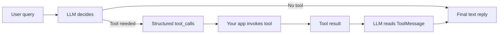

# LangChain Tools: Custom Tools and Tool Calling

## Learning Context

In the previous learning flow, you created a working LangChain environment and ran your first LCEL chain using a prompt, a chat model, and an output parser.

Now we will move one step ahead.

Instead of asking the model to only **generate text**, we will allow it to **request actions** through tools. This is an important idea in agentic systems because real applications often need the model to calculate, search, fetch, validate, or call business logic before giving a final answer.

By the end of this lesson, you will understand how to:

- Create LangChain-native custom tools using `@tool`.
- Attach tools to a chat model using `bind_tools`.
- Read structured tool requests from `tool_calls`.
- Send tool execution results back using `ToolMessage`.
- Handle tool errors without crashing the whole application.
- Diagnose common tool-selection and argument problems from controlled test queries.

## Why Tools Are Needed in LLM Applications

A normal LLM is good at language.

It can explain, summarize, rewrite, classify, and reason in text. But it should not be trusted blindly for facts, calculations, real-time data, or actions that must follow exact business rules.

### Tool

**Official Definition:** A **tool** is a callable function that an AI model can request during a conversation to perform a specific task.

**In Simple Words:** A tool is like giving the model a proper helper function instead of expecting it to do everything from memory.

**Real-Life Example:** Imagine a student preparing a monthly budget. The student may understand the problem, but for exact addition and subtraction, using a calculator is safer than mental math.

In the same way:

- The model understands the user request.
- The model decides whether a tool is useful.
- Your program executes the tool.
- The model uses the tool result to give a better final answer.


| Capability | LLM only | LLM + tools |
| --- | --- | --- |
| General advice | Yes | Yes |
| Live fee calculation with exact rules | May guess | Yes (via your tool) |
| Eligibility check from business rules | May guess | Yes (via your tool) |
| Traceable actions | Hard | Yes (you see each tool call) |

## Tool Calling Flow

Tool calling is not magic. It follows a clear flow.

The model does not directly run Python code by itself. It only emits a structured request saying, "I want to call this tool with these arguments."

The application is responsible for safely running the tool.

Think of a busy restaurant. The customer tells the **waiter** what they want. The waiter does not cook; they write a clear **order slip** and send it to the **kitchen**. The kitchen prepares the food and sends it back; the waiter serves it nicely to the customer.

| Role in software | Restaurant analogy |
| --- | --- |
| User | Customer |
| LLM | Waiter (plans and speaks) |
| Tool call | Written order slip |
| Tool (your function) | Kitchen |
| Tool result | Prepared dish (raw data) |
| Final reply to user | Waiter's friendly explanation |




> **Common doubt:** "If the tool already returned the answer, why call the LLM again?"  
> **Answer:** Tools return data in different shapes (numbers, JSON, short strings). The LLM turns that into one consistent, polite reply for your UI.

### Basic Flow

- The user asks a question.
- The model checks the available tools.
- If a tool is needed, the model returns a structured `tool_calls` object.
- The application reads the tool name and arguments.
- The application executes the matching Python function.
- The application sends the result back as a `ToolMessage`.
- The model uses that result to create the final answer.

This separation is important because it keeps control with your program.

The model can request an action, but your application decides how to execute it, whether to allow it, and how to handle failures.

## LangChain Tool Calling Building Blocks

Before writing code, let us understand the main keywords.

### `@tool`

**Official Definition:** `@tool` is a LangChain decorator that converts a normal Python function into a LangChain-compatible tool.

**In Simple Words:** It wraps your Python function so LangChain can show its name, description, and input structure to the model.

**Real-Life Example:** A normal kitchen knife becomes safer and easier to use when it is stored in a proper labelled kitchen tool kit. Similarly, a Python function becomes easier for the model to understand when it is wrapped as a LangChain tool.

When you use `@tool`, LangChain reads:

- The function name.
- The function description from the docstring.
- The input argument names.
- The input argument types.
- The return value.

Good tool descriptions matter because the model uses them to decide when to call the tool.

### `bind_tools`

**Official Definition:** `bind_tools` is a LangChain chat model method that attaches one or more tools to a model invocation.

**In Simple Words:** It tells the model, "These are the tools available to you for this request."

**Real-Life Example:** In an exam hall, a student may be allowed to use only a calculator and a formula sheet. `bind_tools` is like giving the model its allowed set of helpers.

The model can only choose from the tools you bind.

If you do not bind a tool, the model should not be expected to call it.

### `tool_calls`

**Official Definition:** `tool_calls` is a structured field in the model response that contains the tool name, arguments, ID, and type of tool call requested by the model.

**In Simple Words:** It is the model's formal request to run a tool.

**Real-Life Example:** In a restaurant, a customer does not enter the kitchen and cook. The customer places an order slip. `tool_calls` is like that order slip.

A typical tool call contains:

- `name`: which tool the model wants to call.
- `args`: the values to pass to the tool.
- `id`: a unique ID used to connect the tool result back to the request.
- `type`: usually identifies it as a tool call.

### `ToolMessage`

**Official Definition:** `ToolMessage` is a LangChain message type used to send a tool execution result back to the model.

**In Simple Words:** It is the reply from your Python tool to the model.

**Real-Life Example:** If the restaurant kitchen receives an order slip, prepares the food, and sends it back with the same order number, the waiter knows which order it belongs to. `ToolMessage` does the same matching using `tool_call_id`.

### Error Handling

**Official Definition:** Error handling means detecting failures during tool execution and converting them into controlled responses instead of allowing the program to crash.

**In Simple Words:** If a tool fails, we send the failure as useful feedback instead of stopping the full conversation.

**Real-Life Example:** If a UPI payment fails, the app does not simply close. It shows a message like "Bank server is unavailable, please try again." That is recoverable error handling.

In tool calling, errors can happen because:

- The model selected the wrong tool.
- The model gave a wrong argument name.
- The argument type was wrong.
- The tool function raised an exception.
- The tool result was too large or unclear.

## Writing Custom Tools with `@tool`

Let us start with small tools that feel like real application helpers.

We will create:

- A fee calculator tool.
- A course eligibility checker tool.
- A support ticket status tool.

These examples are simple, but the structure is the same for production applications.

### Full Code: Defining LangChain Tools

```python
from langchain_core.tools import tool  # Import the decorator that converts Python functions into LangChain tools.


@tool  # Register this function as a LangChain tool.
def calculate_final_fee(base_fee: int, discount_percent: int) -> int:  # Define a tool with typed inputs and integer output.
    """Calculate the final course fee after applying a discount percentage."""  # Describe when the model should use this tool.
    discount_amount = base_fee * discount_percent // 100  # Calculate the discount amount using integer math.
    final_fee = base_fee - discount_amount  # Subtract the discount from the original fee.
    return final_fee  # Return the final fee to LangChain.


@tool  # Register this function as another LangChain tool.
def check_course_eligibility(has_laptop: bool, weekly_hours: int) -> str:  # Define a tool that checks simple eligibility rules.
    """Check if a learner is eligible for a coding-heavy online course."""  # Explain the business use of the tool.
    if not has_laptop:  # Check whether the learner has a required laptop.
        return "Not eligible yet: a laptop is required for hands-on practice."  # Return a clear reason for rejection.
    if weekly_hours < 10:  # Check whether the learner can spend enough time every week.
        return "Not eligible yet: at least 10 hours per week are needed."  # Return a clear time-related reason.
    return "Eligible: the learner has the basic setup and time commitment."  # Return approval when both conditions pass.


@tool  # Register this function as a LangChain tool.
def get_ticket_status(ticket_id: str) -> str:  # Define a tool that accepts a support ticket ID.
    """Get the current status of a learner support ticket by ticket ID."""  # Explain what information this tool can retrieve.
    ticket_database = {  # Create a small in-memory dictionary to simulate a real database.
        "T101": "Open: waiting for mentor review.",  # Store one sample ticket status.
        "T102": "Resolved: refund confirmation sent.",  # Store another sample ticket status.
        "T103": "In progress: technical team is checking the issue.",  # Store a third sample ticket status.
    }  # End the sample ticket database.
    return ticket_database.get(ticket_id, "Ticket not found.")  # Return the status or a safe fallback message.


tools = [calculate_final_fee, check_course_eligibility, get_ticket_status]  # Put all available tools in one list.

for current_tool in tools:  # Loop through every registered tool.
    print(current_tool.name)  # Print the tool name that the model will see.
    print(current_tool.description)  # Print the tool description that helps the model choose the tool.
    print(current_tool.args)  # Print the input schema inferred from function typing.
    print("---")  # Print a separator for readability.
```

### How the code works

- `@tool` makes each function visible to LangChain as a structured tool.
- Function names should be clear because the model reads them.
- Type hints like `int`, `bool`, and `str` help LangChain describe the tool arguments.
- The docstring tells the model when the tool should be selected.
- `tools` is a list of all tools that can later be bound to the model.
- The final loop prints the tool details so you can inspect what the model will receive.


## Why Type Hints Matter for Tools

When you write a tool, the **type hints** play an important role.

Type hints like `int`, `bool`, and `str` tell LangChain what kind of input each argument expects, and LangChain shares this information with the model.

```python
def get_ticket_status(ticket_id: str):  # The type hint tells the model this argument should be text.
    ...
```

- **In Simple Words:** A type hint is like writing "fill in numbers only" or "fill in text only" on a form field.
- **Real-Life Example:** A bank form that says "Enter 10-digit mobile number" guides the person to give the right kind of value.
- **Important Note:** A plain type hint is a guide, not a strict guard. For now, you should also validate important inputs **inside** the tool function, as shown earlier with the `if` checks in `check_course_eligibility`.

Clear type hints plus a clear docstring give the model the best chance to call your tool with the correct arguments.

## Writing Better Tool Descriptions

The model chooses tools based on names, descriptions, and input schemas.

If the tool description is vague, the model may choose the wrong tool or may not choose any tool at all.

### Weak Tool Description

```python
"""Does fee work."""
```

This is not helpful because it does not say:

- What input is expected.
- What output is returned.
- When the tool should be used.

### Better Tool Description

```python
"""Calculate the final course fee after applying a discount percentage."""
```

This is better because it clearly explains:

- The tool is for course fees.
- It applies a discount.
- The output is the final payable amount.

### Simple Activity: Improve Tool Descriptions

Read these rough descriptions and rewrite them in a clearer way:

- `"""Checks student."""`
- `"""Gets data."""`
- `"""Does calculation."""`

Try to include:

- The exact task.
- The expected input.
- The expected output.
- The situation where the model should use it.

## Connecting Tools to a Model with `bind_tools`

After creating tools, we need to attach them to a chat model.

This does not execute the tools immediately. It only makes the model aware that these tools are available.

### Full Code: Binding Tools to a Chat Model

```python
from langchain_ollama import ChatOllama  # Import the Ollama chat model integration for LangChain.
from langchain_core.tools import tool  # Import the tool decorator from LangChain Core.


@tool  # Convert this Python function into a LangChain tool.
def calculate_final_fee(base_fee: int, discount_percent: int) -> int:  # Define typed inputs for predictable tool calling.
    """Calculate the final course fee after applying a discount percentage."""  # Tell the model when to use this tool.
    discount_amount = base_fee * discount_percent // 100  # Calculate the discount amount.
    final_fee = base_fee - discount_amount  # Calculate the payable fee.
    return final_fee  # Return the payable fee.


model = ChatOllama(model="llama3.1", temperature=0)  # Create a local chat model with deterministic behavior.
tools = [calculate_final_fee]  # Store the tools that we want to expose to the model.
model_with_tools = model.bind_tools(tools)  # Bind the tool list to the model.

response = model_with_tools.invoke("A course fee is 50000 rupees. Discount is 20%. What is the final fee?")  # Ask a question where the tool is useful.

print(response.content)  # Print any direct text response from the model.
print(response.tool_calls)  # Print the structured tool call requests emitted by the model.
```

### How the code works

- `ChatOllama` creates the chat model object.
- `temperature=0` makes the model less random, which helps during testing.
- `tools` stores the available tool definitions.
- `model.bind_tools(tools)` creates a model wrapper that knows about the tools.
- `invoke()` sends the user query to the model.
- `response.tool_calls` shows whether the model wants a tool to be executed.

Some models may answer directly, and some may return tool calls.

For reliable tool calling, use a model that supports tool calling well. If the model does not support structured tool calling properly, `tool_calls` may be empty or inconsistent.

You continue with **ChatOllama** from your earlier LangChain setup. The tool-calling pattern stays the same even when the model provider changes.

## Understanding `tool_calls`

When the model decides to use a tool, it returns a structured request.

When you call `model_with_tools.invoke(messages)`, the reply is an **`AIMessage`**. It has:

- **`content`** — text the model wrote (may be empty when it only wants tools).
- **`tool_calls`** — list of dict-like objects: tool **name**, **id**, and **args**.

Your job as developer:

1. Append the `AIMessage` to the conversation history.
2. If `tool_calls` is empty → return `content` as the final answer.
3. If not empty → run each tool, wrap results in **`ToolMessage`**, append those, and call the model again.


The exact printed format may vary slightly, but the idea remains the same.

### Example Tool Call Shape

```python
[
    {
        "name": "calculate_final_fee",
        "args": {
            "base_fee": 50000,
            "discount_percent": 20
        },
        "id": "call_abc123",
        "type": "tool_call"
    }
]
```

### What Each Field Means

- `name` tells your program which tool function should run.
- `args` contains the input values for that tool.
- `id` connects the tool request with the tool result.
- `type` identifies this item as a tool call.

The model has still not executed the tool.

It has only created a structured request. Your Python application must read this request and run the correct function.

## Manual Tool Execution Loop

Now we will build the most important part: a manual tool-feedback loop.

This loop is the foundation for many agentic systems.

### Why Manual Loop Is Useful

A manual loop gives your application control over:

- Which tools are allowed.
- How tool arguments are validated.
- How tool errors are handled.
- How tool results are returned to the model.
- How the final answer is generated.

This is safer than blindly allowing tool calls.

### Full Code: Manual Tool Calling Loop

```python
from langchain_ollama import ChatOllama  # Import the Ollama chat model integration.
from langchain_core.messages import HumanMessage, ToolMessage  # Import message classes for user input and tool output.
from langchain_core.tools import tool  # Import the decorator used to create LangChain tools.


@tool  # Register this function as a LangChain tool.
def calculate_final_fee(base_fee: int, discount_percent: int) -> int:  # Define a fee calculation tool with typed arguments.
    """Calculate the final course fee after applying a discount percentage."""  # Describe the exact purpose of the tool.
    discount_amount = base_fee * discount_percent // 100  # Calculate the discount amount.
    final_fee = base_fee - discount_amount  # Subtract the discount from the base fee.
    return final_fee  # Return the final payable amount.


@tool  # Register this function as a LangChain tool.
def check_course_eligibility(has_laptop: bool, weekly_hours: int) -> str:  # Define an eligibility checker with two inputs.
    """Check if a learner is eligible for a coding-heavy online course."""  # Describe when this checker should be used.
    if not has_laptop:  # Check if the learner lacks a laptop.
        return "Not eligible yet: a laptop is required for hands-on practice."  # Return a recoverable business message.
    if weekly_hours < 10:  # Check if weekly study time is below the required level.
        return "Not eligible yet: at least 10 hours per week are needed."  # Return a clear reason to the model.
    return "Eligible: the learner has the basic setup and time commitment."  # Return success when both rules pass.


tools = [calculate_final_fee, check_course_eligibility]  # Store the tools available to the model.
tool_map = {current_tool.name: current_tool for current_tool in tools}  # Create a lookup dictionary by tool name.

model = ChatOllama(model="llama3.1", temperature=0)  # Create the chat model.
model_with_tools = model.bind_tools(tools)  # Bind the available tools to the model.

messages = [HumanMessage(content="I have a laptop and can study 12 hours weekly. Also calculate fee after 15% discount on 60000 rupees.")]  # Start the conversation with one user message.

first_response = model_with_tools.invoke(messages)  # Ask the model to decide whether tools are needed.
messages.append(first_response)  # Add the model response to conversation history.

for tool_call in first_response.tool_calls:  # Loop through each tool call requested by the model.
    selected_tool = tool_map[tool_call["name"]]  # Find the matching Python tool by name.
    tool_result = selected_tool.invoke(tool_call["args"])  # Execute the tool with the model-provided arguments.
    tool_message = ToolMessage(content=str(tool_result), tool_call_id=tool_call["id"])  # Wrap the result with the matching tool call ID.
    messages.append(tool_message)  # Add the tool result to the conversation history.

final_response = model_with_tools.invoke(messages)  # Ask the model to produce a final answer using the tool results.

print(final_response.content)  # Print the final user-facing answer.
```

### How the code works

- `HumanMessage` stores the user question in LangChain message format.
- `model_with_tools.invoke(messages)` asks the model whether tools are needed.
- `first_response.tool_calls` contains the model's requested tools.
- `tool_map` helps the program find the correct function by name.
- `selected_tool.invoke(tool_call["args"])` runs the actual Python function.
- `ToolMessage` sends the tool output back to the model.
- The final model call creates a natural answer using the tool results.

Notice one important point.

The model decides the tool request, but Python executes the tool. That means your application can inspect, approve, block, modify, or log the call before execution.

### Bounded Agent Loop with `max_steps`

In real applications, one user question may need **several** model turns — for example eligibility check first, then fee calculation.

A bounded loop prevents the agent from running forever.

**Loop logic:**

1. Start `messages` with the user query (and optional system message).
2. Repeat up to **`max_steps`** (for example 5):
   - `ai_message = model_with_tools.invoke(messages)`
   - Append `ai_message`.
   - If no `tool_calls` → return `ai_message.content`.
   - For each tool call → run safely → append each `ToolMessage`.
3. If still not done after the step limit → return a polite "could not complete within allowed steps" message.


## Handling Multiple Tool Calls

A single user query can require more than one tool call.

For example:

- "Check if I am eligible and calculate my discounted fee."
- "Find my ticket status and tell me if refund is still pending."
- "Calculate EMI and compare it with my monthly budget."

The manual loop already supports multiple tool calls because it loops through `first_response.tool_calls`.

### Common Doubt

**Doubt:** Can the model call the same tool more than once?

**Answer:** Yes. If the question needs multiple calculations or checks, the model can emit multiple tool calls, depending on model support and prompt clarity.

### Common Mistake

A common mistake is assuming there will always be exactly one tool call.

Better code should handle:

- Zero tool calls.
- One tool call.
- Multiple tool calls.
- Unknown tool names.
- Tool execution errors.

## Recoverable Error Handling

A tool can fail.

But a good agentic application should not immediately crash just because one tool failed.

Instead, it should convert the failure into a structured message that the model can understand.

### Error-Containment Pattern

**Official Definition:** An **error-containment pattern** is a design approach where a failure is caught, converted into a controlled result, and passed forward safely.

**In Simple Words:** The error is packed properly and given back as feedback instead of breaking the whole program.

**Real-Life Example:** If an ATM cannot dispense cash, it gives a printed message or screen message. It does not simply disappear from the wall.

### Structured Error JSON

A strong production habit is to return errors in a consistent shape:

```python
{
    "ok": False,
    "error_type": "order_not_found",
    "message": "No ticket found for id T999."
}
```

This helps the model explain the problem clearly instead of guessing.

| Pattern | What to do |
| --- | --- |
| Structured error objects | Return a clear dictionary with `ok`, `error_type`, `message` |
| Catch tool exceptions | `try/except` around `tool.invoke` |
| Validate arguments early | Add simple `if` checks inside the tool |
| Keep tools minimal | One clear job per tool |
| Limit tool output size | Return only the values the model needs |


### Full Code: Tool Loop with Error Handling

```python
from langchain_ollama import ChatOllama  # Import the Ollama chat model integration.
from langchain_core.messages import HumanMessage, ToolMessage  # Import message classes used in the conversation.
from langchain_core.tools import tool  # Import the tool decorator.


@tool  # Register the function as a LangChain tool.
def divide_budget(total_budget: int, number_of_months: int) -> float:  # Define a tool that divides a budget across months.
    """Divide a total budget equally across a number of months."""  # Describe when the model should use the tool.
    if number_of_months <= 0:  # Check for invalid month count before division.
        raise ValueError("number_of_months must be greater than zero")  # Raise a clear error for invalid input.
    monthly_budget = total_budget / number_of_months  # Divide the total budget by the number of months.
    return monthly_budget  # Return the monthly budget.


tools = [divide_budget]  # Store the available tool in a list.
tool_map = {current_tool.name: current_tool for current_tool in tools}  # Create a tool lookup by name.

model = ChatOllama(model="llama3.1", temperature=0)  # Create the chat model.
model_with_tools = model.bind_tools(tools)  # Bind the tool to the model.

messages = [HumanMessage(content="Divide my 12000 rupees budget across 0 months.")]  # Create a user request that can trigger a tool error.

first_response = model_with_tools.invoke(messages)  # Ask the model to decide the tool call.
messages.append(first_response)  # Store the model response in the conversation.

for tool_call in first_response.tool_calls:  # Process every requested tool call.
    tool_name = tool_call["name"]  # Read the requested tool name.
    tool_args = tool_call["args"]  # Read the requested tool arguments.
    tool_call_id = tool_call["id"]  # Read the unique tool call ID.

    if tool_name not in tool_map:  # Check whether the model requested an unknown tool.
        error_text = f"Tool error: unknown tool '{tool_name}'."  # Create a controlled unknown-tool message.
        messages.append(ToolMessage(content=error_text, tool_call_id=tool_call_id))  # Send the error back as a tool result.
        continue  # Move to the next tool call.

    selected_tool = tool_map[tool_name]  # Get the matching tool object.

    try:  # Start a protected execution block.
        tool_result = selected_tool.invoke(tool_args)  # Run the tool with the model-provided arguments.
        tool_content = str(tool_result)  # Convert the result to text for the ToolMessage.
    except Exception as error:  # Catch any tool failure instead of crashing the program.
        tool_content = f"Tool error: {error}"  # Convert the exception into a recoverable message.

    messages.append(ToolMessage(content=tool_content, tool_call_id=tool_call_id))  # Send the success or error result back to the model.

final_response = model_with_tools.invoke(messages)  # Ask the model to respond after seeing the tool result.

print(final_response.content)  # Print the final answer for the user.
```

### How the code works

- `divide_budget` intentionally raises an error for invalid months.
- The loop checks if the requested tool exists before executing it.
- `try` and `except` prevent the Python script from crashing.
- The error is sent back through `ToolMessage`.
- The model can explain the problem politely and ask for a valid month count.

This pattern is useful in real applications because tool failures are normal.

The goal is not to hide errors. The goal is to make errors understandable and recoverable.

## Diagnosing Tool-Selection and Argument Faults

When working with tools, debugging is part of the workflow.

You should inspect the model's tool calls before assuming the tool code is wrong.

### Common Faults

- **No tool selected:** The model answered directly even though a tool was expected.
- **Wrong tool selected:** The model chose an unrelated tool.
- **Wrong argument name:** The model passed `fee` instead of `base_fee`.
- **Wrong argument type:** The model passed `"twenty percent"` instead of `20`.
- **Missing argument:** The model did not provide all required inputs.
- **Overconfident final answer:** The model gave a final answer without using tool output.

### Controlled Query Set

A **controlled query set** is a small list of test questions used repeatedly to check tool behavior.

**In Simple Words:** It is like a mini test paper for your tool-calling setup.

**Real-Life Example:** Before a coaching centre starts a new batch, it may test the projector, mic, internet, and attendance system with the same checklist every time.

Use queries like:

- "Calculate final fee for 50000 rupees with 20 percent discount."
- "I have a laptop and can study 8 hours weekly. Am I eligible?"
- "I have no laptop but can study 20 hours weekly. Am I eligible?"
- "Divide 12000 rupees budget across 3 months."
- "Divide 12000 rupees budget across 0 months."

### Full Code: Printing Tool Call Traces

```python
from langchain_ollama import ChatOllama  # Import the Ollama chat model integration.
from langchain_core.tools import tool  # Import LangChain's tool decorator.


@tool  # Register this function as a tool.
def calculate_final_fee(base_fee: int, discount_percent: int) -> int:  # Define typed fee calculation inputs.
    """Calculate the final course fee after applying a discount percentage."""  # Provide the model with a clear tool description.
    discount_amount = base_fee * discount_percent // 100  # Calculate discount amount.
    final_fee = base_fee - discount_amount  # Calculate final payable fee.
    return final_fee  # Return the calculated fee.


@tool  # Register this function as a tool.
def check_course_eligibility(has_laptop: bool, weekly_hours: int) -> str:  # Define typed eligibility inputs.
    """Check if a learner is eligible for a coding-heavy online course."""  # Explain the purpose of this tool.
    if not has_laptop:  # Check the laptop requirement.
        return "Not eligible yet: a laptop is required for hands-on practice."  # Return the laptop-related result.
    if weekly_hours < 10:  # Check the weekly-hours requirement.
        return "Not eligible yet: at least 10 hours per week are needed."  # Return the time-related result.
    return "Eligible: the learner has the basic setup and time commitment."  # Return the eligible result.


tools = [calculate_final_fee, check_course_eligibility]  # Store all tools in a list.
model = ChatOllama(model="llama3.1", temperature=0)  # Create the model.
model_with_tools = model.bind_tools(tools)  # Bind tools to the model.

test_queries = [  # Create a controlled set of test queries.
    "Calculate final fee for 50000 rupees with 20 percent discount.",  # Test fee calculation.
    "I have a laptop and can study 8 hours weekly. Am I eligible?",  # Test eligibility with low study time.
    "I have no laptop but can study 20 hours weekly. Am I eligible?",  # Test eligibility without laptop.
    "Tell me a motivational line for studying daily.",  # Test a query that should not need a tool.
]  # End the test query list.

for query in test_queries:  # Loop through every test query.
    response = model_with_tools.invoke(query)  # Send the query to the tool-aware model.
    print("QUERY:", query)  # Print the original query for trace readability.
    print("CONTENT:", response.content)  # Print any direct model text.
    print("TOOL CALLS:", response.tool_calls)  # Print the structured tool calls requested by the model.
    print("-" * 60)  # Print a separator line between test cases.
```

### How the code works

- `test_queries` gives you repeatable examples for debugging.
- Queries that require exact business logic should usually create tool calls.
- General motivational queries may not require any tool.
- Printing `response.tool_calls` helps you see what the model is trying to do.
- If the model repeatedly chooses wrong tools, improve tool names, descriptions, or the user prompt.

## Designing Tools Safely

Tool calling gives the model more power, so tool design should be careful.

A tool should do one clear job.

### Good Tool Design Practices

- Use clear function names like `calculate_final_fee`, not vague names like `process_data`.
- Add type hints for every argument.
- Write docstrings that explain the exact use case.
- Return simple strings, numbers, dictionaries, or lists.
- Validate important inputs inside the tool.
- Avoid tools that do too many unrelated things.
- Avoid exposing dangerous actions without permission checks.

### Common Doubt

**Doubt:** Should every function become a tool?

**Answer:** No. Only functions that the model may need to request should become tools.

For example, a helper function that formats a date internally may not need to be exposed as a model-callable tool.

## Manual Tool Loop vs Fully Automatic Agent

LangChain supports higher-level agent patterns, but the manual loop is important for learning.

When you understand the manual loop, agent frameworks become easier to trust and debug.

### Manual Tool Loop

- You see every tool call.
- You control every execution.
- You can add validation and logging.
- You can decide what to do when something fails.

### Fully Automatic Agent

- The framework may manage repeated tool use for you.
- It can be faster to build for common patterns.
- It may hide details that beginners need to understand first.
- Debugging still requires knowing what happens inside.

For production-quality systems, even automatic agents need observability, limits, and careful tool design.

## Simple Activity: Predict the Tool Call

Read each user request and predict whether a tool should be called.

Also write the likely tool name and arguments.

### Request 1

"My course fee is 45000 rupees and I got a 10 percent discount. What should I pay?"

Expected thinking:

- Tool needed: yes.
- Likely tool: `calculate_final_fee`.
- Likely arguments: `base_fee=45000`, `discount_percent=10`.

### Request 2

"Can you motivate me to study Python every day?"

Expected thinking:

- Tool needed: no.
- Reason: This is a general language-generation request.

### Request 3

"I have a laptop and can study 6 hours weekly. Can I join a coding-heavy course?"

Expected thinking:

- Tool needed: yes.
- Likely tool: `check_course_eligibility`.
- Likely arguments: `has_laptop=True`, `weekly_hours=6`.

## Simple Activity: Find the Fault

Look at this tool call:

```python
{
    "name": "calculate_final_fee",
    "args": {
        "fee": 50000,
        "discount": "twenty"
    },
    "id": "call_123",
    "type": "tool_call"
}
```

Problems:

- `fee` should be `base_fee`.
- `discount` should be `discount_percent`.
- `"twenty"` should be a number like `20`.

Correct version:

```python
{
    "name": "calculate_final_fee",
    "args": {
        "base_fee": 50000,
        "discount_percent": 20
    },
    "id": "call_123",
    "type": "tool_call"
}
```

This kind of inspection is very useful during debugging.

## Practical Mental Model

Think of tool calling like a student, teacher, and office counter.

- The **student** asks a question.
- The **teacher** understands what is needed.
- The **office counter** has official records and calculators.
- The teacher sends a proper request to the counter.
- The counter returns the result.
- The teacher explains the final answer to the student.

In LangChain:

- The student is the user.
- The teacher is the LLM.
- The office counter is your tool function.
- The request slip is `tool_calls`.
- The counter reply is `ToolMessage`.

This mental model helps avoid one common confusion: the model is not the tool.

The model only decides and explains. Your application executes.

## Key Takeaways

- LangChain tools convert normal Python functions into structured capabilities that a model can request.
- Clear function names, type hints, and docstrings help the model call your tool with the correct arguments.
- `bind_tools` exposes selected tools to the model, while `tool_calls` on `AIMessage` shows what the model wants to run.
- `ToolMessage` connects tool results back to the correct model-requested tool call.
- A bounded manual tool-feedback loop with `max_steps` gives you control over execution, validation, logging, and recovery.
- Tool failures should be converted into structured, recoverable messages instead of crashing the whole application.

In the next learning flow, these same ideas can grow into richer agent patterns where the model may reason, choose tools, observe results, and continue until it reaches a useful final answer.

## Important Commands, Libraries, Terminologies Used

| Item | Type | Simple Meaning |
| --- | --- | --- |
| `langchain_core.tools` | Library module | Provides the `@tool` decorator and tool abstractions. |
| `@tool` | Decorator | Converts a Python function into a LangChain tool. |
| `bind_tools` | Model method | Attaches available tools to a chat model. |
| `tool_calls` | Response field | Shows structured tool requests made by the model. |
| `AIMessage` | Message class | Model reply; may include `content` and/or `tool_calls`. |
| `ToolMessage` | Message class | Sends tool execution results back to the model. |
| `HumanMessage` | Message class | Represents the user's message in a LangChain conversation. |
| `ChatOllama` | Chat model integration | Connects LangChain with a local Ollama chat model. |
| `invoke()` | Method | Runs a model, chain, or tool with given input. |
| `temperature=0` | Model setting | Makes model output more deterministic for testing. |
| `try` / `except` | Python syntax | Catches errors and prevents hard crashes. |
| `tool_call_id` | Tool result identifier | Links a `ToolMessage` to the original tool request. |
| `max_steps` | Safety limit | Caps how many model turns the agent may take. |
| Type hint | Argument guide | Tells the model what kind of value an argument expects. |
| Structured error format | Error format | A clear dictionary with `ok`, `error_type`, `message` for debuggable failures. |
| Controlled query set | Testing idea | A fixed list of queries used to debug tool behavior repeatedly. |
