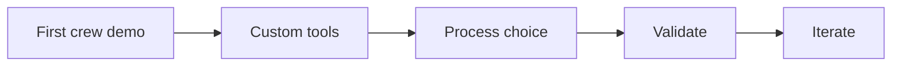
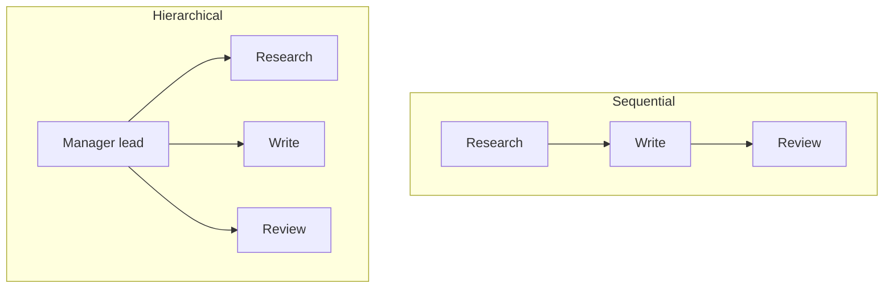

# CrewAI: End-to-End Multi-Agent Workflow

## Context of This Session

In the **previous** session you staffed a first **CrewAI** team: agents with **role**, **goal**, and **backstory**; **tasks** with expected outputs; a sequential **crew**; one **kickoff**; three inspectable artifacts.

This session upgrades that Placement Brief Crew into a **production-style workflow**. You add **custom tools**, choose **sequential** or **hierarchical** process, treat **memory** as optional, **validate** the result, and **iterate** on one weak role or task.

**In this session, you will:**

- **Extend** campus agents with tools that belong only to the researcher
- **Choose** sequential or hierarchical process and run the matching crew
- **Validate** the brief against accuracy, completeness, and format
- **Refine** one role or task prompt after a crew-level failure, then kick off again

---

## From a Demo Crew to a Production-Style Workflow

Connecting sentence: A first kickoff proves the team can run. A weekly desk must survive Monday morning.

- **Official Definition:** A **production-style** CrewAI workflow is an end-to-end multi-agent run with the right tools, an explicit **process**, optional **memory**, **output validation**, and **iteration** on failure.
- **In Simple Words:** Not a one-scene film shoot. A live campus newsroom with sources, a traffic rule, a pre-publish checklist, and a rewrite of the weak brief.
- **Real-Life Example:** **Ananya** already produced one faculty page for Prof. Meera Kulkarni at Greenfield Institute of Technology, Pune. Meera now wants that same stipend brief **every week**, with register lookups and a pass/fail checklist.



**Need:** Fluent prose can still hide a guessed headcount. Tools, process, and a checklist make the run **defensible**.

**Common doubt:** *“Is production-style a new product?”* — No. Same CrewAI nouns. Stricter contracts and a habit of measuring the packet.

### Activity — Name the upgrade

Write one line: what your first crew already did, and one line: what a **weekly** stipend brief still lacks.

---

## Custom Tools for Tool-Enabled Agents

Connecting sentence: Identity is not enough. A weekly researcher needs **lookups**; a writer still must not wander.

- **Official Definition:** A **custom tool** is a Python function you register (for example with `@tool`) so an agent may call it during a task. **Tool-enabled** means that agent’s `tools=[...]` list is not empty.
- **In Simple Words:** Extra ability cards. Issue them only to the desk that should swipe them.
- **Real-Life Example:** The placement researcher may open `campus_facts.txt` **and** `stipend_register.txt`. The writer drafts from notes. The reviewer compares texts.

| Tool | Who gets it | Honest miss |
|---|---|---|
| Campus Facts Lookup | Researcher | File text only — no rumours |
| Stipend Register Lookup | Researcher | `UNKNOWN_COMPANY` if the name is not listed |

**Logic:** Two catalogues still sit with the librarian. Give both to the novelist and they skip the researcher.

**Common error:** Attaching both tools to every agent “to be safe.” That is how a third company appears with a confident headcount.

### Activity — Who holds the card?

Nimbus Analytics is on the register; Infosys is not. Who should call Stipend Register Lookup, and what must the tool return for Infosys?

---

## Sequential vs Hierarchical Process

Connecting sentence: Tools decide *what* an agent can fetch. **Process** decides *how* work moves.

- **Official Definition:** A **sequential process** (`Process.sequential`) runs tasks in list order so later tasks consume earlier outputs. A **hierarchical process** (`Process.hierarchical`) uses a **manager** LLM or manager agent to assign and check specialist work.
- **In Simple Words:** Sequential is a relay. Hierarchical is an assignment editor who can send a story back.
- **Real-Life Example:** A Monday stipend brief is naturally research → write → review. A messy week where Meera must re-brief the researcher mid-run is when hierarchy earns its keep.



| Process | When it fits this campus desk |
|---|---|
| **Sequential** | Later packets truly depend on earlier ones; logs stay easy |
| **Hierarchical** | A lead must redirect weak research before writing starts |

**This lab’s choice:** **sequential**. The handoff is the product. Hierarchical is the switch you will see in the same script (`USE_HIERARCHICAL`).

**Common error:** Picking hierarchical because it sounds more “enterprise.” A vague manager role adds noise, not quality.

### Activity — Defend the process

Write two sentences: why sequential fits Meera’s weekly brief, and one situation where you would turn hierarchical **on**.

---

## Optional Memory

Connecting sentence: Process is the traffic rule for **one** kickoff. **Memory** is whether the desk keeps notes for the **next** edition.

- **Official Definition:** **Memory** in CrewAI is optional crew-level retention of useful context across steps or runs (`memory=True` on `Crew`).
- **In Simple Words:** A shared desk notebook. Helpful when Monday’s brief should remember last week’s `UNCERTAIN` list. Not required for a first strong weekly run.
- **Real-Life Example:** If Ananya kicks off twice in one day on the same stipend topic, memory can reduce repeated fog. If each run must stay inside this week’s two files, leave memory **off**.

**This lab:** `memory=False`. Bounded files are the source of truth. Turn memory on later when repeated context is a real need, and confirm extra packages on your install.

**Common doubt:** *“Will memory stop hallucinations?”* — No. It stores context. Validation still catches invented companies.

---

## Output Validation — Accuracy, Completeness, Format

Connecting sentence: Kickoff returns a packet. **Validation** decides whether faculty may see it.

- **Official Definition:** **Output validation** checks a crew result against success criteria. This lab uses three: **accuracy**, **completeness**, and **format**.
- **In Simple Words:** A pre-publish checklist. Pretty is not the same as pass.
- **Real-Life Example:** A Pune faculty brief that names Infosys fails **accuracy**. A brief missing “Who is affected” fails **completeness**. A wall of text with no table fails **format**.

| Check | Question | Fail signal |
|---|---|---|
| **Accuracy** | Do claims stay inside facts + register? | Extra company; invented unpaid total |
| **Completeness** | Are required section phrases present? | Missing What happened / Who is affected / next step |
| **Format** | Is the shape usable? | No markdown headings; no quality table |

**Logic:** You already mapped “who drove what” after the first crew. Validation turns that reading habit into **pass/fail**, not only a notebook table.

### Activity — Score a fake page

A brief mentions Nimbus and Riverbank, skips “Recommended next step,” and includes a Driven-by table. Tick accuracy / completeness / format as pass or fail.

---

## Iteration — Fix the Weak Link

Connecting sentence: A failed check is not “the AI team failed.” It is a pointer to **one** role or task.

- **Official Definition:** **Iteration** here means changing the role description or **task prompt** that caused a crew-level failure, then kicking off again — not rewriting every agent at once.
- **In Simple Words:** Fix the weak brief, not the whole newsroom.
- **Real-Life Example:** If Infosys appears, tighten the **writer** expected output first (“no company names except those in the notes”). If research bullets are a novel, tighten the **researcher** expected output.

**Common error:** Changing backstories, tools, and process in one panic edit. You will not know what helped.

### Activity — One knob

If completeness fails because “Who is affected” is missing, which **one** field do you edit first — writer `expected_output`, or reviewer backstory?

---

## Lab Setup

Connecting sentence: Same key habit as the first crew: secrets in `.env`, facts on disk, script beside the files.

Create folder `placement_brief_prod`. Inside it, `.env` (do **not** commit):

```text
OPENAI_API_KEY=your_openai_key_here
```

Install:

```bash
pip install crewai python-dotenv
```

If the classroom model name differs, change only the `LLM(...)` line after setup works.

---

## Bounded Scenario — Weekly Placement Brief

Connecting sentence: The fence is still local files. This week the researcher gets a **register** as well as a facts sheet.

Save `campus_facts.txt`:

```text
Campus: Greenfield Institute of Technology, Pune
Placement cell lead: Prof. Meera Kulkarni
Ops desk: Ananya, Campus Ops Inbox, Bengaluru-Pune training campus
Issue: June internship stipends delayed for 14 students (2026 summer cohort)
Companies named in file: Nimbus Analytics; Riverbank Retail
Evidence date: email dated 28 July
Stipend range on file: Rs 8,000 to Rs 15,000 per month
Already done: one reminder email to company HR on 4 August
Not done: no trainer Slack alert yet
Policy: delays above 21 days are high urgency
Do not invent: other company names, per-student unpaid totals, legal threats
```

Save `stipend_register.txt`:

```text
Company | Students affected | June status | Last HR reminder | Trainer Slack
Nimbus Analytics | 8 | delayed | 4 August | not sent
Riverbank Retail | 6 | delayed | 4 August | not sent
```

**Goal of the run:** A faculty-facing weekly brief on **internship stipend delays**, using only these files, then a printed checklist.

---

## Full Production Crew Script

Connecting sentence: Two files are the fence. The script is the weekly desk: two tools, three specialists, sequential kickoff, then validation.

Save as `placement_brief_prod.py` next to both text files and `.env`.

```python
# placement_brief_prod.py — production-style sequential CrewAI workflow
from pathlib import Path  # locate facts and register files beside this script
from dotenv import load_dotenv  # load OPENAI_API_KEY from .env
from crewai import Agent, Task, Crew, Process, LLM  # CrewAI building blocks
from crewai.tools import tool  # turn Python functions into agent tools

load_dotenv()  # read the API key before any LLM call
BASE = Path(__file__).parent  # folder that holds the two knowledge files
FACTS_PATH = BASE / "campus_facts.txt"  # bounded narrative facts
REGISTER_PATH = BASE / "stipend_register.txt"  # bounded student-count register
USE_HIERARCHICAL = False  # keep False for the relay; True tries manager-led process
USE_MEMORY = False  # optional desk notebook; off so files stay the source of truth

llm = LLM(model="openai/gpt-4o-mini", temperature=0.2)  # shared model; low temperature for facts


@tool("Campus Facts Lookup")  # register a named tool for the researcher
def campus_facts_lookup(query: str) -> str:  # query is what the agent asks
    """Read the local campus facts file. Never invent companies or amounts."""  # tool description the agent sees
    text = FACTS_PATH.read_text(encoding="utf-8")  # load the facts fence
    return f"Query: {query}\n\nFacts file:\n{text}"  # return file text only


@tool("Stipend Register Lookup")  # second custom tool — still researcher-only
def stipend_register_lookup(company: str) -> str:  # company name to look up
    """Look up one company in the stipend register. Return UNKNOWN_COMPANY if missing."""  # honest miss contract
    raw = REGISTER_PATH.read_text(encoding="utf-8")  # load the register fence
    needle = company.strip().lower()  # normalise the ask
    for line in raw.splitlines()[1:]:  # skip the header row
        if needle and needle in line.lower():  # match a known company row
            return f"REGISTER_ROW: {line}"  # return the matching line
    return f"UNKNOWN_COMPANY: {company}"  # honest miss — do not invent a row


researcher = Agent(  # tool-enabled specialist
    role="Campus Placement Researcher",  # job title
    goal="Extract only file-backed facts and register rows for the topic.",  # success
    backstory="Pune placement-cell staff. You call both lookup tools. You never invent headcounts.",  # fence
    llm=llm,  # model
    tools=[campus_facts_lookup, stipend_register_lookup],  # both catalogues
    verbose=True,  # print thinking
    allow_delegation=False,  # sequential run keeps the ticket here
)  # end researcher

writer = Agent(  # drafts from notes only
    role="Placement Brief Writer",  # job title
    goal="Turn research notes into a four-section brief with no new facts.",  # success
    backstory="You write notices faculty can scan in two minutes. Simple Indian English only.",  # style
    llm=llm,  # same model, different role
    tools=[],  # no lookups
    verbose=True,  # observable
    allow_delegation=False,  # stay in the writer seat
)  # end writer

editor = Agent(  # labels quality; does not invent
    role="Quality Reviewer",  # job title
    goal="Check draft against notes and label who drove each segment.",  # success
    backstory="You flag claims not in the notes. You do not invent replacement facts.",  # fence
    llm=llm,  # review stance
    tools=[],  # compare texts only
    verbose=True,  # observable
    allow_delegation=False,  # stay in the reviewer seat
)  # end editor

manager = Agent(  # used only if USE_HIERARCHICAL is True
    role="Placement Cell Lead",  # Meera-style coordinator
    goal="Assign specialist work and refuse a brief that invents companies or amounts.",  # success
    backstory="You lead the GIT Pune placement cell. You redirect weak research before writing.",  # stance
    llm=llm,  # manager model
    allow_delegation=True,  # hierarchy needs delegation
)  # end manager

research_task = Task(  # ticket 1
    description=(  # {topic} filled at kickoff
        "Use Campus Facts Lookup and Stipend Register Lookup for {topic}. "  # tool names
        "List only what the files support. Mark gaps as UNCERTAIN. Include student counts from the register."  # fence
    ),  # end description
    expected_output=(  # contract for the writer
        "Markdown 6 to 10 bullets with source hints, student counts from the register, and a short UNCERTAIN list."  # shape
    ),  # end expected output
    agent=researcher,  # owner
    output_file="output/01_research_notes.md",  # artifact
)  # end research_task

write_task = Task(  # ticket 2
    description=(  # writing ticket
        "Using only the research notes, write a weekly placement brief on {topic}. "  # no extra files
        "Sections: Title, What happened, Who is affected, Recommended next step. "  # required shape
        "Do not add companies, amounts, dates, or headcounts that are not in the notes."  # accuracy fence
    ),  # end description
    expected_output="Markdown brief with those four sections and no new facts.",  # contract
    agent=writer,  # owner
    context=[research_task],  # wait for research
    output_file="output/02_draft_brief.md",  # artifact
)  # end write_task

review_task = Task(  # ticket 3
    description=(  # review ticket
        "Compare the draft with the research notes. Keep good sentences. "  # no new facts
        "Label each paragraph FROM_RESEARCH, FROM_WRITER_STYLE, or FLAGGED. "  # who drove what
        "Return the final brief plus a quality table with columns Segment | Driven by | Notes."  # format
    ),  # end description
    expected_output="Final markdown brief, then a Driven-by quality table.",  # contract
    agent=editor,  # owner
    context=[research_task, write_task],  # both earlier packets
    output_file="output/03_final_brief.md",  # artifact
)  # end review_task

crew = Crew(  # one weekly desk
    agents=[researcher, writer, editor],  # specialists (manager is extra when hierarchical)
    tasks=[research_task, write_task, review_task],  # run order for sequential
    process=Process.hierarchical if USE_HIERARCHICAL else Process.sequential,  # process choice
    **({"manager_agent": manager} if USE_HIERARCHICAL else {}),  # omit lead on sequential
    memory=USE_MEMORY,  # optional notebook
    verbose=True,  # crew logs
)  # end crew


def validate_brief(text: str) -> dict:  # checklist after kickoff
    """Return pass/fail for accuracy, completeness, and format."""  # human-facing checker
    lower = (text or "").lower()  # case-insensitive scan
    banned = ["infosys", "tcs", "wipro", "legal notice", "lawsuit"]  # accuracy fences
    accuracy = not any(word in lower for word in banned)  # fail if invented names or legal threats
    accuracy = accuracy and ("nimbus" in lower or "riverbank" in lower)  # must mention a file company
    completeness = all(  # required sections
        heading in lower for heading in ["what happened", "who is affected", "recommended next step"]  # phrases
    )  # end completeness
    fmt = ("|" in (text or "")) and ("driven" in lower or "flagged" in lower or "from_research" in lower)  # table-like format
    return {"accuracy": accuracy, "completeness": completeness, "format": fmt}  # three ticks


if __name__ == "__main__":  # run only when executed directly
    result = crew.kickoff(inputs={"topic": "internship stipend delays"})  # start the weekly run
    final_text = str(result)  # CrewOutput as text for the checklist
    print("=== FINAL CREW OUTPUT ===")  # banner
    print(final_text)  # usually the last task
    checks = validate_brief(final_text)  # production-style gate
    print("=== VALIDATION CHECKLIST ===")  # banner
    for name, passed in checks.items():  # one line per criterion
        print(name, "PASS" if passed else "FAIL")  # readable ticks
    print("=== PER-TASK ARTIFACTS ===")  # banner
    for item in result.tasks_output:  # one object per task
        print("---")  # separator
        print("Agent:", item.agent)  # which role
        print((item.raw or "")[:400])  # short preview
```

**How the code works:**

- Two `@tool` functions wrap **local files**. Only `researcher` receives both. Writer and editor get `tools=[]`.
- `UNKNOWN_COMPANY` is a designed miss. The researcher must put Infosys-style names in `UNCERTAIN`, not in a fake row.
- `USE_HIERARCHICAL` switches **process semantics**. Sequential is the default for this relay. Hierarchical adds `manager_agent`.
- `USE_MEMORY` is the optional notebook. It stays **False** so this week’s files remain the fence.
- `validate_brief` is **your** gate: accuracy (no banned names; a file company present), completeness (three section phrases), format (table-like quality labels).
- `kickoff` still fills `{topic}`. Open `output/` before you trust the printed ticks.

Run:

```bash
python placement_brief_prod.py
```

| Symptom | Likely cause | Fix |
|---|---|---|
| Auth error | `.env` not loaded | Confirm `OPENAI_API_KEY` and `load_dotenv()` |
| File not found | Text files not beside the script | Same folder as `placement_brief_prod.py` |
| Register unused | Tool missing on researcher | `tools=[campus_facts_lookup, stipend_register_lookup]` |
| Writer invents Infosys | Weak write contract | Tighten `expected_output`; re-run once |
| Hierarchical confusion | Manager goal too vague | Keep `USE_HIERARCHICAL = False` until sequential is clean |

---

## After Kickoff — Read, Then Tick

Connecting sentence: Validation is not a substitute for opening artifacts. It is the last gate after you have read them.

1. Open `output/01_research_notes.md`. Are both companies there? Are counts **8** and **6** from the register? Is Infosys absent except perhaps under `UNCERTAIN`?
2. Open `output/02_draft_brief.md`. Four sections? Any new number?
3. Open `output/03_final_brief.md`. Did the reviewer **flag** leftovers or quietly keep them?
4. Read the terminal checklist. If **accuracy** fails, do not argue with the prose — fix the writer or reviewer contract.

**Healthy research bullet:** `Nimbus Analytics: 8 students delayed (stipend register).` **Weak bullet:** `Several IT firms in Pune owe stipends.`

### Activity — Map three segments

Copy three short phrases from the final brief. Label each **researcher**, **writer**, **reviewer**, or **flagged**.

---

## One Failure Mode, One Refinement

Connecting sentence: Pick **one** failed tick. Change **one** prompt. Kick off again.

**Identified failure (common):** Writer (or weak review) introduces a third company. **Accuracy** fails.

**Refinement:** Add this sentence to the writer `expected_output` only: `Company names allowed: only those listed in the research notes.`

Re-run. Compare `02_draft_brief.md` before and after. Completeness and format should not be your first edits if accuracy already failed.

### Activity — Predict the miss

Temporarily set `USE_HIERARCHICAL = True` only after sequential passes. Predict one log difference: a **Placement Cell Lead** appears. If the brief gets worse, switch back. Process is a design choice, not a badge.

Connecting sentence: Hierarchy is a **switch**, not a promotion. Read the log for a lead, then still open the three files.

| After you flip `USE_HIERARCHICAL` | Healthy sign | Unhealthy sign |
|---|---|---|
| Terminal names | Placement Cell Lead plus the three specialists | Only the lead writing the whole brief |
| Research packet | Still has register counts | Lead skipped the researcher |
| Checklist | Same three ticks | Accuracy worse because the manager invented a company |

**Need:** Meera-as-manager is useful when research is weak *and* someone must send it back. It is wasteful when the relay already works.

### Activity — Same checklist, both processes

Write one sentence: which two validation ticks must still pass if you turn hierarchical on? (Hint: accuracy and completeness do not care who the chair was.)

---

## What “Good” Looks Like on This Weekly Desk

A successful production-style run has all of the following:

- Researcher called **both** tools (visible in verbose logs)
- Register counts appear in research notes
- Draft uses the four required sections
- Final page includes a Driven-by table
- Checklist prints three **PASS** lines — or you can name the **one** FAIL and the field you will iterate
- No extra company names

Stiff prose is acceptable. An invented fact is a **crew-design** bug.

**Upcoming** work uses **dialogue-driven** agent pairs (not only fixed tickets), then hosted builders and ops. This session’s job is a **checkable CrewAI workflow**.

---

## Key Takeaways

- A **production-style** crew adds **custom tools**, a defended **process**, optional **memory**, **output validation**, and **iteration**.
- Give lookups only to the agent who should have them; sequential fits a research–write–review relay; hierarchical needs a clear manager.
- Validate **accuracy**, **completeness**, and **format** before faculty see the page.
- Fix one role or task prompt per failure — then kick off again.

These habits — right tools, right process, a checklist, one honest fix — are what you will reuse when work moves from crew tickets to conversational agent pairs in **upcoming** sessions.

---

## Important Commands, Libraries, and Terminologies Used

| Term / Command | Type | Meaning |
|---|---|---|
| **Production-style workflow** | Habit | Tools + process + validation + iteration |
| **Custom tool** | Function | `@tool` helper an agent may call |
| **Tool-enabled agent** | Pattern | Non-empty `tools=[...]` on the right role |
| **Process.sequential** | Process | Tasks run in list order |
| **Process.hierarchical** | Process | Manager assigns and checks |
| **manager_agent** | Field | Lead used when hierarchical is on |
| **Memory** | Optional | Crew-level retained context (`memory=True`) |
| **Output validation** | Habit | Accuracy, completeness, format checklist |
| **Accuracy** | Check | Claims stay inside files / tools |
| **Completeness** | Check | Required sections present |
| **Format** | Check | Expected shape (headings, table) |
| **Iteration** | Habit | Change one role or task, re-run |
| **UNKNOWN_COMPANY** | Tool result | Honest miss from the register |
| **Kickoff** | Method | `crew.kickoff(inputs=...)` |
| `pip install crewai python-dotenv` | Command | Install CrewAI and `.env` loader |
| `python placement_brief_prod.py` | Command | Run the weekly desk |
| `validate_brief` | Function | Prints accuracy / completeness / format ticks |
| `USE_HIERARCHICAL` | Flag | Switches sequential vs manager-led process |
| `stipend_register.txt` | File | Bounded student-count source for the researcher |
