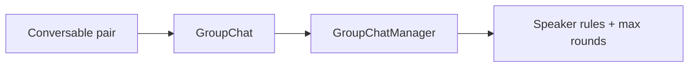
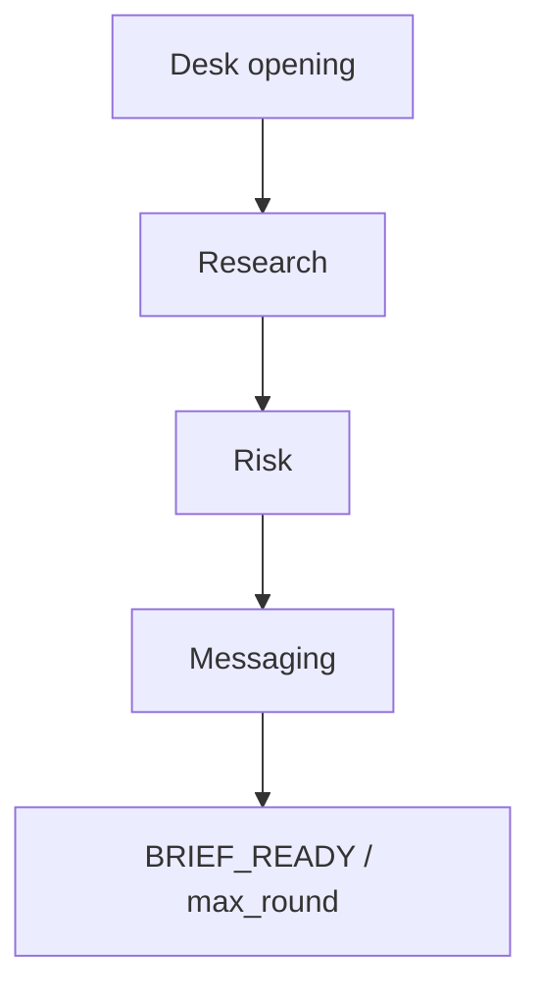
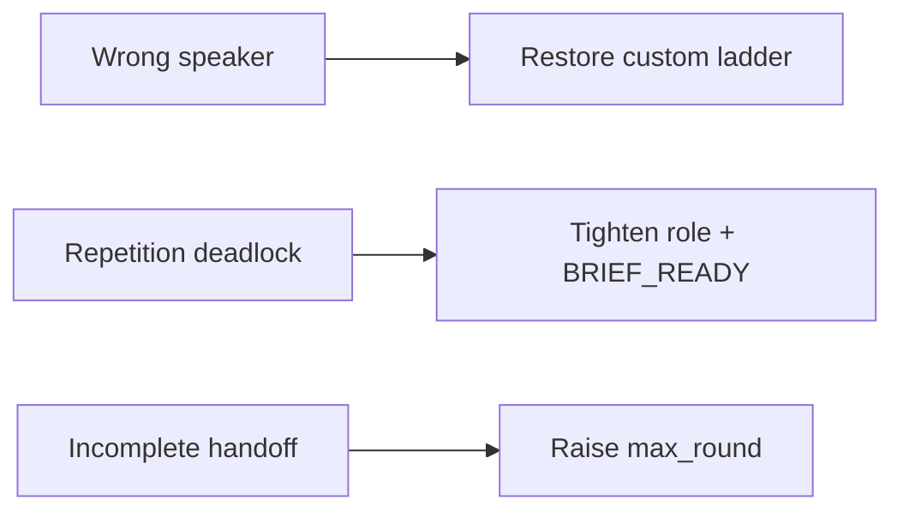

# AutoGen: Group Chat and Multi-Agent Orchestration

## Context of This Session

In the **previous** session you built an AutoGen **conversable pair**: **AssistantAgent**, **UserProxyAgent**, **register_function**, **termination**, and a **conversation trace** for Ananya’s daily stipend-and-dispatch summary.

This session scales that idea. A **placement-drive briefing** plus a **stipend-tracker feature launch** needs three specialists in one room: research, risk, and messaging, under a **GroupChatManager**, with **speaker selection**, **max rounds**, and clear **handoffs**.

**In this session, you will:**

- **Design** a group of three or more specialized agents for one campus briefing
- **Configure** speaker selection and **max rounds** so the dialogue cannot run forever
- **Run** a chat where each agent contributes a **distinct sub-result**
- **Diagnose** repetition deadlock or wrong speaker and apply one configuration fix

---

## From Agent Pairs to Orchestrated Group Dialogue

Connecting sentence: A pair finishes a delegated lookup. A launch brief needs **several experts** who must not all talk at once.

- **Official Definition:** **Orchestration** is the set of rules that control turn-taking, handoffs, and closure in a multi-agent conversation.
- **In Simple Words:** A chairperson and an agenda, not a WhatsApp group with no admin.
- **Real-Life Example:** Prof. Meera Kulkarni wants one packet: known internship facts, policy fences, and student-facing copy for a **stipend-status tracker** launch during a Pune **placement drive**.



**Need:** Three separate documents that nobody reconciled is how Infosys appears in a cheerful notice. One shared thread with a chair is how the campus ships **one** briefing.

**Common doubt:** *“Can I just add a third AssistantAgent to the pair chat?”* — Without a **GroupChat** and speaker policy, you get a noisy meeting.

### Activity — Name the extra seat

Write one line: what the pair already did well, and one line: what a drive-plus-launch brief still needs.

---

## GroupChat and GroupChatManager

Connecting sentence: Orchestration needs a **room** and a **chair**. AutoGen names both.

- **Official Definition:** A **GroupChat** is a shared message space for multiple conversable agents. A **GroupChatManager** is the coordinator that runs that space under your rules.
- **In Simple Words:** The meeting room, and the person who gives the floor.
- **Real-Life Example:** Ananya’s Campus Ops Inbox supplies the opening ask. The manager is not a fourth novelist. It is the chair who calls research, then risk, then messaging.

| Piece | Job | Campus mapping |
|---|---|---|
| **GroupChat** | Holds the shared transcript | One briefing thread |
| **GroupChatManager** | Applies flow and stop rules | Placement-cell chair |
| **UserProxyAgent** | Starts the case; optional tool executor | Desk runner |
| **AssistantAgent** × 3 | Distinct specialties | Research / risk / messaging |

**Optional human input:** `human_input_mode` on the user-side agent can be `NEVER` (this lab’s demo), `TERMINATE` (ask a human only at the end), or `ALWAYS` (Meera types every turn). Always-on input is slow on Zoom. Know the knob; keep the demo automatic.

**Common error:** Treating the manager as a fourth writer. If the chair drafts student copy, you cannot see which specialist failed.

### Activity — Chair vs specialist

Who should write the student notice — **GroupChatManager** or **MessagingSpecialist**? Write one sentence why.

---

## Speaker Selection, Handoffs, and Max Rounds

Connecting sentence: A room and a chair are not enough. You must say **who speaks next** and **when the meeting dies**.

- **Official Definition:** **Speaker selection** is the policy for the next speaker (auto, round-robin, or a custom function). A **multi-agent handoff** is the designed move of work from one specialist to another. **Max rounds** (`max_round`) is a hard cap on group turns.
- **In Simple Words:** Call the right expert; pass the folder; ring the bell.
- **Real-Life Example:** After research lists Nimbus and Riverbank, **risk** must speak before **messaging** turns notes into a poster. If messaging speaks first, the poster invents urgency-as-lawsuit.



| Control | Failure it prevents |
|---|---|
| Custom speaker ladder | **Wrong speaker** (copywriter answering policy) |
| Handoff in system messages | **Incomplete handoff** (risk never sees research) |
| `max_round` | **Runaway dialogue** and **repetition deadlock** |

**This lab:** a small custom `select_briefing_speaker` function: research → risk → messaging, with the desk runner only if you later add tools. **Max rounds = 10**.

**Common error:** `max_round=3` on a three-specialist brief. The meeting dies before messaging speaks. That is not “efficient.” It is an incomplete handoff.

### Activity — Set the bell

If each specialist needs one substantial turn, what is the **smallest** `max_round` you would try — 4, 10, or 40 — and why not 40?

---

## Three Specialists, One Complex Task

Connecting sentence: Selection rules only work if each agent owns a **slice**.

| Specialist | Distinct sub-result | Must not do |
|---|---|---|
| **ResearchSpecialist** | File-backed facts: 14 students, two companies, tracker will show delay status | Write final student copy |
| **RiskSpecialist** | Fence list: no legal threats, no unpaid totals, no extra companies | Invent replacement facts |
| **MessagingSpecialist** | Faculty/student notice from **approved** lines only | Invent Nimbus headcount |

**Bounded facts** (inside the script, same fence as earlier campus files): Greenfield Institute of Technology, Pune; June stipends delayed; Nimbus Analytics; Riverbank Retail; Rs 8,000–15,000 range; HR reminder 4 August; trainer Slack not sent; tracker launch is a **status board**, not a payment guarantee.

**Completion signal:** Messaging ends with `BRIEF_READY`. The manager uses the same `is_done` check.

### Activity — Fill the slices

On paper, write one bullet each specialist must produce for *“placement drive + stipend tracker launch.”*

---

## Lab Setup

Connecting sentence: Same key as the pair lab. The group only adds orchestration objects.

Create folder `placement_drive_group`. `.env`:

```text
OPENAI_API_KEY=your_openai_key_here
```

```bash
pip install ag2 python-dotenv
```

Keep **code execution off**. This briefing is words and fences, not generated scripts.

---

## Full Group Script

Connecting sentence: The facts are the fence. The script is the chaired meeting: three specialists, one desk starter, custom speaker policy, round cap.

Save as `placement_drive_group.py`.

```python
# placement_drive_group.py — AutoGen group chat for a placement-drive briefing
import os  # read OPENAI_API_KEY
from dotenv import load_dotenv  # load .env
from autogen import (  # group-chat building blocks
    AssistantAgent,  # specialists
    UserProxyAgent,  # desk starter
    GroupChat,  # shared room
    GroupChatManager,  # chair
)  # end import

load_dotenv()  # load the key
API_KEY = os.getenv("OPENAI_API_KEY", "")  # empty if missing

llm_config = {  # shared model settings
    "config_list": [{"model": "gpt-4o-mini", "api_key": API_KEY}],  # classroom model
    "temperature": 0.2,  # steady campus facts
}  # end llm_config

FACTS = (  # bounded briefing fence
    "Campus: Greenfield Institute of Technology, Pune. "  # institute
    "Lead: Prof. Meera Kulkarni. Ops: Ananya, Campus Ops Inbox. "  # people
    "Issue: June internship stipends delayed for 14 students. "  # problem
    "Companies: Nimbus Analytics; Riverbank Retail. "  # on-file names
    "Range on file: Rs 8000 to 15000 per month. "  # stipend range
    "HR reminder sent 4 August. Trainer Slack not sent. "  # dispatch facts
    "Launch: stipend-status tracker shows delay status only — not a payment promise. "  # feature fence
    "Do not invent companies, unpaid totals, or legal threats."  # hard no
)  # end FACTS


def is_done(message) -> bool:  # shared stop rule
    content = (message.get("content") or "") if isinstance(message, dict) else str(message)  # safe text
    return "BRIEF_READY" in content.upper() or "TERMINATE" in content.upper()  # completion stamps


research = AssistantAgent(  # specialist 1
    name="ResearchSpecialist",  # trace label
    system_message=(  # slice
        "You are campus research for a GIT Pune placement-drive briefing. "  # seat
        f"Use only these facts: {FACTS} "  # fence
        "Write 5 to 7 bullets of evidence. No student-facing poster. No legal language. "  # sub-result
        "Do not mention companies that are not in the facts."  # accuracy
    ),  # end research message
    llm_config=llm_config,  # model
)  # end research

risk = AssistantAgent(  # specialist 2
    name="RiskSpecialist",  # trace label
    system_message=(  # slice
        "You are policy risk for the placement cell. "  # seat
        "Read research bullets. List fences: no extra companies, no unpaid totals, "  # fences
        "no legal threats, tracker is status-only. Flag any invented claim. "  # flags
        "Do not write the final student notice."  # not messaging
    ),  # end risk message
    llm_config=llm_config,  # model
)  # end risk

messaging = AssistantAgent(  # specialist 3
    name="MessagingSpecialist",  # trace label
    system_message=(  # slice
        "You write faculty and student messaging for the stipend-tracker launch. "  # seat
        "Use only research bullets that Risk did not flag. "  # approved inputs
        "Produce a short notice with Title, What students will see, What we will not claim. "  # shape
        "End with the line BRIEF_READY. Never invent facts."  # stop stamp
    ),  # end messaging message
    llm_config=llm_config,  # model
)  # end messaging

desk = UserProxyAgent(  # starts the meeting
    name="CampusDeskRunner",  # trace label
    human_input_mode="NEVER",  # automatic demo; optional human input stays off
    code_execution_config=False,  # no generated code
    is_termination_msg=is_done,  # stop on BRIEF_READY
)  # end desk


def select_briefing_speaker(last_speaker, groupchat):  # custom speaker selection
    messages = groupchat.messages  # shared transcript
    if not messages:  # first turn after kickoff
        return research  # research speaks first
    if last_speaker is research:  # research handoff
        return risk  # then policy
    if last_speaker is risk:  # risk handoff
        return messaging  # then copy
    if last_speaker is messaging:  # notice done or repeating
        return messaging  # stay until BRIEF_READY / max_round
    return research  # safe default


groupchat = GroupChat(  # the room
    agents=[desk, research, risk, messaging],  # roster
    messages=[],  # fresh transcript
    max_round=10,  # hard stop against runaway dialogue
    speaker_selection_method=select_briefing_speaker,  # chair rules
)  # end groupchat

manager = GroupChatManager(  # the chair
    groupchat=groupchat,  # attach the room
    llm_config=llm_config,  # available if the manager must speak
    is_termination_msg=is_done,  # same close rule
)  # end manager


def print_trace():  # quality-review helper
    print("=== GROUP CONVERSATION TRACE ===")  # banner
    for i, msg in enumerate(groupchat.messages, start=1):  # numbered turns
        name = msg.get("name") or msg.get("role") or "unknown"  # speaker
        content = str(msg.get("content") or "")[:220]  # preview
        print(f"{i}. [{name}] {content}")  # one line
    print("=== END TRACE ===")  # footer


if __name__ == "__main__":  # direct execution only
    if not API_KEY:  # fail clearly
        raise ValueError("Set OPENAI_API_KEY in .env")  # setup
    opening = (  # complex campus task
        "Prepare one placement-drive briefing for faculty and a student notice "  # two audiences
        "for the stipend-status tracker launch. Research, then risk, then messaging. "  # order
        "Stay inside known campus facts."  # fence
    )  # end opening
    desk.initiate_chat(manager, message=opening)  # start through the chair
    print_trace()  # inspect handoffs
```

**How the code works:**

- Three **AssistantAgent** specialists have **non-overlapping** system messages. Each must produce a different sub-result.
- **GroupChat** is the shared room. **GroupChatManager** is the chair `initiate_chat` talks to.
- `select_briefing_speaker` encodes **handoffs**: research → risk → messaging. That is **speaker selection**, not round-robin luck.
- `max_round=10` is the bell. `BRIEF_READY` is the success stamp. Together they stop **runaway dialogue**.
- `human_input_mode="NEVER"` is the optional-human choice for the demo. Switch later if Meera must approve the notice live.

Run:

```bash
python placement_drive_group.py
```

---

## Diagnose One Failure Mode and Fix Configuration

Connecting sentence: A messy trace is a **configuration** document, not a reason to scrap the team.

- **Official Definition:** A **group-chat failure mode** is a repeatable bad pattern such as **repetition deadlock** (same points, no progress) or **wrong speaker** (the specialist who should not own this turn speaks).
- **In Simple Words:** The meeting got stuck, or the wrong person grabbed the mic.
- **Real-Life Example:** Messaging answers “can we threaten legal action?” That is **wrong speaker**. Research repeating the same seven bullets four times is **repetition deadlock**.

| Failure mode | What you see in the trace | Configuration fix to try |
|---|---|---|
| **Wrong speaker** | Messaging speaks immediately after the desk opening | Keep the custom ladder; do not use random auto select |
| **Repetition deadlock** | Risk restates research with no new fence | Tighten risk’s message; lower `max_round` slightly **after** messaging still has room |
| **Incomplete handoff** | `BRIEF_READY` never appears; messaging never speaks | Raise `max_round`; confirm the ladder returns messaging after risk |
| **Endless politeness** | “Happy to help” loops | Stronger `BRIEF_READY` instruction + `is_done` |

**Lab fix (wrong speaker):** If you temporarily set `speaker_selection_method="round_robin"`, the desk or the wrong specialist may talk out of turn. Restore `select_briefing_speaker` and re-run. That is a **configuration** fix, not a new framework.

**Lab fix (deadlock):** If messaging never prints `BRIEF_READY`, add the sentence *End with BRIEF_READY on the first complete notice* to the messaging system message only. Re-run once.

### Activity — Trace detective

After the run, fill: Did research speak before risk? Did messaging include `BRIEF_READY`? Did any extra company appear?

### Activity — Break then fix

Set `max_round=3`, re-run, write what failed (likely incomplete handoff). Restore `max_round=10` and confirm messaging returns.

### Activity — Human-input judgement

Write one sentence: when you would set `human_input_mode` so Prof. Meera approves the notice, and why you would **not** use `ALWAYS` for every specialist turn.

---

## Speaker Selection Methods — Choose on Purpose

Connecting sentence: Custom ladders are not the only AutoGen option. Know the menu so you do not pick **random** for a policy-sensitive brief.

| Method | Simple meaning | Fit for this briefing |
|---|---|---|
| **Custom function** (this lab) | You encode research → risk → messaging | Best: handoffs are the product |
| **round_robin** | Next name in the roster list | Easy to demo; easy to get **wrong speaker** |
| **auto** (LLM picks) | The model chooses who speaks | Flexible; harder to debug in class |

**Need:** A placement-drive notice that can invent legal language is a **governance** problem, not a style problem. Speaker rules are the first control. Hosted builders and ops habits come later in this module; the chair in this script is already a control.

**Common error:** Switching to `auto` because the custom function “feels rigid.” Rigidity is the point when risk must speak before messaging.

### Activity — Predict round-robin

Roster order is desk, research, risk, messaging. If round-robin starts after the opening, who might speak **before** research? Why is that a wrong-speaker risk?

---

## A Healthy Group Trace

Connecting sentence: Lock a picture of success so deadlock and wrong speaker are obvious.

| Turn (typical) | Speaker | Distinct sub-result |
|---|---|---|
| 1 | CampusDeskRunner | Opens the drive + tracker ask |
| 2 | ResearchSpecialist | 5–7 file-backed bullets |
| 3 | RiskSpecialist | Fence list; flags |
| 4 | MessagingSpecialist | Notice + **BRIEF_READY** |

If turn 2 is already messaging, **wrong speaker**. If turns 3–8 are research repeating the same Nimbus paragraph, **repetition deadlock**. If the log ends at turn 3 with only research and risk, **incomplete handoff** (often `max_round` too low).



### Activity — Label a fake log

Log: messaging, messaging, messaging, no `BRIEF_READY`. Is that wrong speaker, deadlock, or both? What **one** change do you try first?

---

## Pair vs Group — Ananya’s Week

Connecting sentence: The **previous** pair is still the right tool for a two-seat lookup. The group is for **one complex packet** with three slices.

| Campus request | Design unit |
|---|---|
| Daily “Slack sent or not?” | AutoGen **pair** + dispatch tool |
| Weekly four-section faculty brief | **CrewAI** production crew |
| Drive briefing + tracker launch copy | AutoGen **group** with chair |

Do not put three novelists in a GroupChat for a yes/no dispatch question. Do not ask one pair to own research, risk, *and* messaging without a chair.

### Activity — Choose the unit

Prof. Meera asks: “Give me one page faculty can read before the drive, with risk fences visible.” Crew, pair, or group? Write one sentence.

---

## Troubleshooting the Chaired Meeting

| Symptom | Likely cause | Fix |
|---|---|---|
| Auth error | Missing key | `.env` + `load_dotenv()` |
| Import error | Package name | `pip install ag2 python-dotenv` |
| Messaging never speaks | `max_round` too low | Restore `10`; confirm ladder after risk |
| Extra company in the notice | Weak messaging message | “Use only unflagged research”; re-run |
| Chair writes the poster | Manager treated as novelist | Keep copy in MessagingSpecialist only |
| Human waits every turn | `ALWAYS` left on | Demo with `NEVER`; use human input only at approval |

**Optional human input, restated:** Keep the automatic path until the ladder works. Then imagine `TERMINATE` mode: the group prepares the notice, and Meera types once — send, or send back to risk. That is oversight without slowing every specialist sentence.

---

## What “Good” Looks Like on This Group

A successful orchestrated run has all of the following:

- Trace shows **ResearchSpecialist**, then **RiskSpecialist**, then **MessagingSpecialist**
- Three **distinct** sub-results (bullets, fences, notice)
- No extra company names; no legal threats
- `BRIEF_READY` appears, or you can name the failure mode and the **one** setting you changed
- The meeting did not need 40 rounds of agreement

**Upcoming** work moves toward no-code scenarios (**make.com**), hosted builders, **ops**, and **governance**. This session’s job is a **chaired specialist meeting** you can debug.

### Activity — Reliability checklist

| # | Check | Done? |
|---|---|---|
| 1 | Three specialists have non-overlapping system messages | |
| 2 | Custom speaker ladder is research → risk → messaging | |
| 3 | `max_round` is high enough for messaging to speak | |
| 4 | Trace shows three distinct sub-results | |
| 5 | No extra company names in the notice | |
| 6 | BRIEF_READY (or a named failure + one fix) | |
| 7 | Human input is a choice, not an accident | |

Connecting sentence: If row 4 fails, do not start with make.com. Fix the chair in this script first.

### Activity — Distinct sub-results

Copy one phrase from each specialist in your trace. If two phrases could have come from the same role, the boundaries are still overlapping — tighten **one** system message.

---

## Optional Human Input Without Slowing the Room

Connecting sentence: Oversight is a **mode**, not a personality.

| Mode | What happens | Campus use |
|---|---|---|
| `NEVER` | Fully automatic | Class demo; ladder practice |
| `TERMINATE` | Human may speak when the group would stop | Meera approves the notice |
| `ALWAYS` | Human every turn | Slow; easy to stall a Zoom lab |

**Need:** Governance later in the module will ask who is allowed to publish. Practise the knob now so “human in the loop” is a setting you can explain, not a slogan.

**Common error:** Turning `ALWAYS` on to “be safe,” then wondering why research never finishes. Safety here is **speaker rules + max rounds + BRIEF_READY**, then a single human gate if the notice is public.

### Activity — One gate

Write the single question you would ask Prof. Meera at `TERMINATE` time. Example: *Send this student notice, or send it back to RiskSpecialist?*

---

## If the Group Never Closes

Connecting sentence: Endless politeness is still a **stop-rule** bug.

If agents keep saying “happy to help,” they never emit `BRIEF_READY`. The chair cannot guess that you are satisfied. Put the stamp in the **messaging** system message, mirror it in `is_done`, and keep `max_round` as a backstop — not as the only plan.

If `max_round` fires first, the last message may be incomplete. That is still useful evidence: raise the cap **or** shorten each specialist’s expected sub-result. Do not do both in the same panic edit.

### Activity — Name the stop

After your run, write whether the chat ended because of **BRIEF_READY** or because **max_round** was hit. Only one of those is a successful completion for this lab.

---

## Key Takeaways

- **GroupChat** plus **GroupChatManager** turn many conversable agents into one orchestrated briefing thread.
- **Speaker selection** and **handoffs** keep research, risk, and messaging in order; **max rounds** stop runaway chat.
- Each specialist must contribute a **distinct sub-result**; the chair is not a fourth novelist.
- Diagnose **wrong speaker** or **repetition deadlock** from the trace, then change **one** configuration.

These orchestration habits — room, chair, turn rules, bell — are what you will reuse when campus workflows move into hosted builders and operational governance in **upcoming** sessions.

---

## Important Commands, Libraries, and Terminologies Used

| Term / Command | Type | Meaning |
|---|---|---|
| **Orchestration** | Habit | Turn-taking, handoffs, and closure |
| **GroupChat** | Class | Shared multi-agent message room |
| **GroupChatManager** | Class | Chair that runs the group |
| **Speaker selection** | Policy | Who speaks next |
| **Multi-agent handoff** | Pattern | Work moves specialist to specialist |
| **max_round** | Setting | Hard cap on group turns |
| **Human input** | Optional | `human_input_mode` for live approval |
| **Repetition deadlock** | Failure | Same points, no progress |
| **Wrong speaker** | Failure | Unsuitable agent takes the turn |
| **BRIEF_READY** | Keyword | Group completion stamp |
| **initiate_chat** | Method | Desk starts the meeting via the manager |
| **Conversation trace** | Evidence | Ordered group messages |
| `pip install ag2 python-dotenv` | Command | Install AutoGen family and `.env` loader |
| `python placement_drive_group.py` | Command | Run the placement-drive group |
