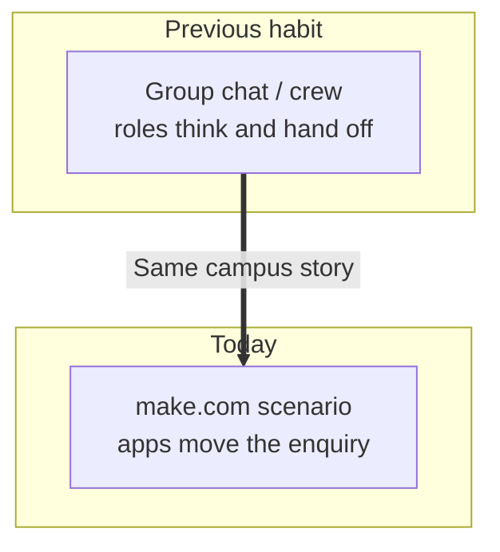
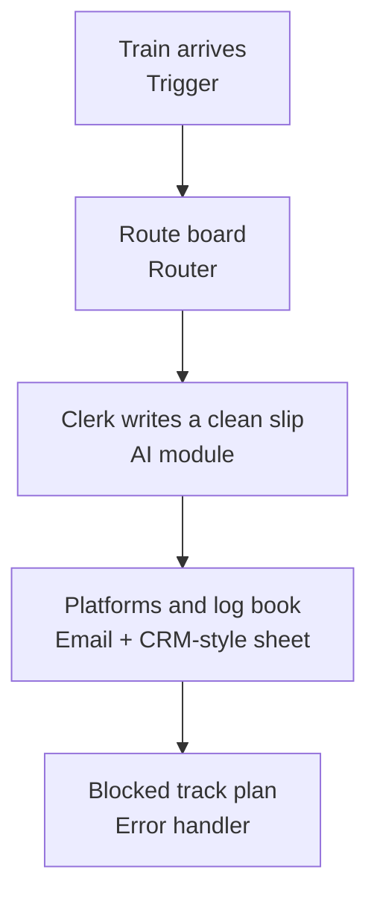
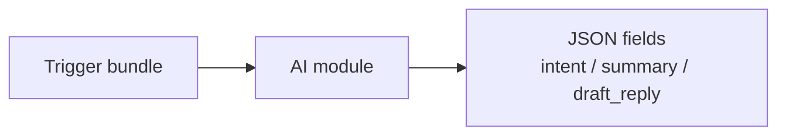
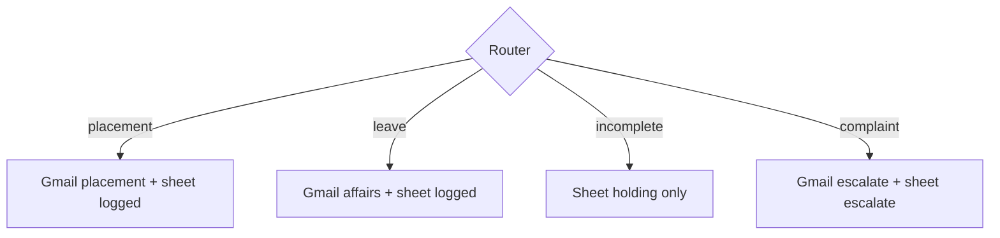

# make.com: No-Code AI Automation Scenarios

## Context of This Session

In the **previous** session you ran an **AutoGen group chat**: specialised agents, a speaker-selection policy, round limits, and one collaborative task with distinct sub-results. That was a **staffed meeting**.

This session walks out of the meeting room and onto the **ops floor**. You will wire the same campus enquiry into **make.com**: a form arrives, AI classifies it, a router picks a path, then email and a CRM-style sheet update — without writing an application.

**In this session, you will:**

- **Explain** how make.com **scenarios** serve the same integration goal as code-first automation, with a different build style
- **Assemble** a scenario with a **trigger**, a **router**, and at least one **AI-powered** transformation
- **Connect** output actions to **email** and a **spreadsheet** used as a campus CRM
- **Test** and document **one success path** and **one recoverable error path**

---

## From a Staffed Meeting to a Business Assembly Line

Crews and group chats are excellent when **roles** must think. Campus Ops still has another job: **move a row through apps** the office already uses.

- **Official Definition:** **make.com** is a no-code platform for building **scenarios** — visual workflows that connect apps, AI modules, and actions.
- **In Simple Words:** A canvas where you plug Form → AI → Gmail → Sheet without compiling a product.
- **Real-Life Example:** **Ananya** at **Greenfield Institute of Technology, Pune** should not copy every student enquiry into Prof. Meera Kulkarni’s placement register by hand.

**Need:** Code-first stacks give deep control. They are slow when the only goal is “when a form lands, classify it and email the right desk.”

**Common doubt:** *“Did we already do this in n8n?”* — Same **thinking**. Different **product**, different **connectors**, and a style ops teams meet often in Indian startups and campus offices.

---

## Scenarios Versus Code-First Automation

Connecting sentence: Before you click modules, lock the honest comparison — same destination, different vehicle.

- **Official Definition:** A **scenario** is one runnable make.com workflow: trigger, modules, routers, and actions assembled on a canvas.
- **In Simple Words:** The whole factory floor plan you turn **On**.
- **Real-Life Example:** “Student Enquiry Junction” is a scenario. “Send Gmail” is only one station.

| Lens | make.com scenario | Code-first automation |
|---|---|---|
| How you build | Visual modules and mapping | Python, REST endpoints, environment variables |
| Who can maintain | Ops / Campus Ops with training | Engineering process and reviews |
| Speed to first demo | Hours for Form → AI → Sheet | Days if you also host an API |
| Deep custom logic | Filters, routers, HTTP | Full control of every branch |
| Same goal | Reliable integration | Reliable integration |

**Logic:** Choosing make.com is not “giving up engineering.” It is picking the tool that matches **who must keep the lights on** after class.

### Activity — Pick the vehicle

Write one sentence: for Greenfield’s enquiry form, would you start with make.com or a Python HTTP API — and **who** would edit it next week?

---

## Building Blocks on the Canvas

Connecting sentence: A scenario is not one magic box. It is named stations you can point to in a review.

- **Official Definition:** A **module** is one app step on the scenario canvas (watch a form, call AI, send email, update a sheet).
- **In Simple Words:** A worker at one station.
- **Real-Life Example:** “Watch Google Form responses” is a module. So is “Create a Google Sheets row.”

| Block | Official meaning | Campus mapping today |
|---|---|---|
| **Trigger** | Event that starts a run | New student enquiry form row |
| **Router** | Splits the bundle into labelled routes | Placement / leave / incomplete / complaint |
| **AI module** | LLM classify, extract, or draft | Intent + short CRM note |
| **HTTP module** | Call any REST endpoint when no native app exists | Optional later; skip if Gmail + Sheets exist |
| **Data store** | Small key–value cupboard inside make.com | Lookup: intent → owner email |
| **Scheduling** | Run on a clock, not only on an event | Weekday 9 AM pull if the form is polled |
| **Error handling** | Directives when a module fails | Gmail timeout → “needs human” sheet |

**Common error:** Putting classify, email, and sheet update inside **one** module “to keep it simple.” You cannot test or recover a mashed station.

---

## Analogy — The Railway Junction

Connecting sentence: If the canvas feels noisy, reuse one picture for the rest of the lab.

1. The enquiry **arrives** (trigger).
2. The **route board** splits placement, leave, incomplete, complaint (router).
3. The **clerk** turns messy language into a label and a short note (AI).
4. **Platforms** update: email the desk, write the register (actions).
5. A blocked track follows a **recovery plan**, not a silent freeze (error handling).

**Logic:** Anyone can demo the express train. Professionals also document what happens when the track is blocked.

---

## Bounded Scenario — Greenfield Student Enquiry Desk

Connecting sentence: A first scenario needs a **fence**. The fence is four enquiry types and two apps: Gmail and a sheet.

Campus Ops already has a Google Form (or a sheet that receives form rows). Columns you will treat as truth:

| Field | Example |
|---|---|
| `timestamp` | 24 Aug 2026, 08:12 |
| `student_name` | Riya Sharma |
| `email` | riya.sharma@greenfield.edu |
| `message` | When is the Nimbus Analytics placement talk? |
| `source` | Campus Ops Inbox form |

**Goal of the run:** Classify the message, email the right owner, append one CRM-style row. Do **not** invent a company drive that is not in the message.

**Owners (write these in a data store or a mapping table):**

| Intent | Owner inbox | Sheet status |
|---|---|---|
| `placement` | placement@greenfield.edu | `logged` |
| `leave` | student.affairs@greenfield.edu | `logged` |
| `incomplete` | (no faculty ping) | `holding` |
| `complaint` | campus.ops@greenfield.edu | `escalate` |

This continues Ananya’s story: n8n could route a stipend complaint; crews could write a brief; group chat could debate a plan. Today the **form itself** becomes a live junction.

### Activity — Label four messages

On paper, mark each as `placement`, `leave`, `incomplete`, or `complaint`: (1) “TCS drive date?” (2) “Need 2 days leave for sister’s wedding.” (3) empty message (4) “Stipend still unpaid — this is unfair.”

---

## Lab Setup

Connecting sentence: The scenario will call an LLM and Gmail, so credentials live in make.com connections — not in a pasted chat.

1. Open [make.com](https://www.make.com) and sign in with the classroom account.
2. Create a folder named `Greenfield Campus Ops`.
3. Click **Create a new scenario**.
4. Add connections when a module asks: **Google Forms** or **Google Sheets**, **Gmail**, **OpenAI** (or the class LLM connection).
5. Keep API keys inside make.com credentials. Do **not** paste keys into Slack or the scenario notes.

If Google Forms is unavailable, **Watch new rows** on a sheet that mimics the form. The thinking is identical.

---

## Click Path — Trigger

Connecting sentence: Nothing runs until something **starts** the line.

- **Official Definition:** A **trigger** is the first module that starts a scenario run when an event occurs or a schedule fires.
- **In Simple Words:** The starting gun.
- **Real-Life Example:** “When a new Greenfield form response appears.”

### Numbered clicks (form or sheet)

1. On the empty canvas, click the **+** / **Add a module**.
2. Search **Google Forms** → **Watch Responses** (or **Google Sheets** → **Watch New Rows**).
3. Choose the enquiry form / sheet. Map the columns: name, email, message.
4. Set **Limit** to `1` while testing so one enquiry equals one run.
5. Right-click the trigger → **Run this module only** once to confirm a bundle appears.

**Scheduling note:** Instant watch uses a webhook-style push. If you must **poll**, open the scenario clock and choose a weekday interval (for example every 15 minutes in class, not every second).

**Common error:** Watching the wrong tab. Confirm the sheet name is `Enquiries`, not `Sheet1` leftovers.

### Scheduling (clock versus event)

- **Official Definition:** **Scheduling** in make.com is the scenario clock: how often a polling trigger runs, or a time module that starts work on a weekday timetable.
- **In Simple Words:** A timetable, not only a doorbell.
- **Real-Life Example:** If the form cannot push instantly, Ananya polls `Enquiries` every 15 minutes during office hours — not every second overnight.

Instant **watches** are doorbells. **Polling** is a timetable. Use the timetable when the classroom form has no webhook.

Turn the scenario **Off** on holidays so the clock does not burn operations while Campus Ops is closed.

### Activity — Name the gun

Write the trigger in one line: app + event + which campus form.

---

## Click Path — AI Classification Module

Connecting sentence: The bundle is still messy English. The next station must return a **strict label**.

- **Official Definition:** An **AI module** (OpenAI or similar) sends a prompt and returns model text you map into later modules.
- **In Simple Words:** The clerk who stamps `placement` / `leave` / `incomplete` / `complaint`.
- **Real-Life Example:** Riya’s “When is the Nimbus talk?” should not be emailed to Student Affairs.

### Numbered clicks

1. Click **Add another module** after the trigger.
2. Search **OpenAI** → **Create a Chat Completion** (or the class equivalent).
3. Model: the classroom chat model (low temperature, for example `0.2`).
4. System prompt (paste, then tighten): *You classify Greenfield student enquiries. Reply with JSON only: intent (placement|leave|incomplete|complaint), summary (max 25 words), draft_reply (two sentences). Never invent dates or company names.*
5. User prompt: map `student_name`, `email`, and `message` from the trigger bundle.
6. After one test run, add a **JSON** parse / **Parse JSON** module if the AI returns a string, so `intent` is a field — not a paragraph.

**Need:** Later routers filter on **fields**. They cannot reliably filter on a poem.

**Common doubt:** *“Should I also draft a long email here?”* — No. Keep **classify + short draft**. Long letters belong in a later module or a human.

### Activity — Tighten the stamp

Rewrite the system prompt in two lines so `incomplete` is forced when `message` is blank.

---

## Click Path — Router

Connecting sentence: One label is useless until **different exits** exist.

- **Official Definition:** A **router** in make.com copies the bundle onto multiple routes; **filters** on each route decide which path continues.
- **In Simple Words:** The railway route board.
- **Real-Life Example:** Placement FAQs go to Meera’s inbox. Complaints skip auto-cheer and escalate.

### Numbered clicks

1. After the JSON fields exist, add **Flow Control** → **Router**.
2. Create **four** routes. On each, click the wrench → **Set up a filter**.
3. Route A: `intent` Equal to `placement`.
4. Route B: `intent` Equal to `leave`.
5. Route C: `intent` Equal to `incomplete`.
6. Route D: `intent` Equal to `complaint`.
7. Optional fallback route: `intent` Does not equal any of the four — send to `needs_review`.

**Logic:** Filters must use the **parsed** `intent`, not a keyword search on the original message. “stipend” inside a polite FAQ should not steal the complaint track.

### Activity — Draw the board

On paper, draw four arrows from one router. Write one filter condition on each arrow.

---

## Click Path — Email and CRM-Style Sheet

Connecting sentence: Classification without delivery is a labelled tray that nobody empties.

- **Official Definition:** An **action module** writes to an external app (send email, append a sheet row, create a CRM record).
- **In Simple Words:** The platform announcement and the log book.
- **Real-Life Example:** A sheet named `Enquiry_CRM` is Greenfield’s cheap CRM: every enquiry gets a row, an owner, and a status.

### Numbered clicks — success path (placement)

1. On the **placement** route, add **Gmail** → **Send an Email**.
2. **To:** `placement@greenfield.edu` (or your lab inbox). **Subject:** `[Placement] {{student_name}}`.
3. **Body:** map `summary` and `draft_reply`. Do not paste the raw API key. Include the student email so staff can reply.
4. Add **Google Sheets** → **Add a Row** on `Enquiry_CRM`.
5. Map columns: timestamp, name, email, intent, summary, status=`logged`, owner=`placement`.

Repeat for **leave** with Student Affairs. For **incomplete**, skip faculty Gmail; write status=`holding` only. For **complaint**, email Campus Ops with subject `[Escalate]` and status=`escalate`; do **not** auto-send a cheerful “we have solved this” to the student.

**Common error:** Using the AI `draft_reply` as if it were already sent. The Gmail module is what **sends**. The sheet is what **proves** it.

---

## Data Stores and Lookups

Connecting sentence: Hard-coding Meera’s inbox in four Gmail modules will rot the first time the owner changes.

- **Official Definition:** A **data store** is make.com’s small persistent table for keys and values the scenario can look up.
- **In Simple Words:** A cupboard of “intent → owner email.”
- **Real-Life Example:** A printed duty roster on the Campus Ops wall — except the roster is inside the scenario.

### Numbered clicks

1. In make.com, open **Data stores** → **Add data store** → name `intent_owners`.
2. Columns: `intent` (text), `owner_email` (text), `default_status` (text).
3. Add four records matching the owner table above.
4. In the scenario, after JSON parse, add **Data store** → **Get a record** (or Search) using `intent`.
5. Map `owner_email` into Gmail **To**.

**Need:** Lookups keep routers thin. Changing a person should not require redrawing four routes.

### Activity — One roster row

Write the data-store record for `complaint` in three fields: intent, owner, status.

---

## Error Handling — The Blocked Track

Connecting sentence: Anyone can demo Gmail on a good day. Professionals decide what happens at 11 PM when Gmail times out.

- **Official Definition:** **Error handling** in make.com attaches directives to a module (break, ignore, rollback, commit, or a custom error route) so a failure is **visible and recoverable**.
- **In Simple Words:** The recovery plan when a station fails.
- **Real-Life Example:** If the announcement speaker dies, the station still writes the train in the log book and calls a human.

### Numbered clicks (Gmail)

1. Right-click the **Gmail** module → **Add error handler**.
2. Add **Google Sheets** → **Add a Row** on a tab `Needs_Human`.
3. Map the original name, email, message, intent, and a field `error_reason` from the error bundle.
4. Optionally add a second Gmail to **Ananya’s** ops address: subject `[make.com] send failed`.
5. Choose **Break** or continue after the error route so the scenario does not look “successful” when mail never left.

**Do not** “Ignore” Gmail errors in production-style tests. Ignore is how leads vanish.

### Activity — Write the recovery sentence

In one sentence: if Gmail fails, what two things must still exist tomorrow morning?

---

## Test Plan — Success Path and Recoverable Error Path

Connecting sentence: A green run is not a handoff. Two documented paths are.

- **Official Definition:** A **success path** is one clean enquiry that reaches the intended email and sheet status. A **recoverable error path** is a forced failure that still logs the case for a human.
- **In Simple Words:** The express train **and** the blocked-track drill.
- **Real-Life Example:** Riya’s placement question versus a Gmail disconnect while her row is in flight.

### Success path (run this first)

1. Pin or submit: name `Riya Sharma`, email valid, message `When is the Nimbus Analytics placement talk?`
2. Click **Run once**. Watch the bubble on each module turn green.
3. Confirm: Gmail in the placement inbox, `Enquiry_CRM` status `logged`, intent `placement`.
4. Screenshot or copy execution IDs into your runbook.

### Recoverable error path

1. Temporarily break Gmail: wrong connection, or a filter that cannot send, **or** disable the Gmail connection for one run.
2. **Run once** with the same Riya bundle (or a new one).
3. Confirm: `Needs_Human` has a row; `Enquiry_CRM` is not silently marked `logged` if mail never sent (adjust mapping if you logged too early — **sheet after successful send**, or set status `send_failed`).
4. Restore Gmail. Re-run. Confirm the happy path still works.

| Check | Success | Error drill |
|---|---|---|
| AI `intent` | `placement` | still classified |
| Gmail sent | Yes | No |
| CRM row | `logged` | `send_failed` or `Needs_Human` |
| Human can retry | Not needed | Yes — row has email + message |

**Common error:** Testing only spam. You never proved the placement track. Always keep **one golden success enquiry**.

### Activity — Fill the runbook row

Copy the table. Tick what you actually saw, not what you hoped.

---

## HTTP Module — When There Is No Native Button

Connecting sentence: Sheets and Gmail will not always be enough. Some campus tools only speak HTTP.

- **Official Definition:** The **HTTP** module sends a request to a **REST endpoint** (URL, method, headers, JSON body) when make.com has no branded connector.
- **In Simple Words:** A polite knock on any API door.
- **Real-Life Example:** A ticketing tool with a public REST endpoint but no make.com app yet.

### Numbered clicks (concept you practise only if the class has a URL)

1. Add **HTTP** → **Make a request**.
2. Method `POST`. URL = the classroom REST endpoint.
3. Headers: `Content-Type: application/json`. Put tokens in a **connection** or environment-style secret field — never in the mapping notes.
4. Body: JSON with `student_name`, `intent`, `summary`.
5. On error, reuse the same **Needs_Human** handler as Gmail.

**Verify before you trust it:** status `2xx`, JSON shape you expect, and that a timeout still hits the error route.

If you have no endpoint today, write the request on paper. Do not invent a fake export file.

---

## Document the Scenario for Handoff

Connecting sentence: Ananya going on leave should not take the junction with her.

Write a one-page runbook (Google Doc or README in the class folder):

- Scenario name and folder
- Trigger (which form / sheet)
- Four router filters
- Which Gmail and which sheet tabs
- Where credentials live (make.com connections — not Slack)
- Success enquiry used
- Error drill used
- How to turn the scenario **Off** during holidays

**Upcoming** work evaluates **hosted agent builders** — a concierge with knowledge and guardrails, not only a junction of apps. This session’s job is a **testable Campus Ops scenario**.

---

## Map Bundles Like an Ops Lead

Connecting sentence: Green clicks still hide a bad mapping. Read the bundle the way you read a crew artifact.

After **Run once**, open the execution and inspect each module’s output:

| Module | What you must see | Red flag |
|---|---|---|
| Trigger | `student_name`, `email`, `message` filled | Empty `message` treated as placement |
| AI | JSON with one of four `intent` values | A paragraph, or a fifth invented label |
| Router | Exactly one business route fires | Two Gmails for one enquiry |
| Gmail | To = owner from data store | To = the student on a complaint |
| Sheet | Status matches the route | `logged` even when send failed |

**Logic:** Style in `draft_reply` can be friendly. **Facts** (drive dates, company names) must come from the student message. If the AI invents “Infosys 12 September,” treat it like a writer who ignored the facts file — tighten the system prompt, then re-run the golden enquiry.

**Common doubt:** *“The router looks fine but Meera got a leave ticket.”* — Then `intent` was wrong, not Gmail. Fix the AI stamp first.

### Activity — Name the guilty station

Ananya sees a sheet row `intent=placement` and a Student Affairs email. Write which module lied, and which two outputs prove it.

---

## What “Good” Looks Like on This First Scenario

Connecting sentence: You are not grading prose. You are grading **contracts** between stations.

A successful first scenario has all of the following:

- Trigger reads the Greenfield enquiry form (or its sheet twin)
- AI returns parseable JSON with exactly the four intents
- Router has four filtered routes plus a review fallback
- Placement and leave send email **and** write `Enquiry_CRM`
- Incomplete writes `holding` and does **not** ping faculty
- Complaint escalates and does **not** auto-soothe the student
- Gmail errors land on `Needs_Human`
- Runbook names the golden success enquiry and the error drill

If the draft reply is a bit stiff, that is acceptable. If a **company drive** appears from nowhere, that is a prompt bug.

### Activity — Holiday Off switch

Write two lines Ananya would leave on the wall: how to turn the scenario **Off** before Diwali break, and what still sits in `Needs_Human`.

---

## Key Takeaways

- **make.com scenarios** chase the same integration goal as code-first automation; you assemble **modules** visually instead of writing an application.
- A trustworthy enquiry desk is **trigger → AI JSON → router → email + CRM-style sheet**, with owners in a **data store**.
- **Error handling** plus a **Needs_Human** row is what separates a demo from an ops handoff.
- Test **one success path** and **one recoverable error path**, then write the runbook so the next owner can replay both.

These habits — junctions, labels, and recovery — are what you will reuse when **upcoming** sessions add hosted helpers, LLM operations, and governance around the same Greenfield story.

---

## Important Commands, Libraries, and Terminologies Used

| Term / item | Type | Meaning |
|---|---|---|
| **make.com** | Platform | No-code scenario builder (formerly Integromat) |
| **Scenario** | Workflow | One visual automation you turn On |
| **Module** | Step | One app station on the canvas |
| **Trigger** | Module | Event or schedule that starts a run |
| **Router** | Flow control | Splits bundles onto labelled routes |
| **Filter** | Rule | Condition that lets a route continue |
| **AI module** | Module | LLM classify / extract / draft |
| **HTTP module** | Module | Call a REST endpoint with JSON |
| **Action module** | Module | Email, sheet row, CRM-style write |
| **Data store** | Feature | Key–value cupboard inside make.com |
| **Scheduling** | Feature | Clock-based runs / polling interval |
| **Error handler** | Feature | Recovery path when a module fails |
| **Bundle** | Data | One item moving through modules |
| **JSON** | Format | Strict fields (`intent`, `summary`) for routers |
| **CRM-style sheet** | Habit | Spreadsheet used as the enquiry register |
| **Success path** | Test | Clean enquiry reaches intended apps |
| **Recoverable error path** | Test | Failure still logged for a human |
| **Run once** | Control | Manual execution while designing |
| **Connection / credential** | Secret | Gmail, Sheets, OpenAI keys stored in make.com |
| **REST endpoint** | API | URL an HTTP module can call |
| **Environment-style secret** | Habit | Token not pasted into notes or Slack |
| **Runbook** | Doc | Handoff: filters, apps, tests, Off switch |
