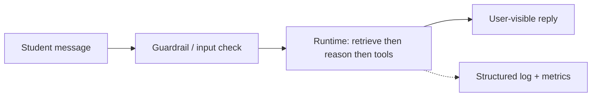
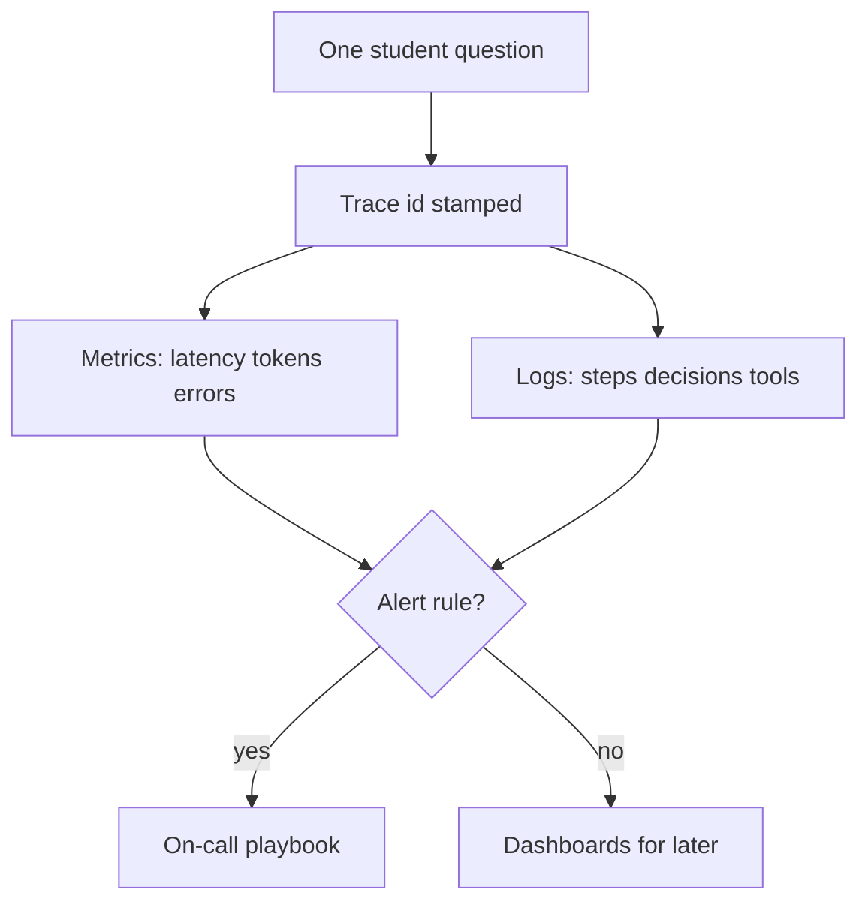
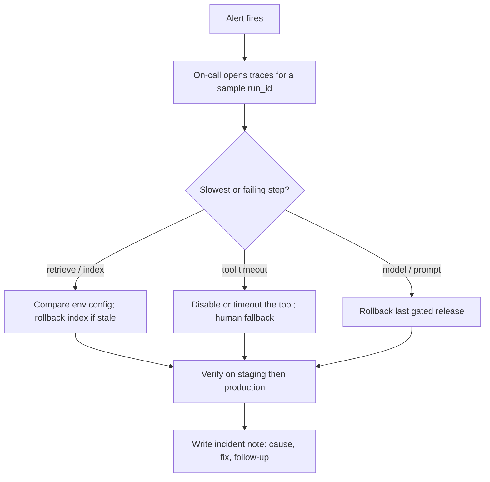

# Deployment and Monitoring for Agent Systems

## Context of This Session

In the **previous** session you practised **LLM Ops**: versioning prompts and configs, **release gates** on a regression set, **secrets** and access, **PII** handling, **input/output guardrails**, and **human-in-the-loop** stops. That work answers *is this change safe enough to ship?*

This session answers the next question: *after it ships, can other people run it, see what it did, and fix it when quality or speed drops?* You will **strategise deployment**, choose **hosting and runtime**, separate **environments**, design **observability**, write a **logging** plan, and connect **monitoring** to **incident response**.

**Running story:** **Ananya’s** campus support agent leaves the lab and goes live on a WhatsApp-like student channel. The demo was perfect. Monday morning, mess-rebate answers are fluent and wrong, replies take 45 seconds, and the intern on duty has a screenshot — not a trace.

**In this session, you will:**

- **Compare** deployment options and justify a **hosting and runtime** strategy for a given scenario
- **Design** an **observability** plan — what to **measure**, **trace**, and **alert** on across agent, tool, and retrieval steps
- **Specify** a **logging** strategy with **trace and audit fields** for debugging and compliance
- **Relate** **monitoring workflows** and **performance** signals to **incident response** when quality or latency degrades

---

## From a Tested Agent to a Live System

Connecting sentence: A passing eval set is a ticket to the runway. It is not the flight itself.

- **Official Definition:** **Deployment** is the act of placing an agent system in a defined **runtime** so real users can reach it, with configs that match the intended **environment**.
- **In Simple Words:** You stop running the demo on one laptop and put the agent where students, wardens, or customers can actually use it.
- **Real-Life Example:** A college fest website that only works on the designer’s phone is not “live.” A support agent that only works in Ananya’s notebook is the same gap.

**Need:** After go-live, failures are public. A wrong rebate in a hostel group is not a unit-test red bar. It is a parent WhatsApp and a registrar email.

**Common doubt:** *“We already have guardrails, so we are production-ready.”* Guardrails filter bad inputs and outputs. They do not tell you **where** the agent ran, **which index** it searched, or **which tool** timed out.

The mental shift: treat the agent as a **live system others can run**, not as a chat you babysit.

### Activity — Name the gap

Write two lines: one thing your **previous** release-gate work already protects, and one thing it **cannot** tell you at 9 a.m. on Monday.

---

## Deployment Options and Hosting Strategy

Connecting sentence: Before you log a single field, decide **where** the agent lives. That choice shapes every later alert.

- **Official Definition:** A **hosting strategy** is the combination of **where** compute runs (machine, container, function, vendor platform) and **who** is responsible for uptime, scaling, and data residency.
- **In Simple Words:** Who owns the building the agent sits in — your campus server room, a rented container, a pay-per-call function, or a hosted builder.
- **Real-Life Example:** A canteen can cook in a hostel kitchen, a shared food court, or a cloud kitchen. Each option changes hygiene checks, peak-hour capacity, and who gets the complaint when the stove fails.

| Approach | What it means | When it fits | Watch-out |
|---|---|---|---|
| **Self-hosted VM / server** | You manage the machine, updates, scaling | Strict data residency; custom campus tools | You own patches and 2 a.m. restarts |
| **Container-based hosting** | Pack the agent and run the same image everywhere | Repeatable **dev / staging / production** | Image must include the right config, not last month’s index path |
| **Serverless / managed functions** | Code runs on demand; you do not babysit servers | Spiky traffic (result day, fee deadline) | **Cold start** latency; timeout limits |
| **Platform-hosted agents** | Vendor runs much of the stack | Fast launch; small ops team | Less low-level control; vendor outage is your outage |
| **Hybrid** | Mix of the above | Policy PDFs stay internal; chat sits on a vendor | Two places to monitor, not one |

**Logic:** There is no universally “best” host. Match **control, cost, compliance, and team skill** to the scenario. A mess-policy agent that must not leave campus may stay on a VM. A public FAQ bot may sit on a hosted builder.

**Common error:** Choosing a host because a tutorial used it, then discovering production traffic needs a different timeout or a different log hook.

### Activity — Justify one host

Ananya’s support agent must read hostel circulars that cannot leave campus, and reply on a vendor chat channel. Write **one sentence** naming a **hybrid** split (what stays on-prem, what may be vendor-hosted).

**Suggested direction:** Circulars and retrieval stay on a campus VM or container; the chat channel is the vendor front door, with logs still written to campus storage.

---

## Runtime Choices — What Actually Executes the Agent

Connecting sentence: Hosting is the building. **Runtime** is the software that cooks inside it.

- **Official Definition:** A **runtime** is the executing layer of the agent — the process or workflow engine that receives a request, calls the model and tools, and returns a reply.
- **In Simple Words:** The programme that is *actually running* when a student sends “mess rebate for June.”
- **Real-Life Example:** The same recipe can be cooked in a pressure cooker, an oven, or a tandoor. The dish name is the same; the thermometer and timer are different.

Typical runtimes you already know from this module:

| Runtime | How it usually goes live | Monitoring hook you will need |
|---|---|---|
| **LangChain Python service behind an HTTP API** | A process that accepts JSON requests and returns JSON replies | Request id, latency, status code, step logs |
| **n8n workflow with LLM nodes** | A published workflow with a webhook or schedule | Execution id, node timings, error branches |
| **CrewAI script on a schedule** | A job that kicks off a crew (nightly briefs, weekly reports) | Kickoff id, per-task duration, artifact paths |
| **Hosted builder agent** | Vendor-managed run | Vendor traces plus your own outcome log |

**Need:** Each runtime fails differently. An n8n node timeout looks unlike a Python tool exception. Your observability plan must name the runtime, not only “the AI.”

**Common doubt:** *“Can I skip HTTP and just leave a Python file on my laptop?”* For a live student channel, no. Someone else must be able to restart the process and read the same logs. A laptop that sleeps is not a runtime strategy.



---

## Environments — Keep Risk in Separate Rooms

Connecting sentence: A good host still fails if **staging** and **production** secretly read different circulars.

- **Official Definition:** An **environment** is a named, isolated setup (code, config, data, secrets) used for a specific purpose — typically **development**, **staging**, and **production**.
- **In Simple Words:** Practice kitchen, dress rehearsal, and opening night. Do not serve the rehearsal soup to paying guests.
- **Real-Life Example:** The fest lighting crew tests cues in an empty auditorium. They do not first try a new dimmer during the chief guest’s speech.

| Environment | Who uses it | Data and secrets | Typical mistake |
|---|---|---|---|
| **Development** | Builders experiment | Dummy circulars; test keys | Shipping a debug print that leaks a student name |
| **Staging** | Release candidates | Production-*like* index and traffic shape | Staging index is fresh; production still points at last semester |
| **Production** | Real students / customers | Real policies; tightly held secrets | Hot-fixing production without a gate |

**Logic:** Config must travel with the release. If the **index path** or **model version** is an environment variable, production must receive the *intended* value, not a leftover from Sunday night.

**Common error:** “It worked in staging” used as a sentence that ends the investigation. Staging success only counts if production config is proven to match.

### Activity — Catch the Sunday switch

Production was updated with a new retrieval index **path**, but the environment variable still points at last semester’s folder. Write the **one check** you would add to the release gate so this cannot silently ship.

**Suggested answer:** A staging-vs-production **config diff** (index path, model id, tool base URL) must be green before go-live.

---

## Observability — Measure, Trace, Alert

Connecting sentence: Once the agent is in a real environment, you need **eyes** — not a hope that students will complain politely.

- **Official Definition:** **Observability** is the ability to explain what happened inside a system from the **signals** it emits — typically **logs**, **traces**, and **metrics** — without guessing from the final sentence alone.
- **In Simple Words:** You can replay the journey of one question: what it retrieved, which tool it called, how long each step took, and what the user saw.
- **Real-Life Example:** A courier tracking page is observability. “The parcel left the hub” without a scan id is a rumour.

A practical observability plan answers three questions.

**1. What should we measure (metrics)?**

| Metric | Why it matters for agents |
|---|---|
| End-to-end **latency** | 4 s vs 45 s is a user-visible failure |
| Step success / error rate | Retrieve can succeed while the tool fails |
| **Token usage** and estimated cost | Runaway loops show up as money before they show up as tickets |
| Retrieval hit rate | Empty chunks → fluent guesses |
| Tool-call success and duration | Slow APIs hide behind “the model is slow” |
| Guardrail block rate | Sudden spikes may mean attacks — or a broken policy |

**2. What should we trace?**

- **Official Definition:** A **trace** is the ordered set of steps for **one** agent run, joined by a shared **run id** / **trace id**.
- **In Simple Words:** One courier tracking number stamped on every scan: intake, retrieve, reason, tool, reply.
- **Real-Life Example:** IRCTC’s PNR links booking, charting, and refund. Without a PNR, “what happened to my ticket?” is a fight.

**3. What should trigger alerts?**

Not every log line should wake someone at 2 a.m. Alerts fire on **patterns that hurt users or budget**: latency above a threshold, error spikes, cost jumps, quality drop on a sampled eval set.



**Common doubt:** *“We will look at ChatGPT’s web log.”* Vendor UIs are a bonus. Your plan must still name **your** fields, **your** retention, and **your** alert thresholds.

---

## Trace and Audit Fields

Connecting sentence: Observability stays vague until you list the **fields** you will actually store.

- **Official Definition:** **Audit fields** are the named pieces of data you keep so you can reconstruct a run for engineers **and** for a registrar, auditor, or manager.
- **In Simple Words:** The columns on the incident form — not a novel pasted into Slack.
- **Real-Life Example:** A hospital discharge summary has patient id, time, medicine, dose. “We treated him well” is not an audit field.

| Field | Why it matters |
|---|---|
| **Run id / trace id** | Join every log line from one question |
| **Timestamp** (UTC) | Spot delays and wrong ordering |
| **Environment** | Prove it was production, not Ananya’s laptop |
| **Step name** | Retrieve vs reason vs tool vs output |
| **Model version / prompt version** | Tie behaviour to a specific release |
| **Retrieval query and top chunk ids** | Prove what context the model saw (not full PII text) |
| **Tool name, argument summary, status, duration** | See which external action ran or failed |
| **Decision summary** | Why the agent answered directly, retrieved, or escalated |
| **Error flag and message** | Surface failures instead of swallowing them |
| **Final outcome category** | Answered / blocked / escalated / tool-failed |
| **User-visible status** | What the student actually received |

**Need:** Retrieval **chunk ids** beat dumping full circular paragraphs into logs. You can still open the source document later. You reduce **PII** leakage.

**Common error:** Logging the raw user message with a roll number and parent phone. That is an incident waiting for the **upcoming** governance session. Redact first; store a hash or a ticket id.

### Activity — Pick three fields

For ticket **CAMP-8842** (“mess rebate for June”), list **three** audit fields you would need to prove whether the agent searched the June circular or last year’s.

---

## Logging Agent Decisions

Connecting sentence: Metrics tell you *that* something is slow. **Logs** tell you *what the agent chose* at each step.

- **Official Definition:** **Logging**, here, is writing **structured records** at important moments — inputs, **decisions**, tool traffic, retrieval context, errors, and outcomes — in a searchable shape.
- **In Simple Words:** One readable JSON (or similar) line per event, with named fields, not a paragraph of `print`.
- **Real-Life Example:** A bank passbook has date, type, amount. A WhatsApp “paid something yesterday” is not a log.

A strong strategy captures:

- **Inputs** — sanitized query, user role (student / warden), session id; **no** secrets, **no** raw Aadhaar
- **Decisions** — answer directly / retrieve first / call a tool / escalate to human
- **Tool traffic** — which tool, request summary, response status, duration
- **Retrieval context** — which document ids or chunk ids, how many hits
- **Errors** — timeouts, API failures, guardrail blocks, enough to reproduce
- **Outcomes** — final status, category of user-visible message, optional thumbs-up if you collect it

**Logic:** Structured logs let you filter *failed tool calls in the last hour* or *runs where retrieval returned zero chunks*. Unstructured novels do not.

**Common doubt:** *“Logging will make the agent slower.”* Writing one JSON line per step is cheap compared with a 40-second tool call. If logging is slow, you have a storage problem, not a reason to fly blind.

Two audiences share the same trail:

- **Engineers** debugging tonight
- **Managers and compliance** asking what happened on 3 August

---

## A Small Logging and Metrics Script

Connecting sentence: A table of fields is easier to trust when you can run a tiny version of the same idea. The script below **simulates** one campus support run. Production would wrap a real model and a real tool.

```python
# campus_support_log.py — run: python campus_support_log.py
import json  # print one structured record per event
import time  # measure step duration in milliseconds
from datetime import datetime, timezone  # timestamps in UTC for audit


def utc_now() -> str:  # one clock for every log line
    return datetime.now(timezone.utc).isoformat()  # machine-sortable time


def log_event(run_id: str, step: str, **fields) -> dict:  # named fields, not a paragraph
    record = {  # start the structured event
        "run_id": run_id,  # join all lines for this student question
        "timestamp": utc_now(),  # when this step happened
        "env": "production",  # prove this was not a laptop demo
        "step": step,  # retrieve / reason / tool / output
        **fields,  # extra audit fields for this step
    }  # record is complete
    print(json.dumps(record))  # one JSON line — easy to search later
    return record  # caller may store duration from this


def redact(text: str) -> str:  # never put raw student identifiers in logs
    return text.replace("9876543210", "[PHONE]")  # toy redaction for the demo


if __name__ == "__main__":  # simulate one live question
    RUN = "CAMP-8842"  # trace id the registrar can quote
    t0 = time.perf_counter()  # start clock for end-to-end latency
    raw_q = "mess rebate June, call 9876543210"  # what the student typed
    log_event(RUN, "input", user_role="student", query=redact(raw_q), pii_redacted=True)  # sanitized input
    t_ret = time.perf_counter()  # retrieval clock
    chunks = ["circ-2026-06-mess#p2", "circ-2026-06-mess#p5"]  # ids, not full PDF text
    ret_ms = int((time.perf_counter() - t_ret) * 1000)  # retrieval duration
    log_event(RUN, "retrieve", chunk_ids=chunks, hits=len(chunks), latency_ms=ret_ms, index="prod-v3")  # retrieval audit
    t_tool = time.perf_counter()  # tool clock
    time.sleep(0.05)  # pretend the ticketing API was slow; raise this to demo latency
    tool_ms = int((time.perf_counter() - t_tool) * 1000)  # tool duration
    log_event(RUN, "tool", tool="create_ticket", status="ok", duration_ms=tool_ms, args_summary="category=mess_rebate")  # tool traffic
    log_event(RUN, "decision", path="retrieve_then_ticket", reason="policy_found")  # why this path
    total_ms = int((time.perf_counter() - t0) * 1000)  # end-to-end
    log_event(RUN, "outcome", status="answered", latency_ms=total_ms, tokens_est=420)  # user-visible result plus cost signal
    if total_ms > 8000:  # toy alert threshold — production uses a real monitor
        log_event(RUN, "alert", rule="latency_high", fired=True)  # would page on-call
    else:  # healthy run
        log_event(RUN, "alert", rule="latency_high", fired=False)  # recorded, no page
```

**How the code works**

- `run_id` is the **trace id**. Every line for ticket CAMP-8842 shares it.
- `redact` stands in for a real PII filter. Logs store a masked query, not a parent phone.
- `chunk_ids` and `index="prod-v3"` are the fields that catch the Sunday-night **wrong environment** bug.
- `duration_ms` on the tool step is how you prove “the model was fine; the ticket API was slow.”
- The toy `if total_ms > 8000` is a **monitoring** rule. In production this lives in an alert system, not only in the script.

Run it. You should see several JSON lines with the same `run_id`.

Change `time.sleep(0.05)` to `time.sleep(9)` once. The **alert** line should flip to `fired: true`.

### Activity — Read your own log

After one run, copy the **retrieve** line. Circle `index` and `chunk_ids`. Write one sentence: how would these two fields prove a stale circular?

---

## Monitoring Workflows and Performance Signals

Connecting sentence: Logs sitting on disk are not monitoring. **Monitoring** is watching signals and **acting** when they cross a limit.

- **Official Definition:** **Monitoring** is the ongoing practice of comparing live **metrics** to thresholds and starting a defined **workflow** when they breach.
- **In Simple Words:** A dashboard is a TV. A monitoring workflow is the fire drill you actually follow.
- **Real-Life Example:** A blood-pressure machine that beeps is useful only if someone in the ward knows whether to call a doctor or change the cuff.

| Signal | Possible meaning | First response |
|---|---|---|
| Latency up 3× | Model overload, slow tool, or bad index | Open traces; find the **slowest step**; scale, timeout, or rollback |
| Error rate spike | Bad deploy, expired secret, tool outage | Diff last release time vs error start; inspect error logs |
| Cost surge | Runaway loop, bigger model, huge retrieval payloads | List high-token `run_id`s; cap tokens; enable cache |
| Quality drop on eval sample | Prompt drift, stale knowledge, wrong environment | Re-run regression set; compare staging vs production config |
| Guardrail blocks rising | Abuse, or a policy that is too tight | Sample blocked inputs; fix rules if they are false positives |

**Performance tracking** is not decoration. You track **latency**, **error rate**, **token spend**, and **sampled quality** so the right person acts before the warden’s inbox floods.

**Common error:** Alerting on every single failed retrieve. One empty search at 2 a.m. is noise. A **rate** over five minutes is a signal.

**Need:** Tie each signal to a **owner** (who looks) and a **next action** (rollback, disable tool, human fallback). An alert without an owner is a ringtone nobody picks up.

---

## Incident Response Planning

Connecting sentence: When quality drops on a live channel, heroics do not scale. A **playbook** does.

- **Official Definition:** **Incident response planning** is deciding in advance who is **on call**, what **severity** means, when to **roll back**, when to **disable a tool**, when to switch to **human fallback**, and how the incident is **documented**.
- **In Simple Words:** The airport tower’s fog checklist — divert, hold, inspect, resume — written before the fog.
- **Real-Life Example:** A hostel fire drill names the assembly point. It does not wait for the first smoke to invent one.



**A minimum campus playbook**

| Step | Owner | Action |
|---|---|---|
| 1. Acknowledge | On-call intern | Confirm the alert is real, not a dashboard glitch |
| 2. Triage | On-call + Ananya | Pull 3 traces; name the slow or wrong step |
| 3. Contain | On-call | Rollback release, disable tool, or route high-stakes queries to a human |
| 4. Verify | On-call | Re-run the regression sample in **production** config |
| 5. Document | On-call | Cause, user impact, what will prevent a repeat |

**When to roll back vs patch forward:** If the last release timestamp matches the error spike, **roll back** first. If a vendor tool is down and your code did not change, **disable the tool** and fallback. Do not “quickly edit production prompts” during an incident unless that is an approved emergency path.

**Common doubt:** *“We will just restart the server.”* Restarting hides a bad index for ten minutes. Traces still have to prove *why*.

### Activity — Write four lines of a playbook

For “latency 45 s at 9 a.m., retrieve 200 ms, ticket tool 40 s,” write **who** looks first, **what** they disable, **whether** they rollback the model, and **what** they write in the incident note.

**Suggested direction:** On-call inspects traces; add a **timeout** and human fallback on the ticket tool; do **not** rollback the model if retrieve and prompt look healthy; note “tool SLO breach.”

---

## One Go-Live Picture for Campus Support

Connecting sentence: Strategy is only real when it fits **one** scenario you can defend.

**Scenario:** Ananya’s support agent on a WhatsApp-like channel, reading hostel circulars, creating tickets.

| Decision | Choice (example you can argue) | Why |
|---|---|---|
| Hosting | Hybrid: retrieval + logs on campus container; chat via vendor | Circulars stay on-prem |
| Runtime | LangChain Python service behind an **HTTP API**, or n8n webhook | Other interns can restart it |
| Environments | Dev / staging / production with a config diff in the release gate | Stops the Sunday index-path bug |
| Measure | Latency, tool errors, token estimate, sampled quality | Users feel speed; finance feels tokens |
| Trace | `run_id`, step, index name, chunk ids, tool duration | Audit ticket CAMP-8842 |
| Alert | Latency p95 > 8 s for 5 minutes; error rate > 5% | Avoids paging on one blip |
| Incident | Rollback last release **or** disable ticket tool; human fallback | Contain before the group chat explodes |

The same table works for a **fintech WhatsApp refund agent**. Swap “circulars” for “policy PDFs” and “warden” for “support lead.” The operational skeleton does not change.

---

## Compare Two Scenarios — Then Defend the Host

Connecting sentence: Metadata asked you to **justify** a strategy for a **given** scenario. Practise that defence out loud, not only fill a table.

| Question | Campus mess-rebate agent | Fintech refund agent |
|---|---|---|
| Who is hurt if it is wrong? | Student + parent trust | Customer + regulator |
| Where must data live? | Often on campus | Often in a licensed cloud region |
| Traffic shape | Spikes at 9 a.m. and result week | Spikes after a product outage |
| Runtime that fits | HTTP API or n8n webhook; restartable by an intern | Same, plus stricter secret rotation |
| First three metrics | Latency, empty retrievals, wrong-amount complaints | Latency, tool errors, refund-amount mismatch rate |

**Need:** “We used containers because the tutorial did” is not a justification. “We used a campus container because circulars are confidential and the intern batch must reproduce staging” is a justification.

**Common doubt:** *“Serverless is always cheaper.”* For a chatty agent with long retrieval, **cold starts** plus timeouts can *raise* latency and retries — which raises cost. Measure; do not assume.

### Activity — Sixty-second defence

Pick campus **or** fintech. Write four short lines: host, runtime, one environment check, one alert.

That defence — not a cloud brand name — is the skill this session grades.

---

## Sampled Quality and Alert Hygiene

Connecting sentence: Latency is easy to graph. **Quality** is easier to miss until the hostel group is already angry.

- **Official Definition:** **Sampled quality** is a small, repeating eval set run against **production** config (not only staging) so you notice prompt drift and stale indexes before users flood support.
- **In Simple Words:** Every morning, ten known questions. If mess-rebate answers flip, you hear it from a dashboard — not from a warden.
- **Real-Life Example:** A baker keeps yesterday’s “good loaf” as a reference. They do not wait for fifty customer complaints to notice the salt jar was swapped.

**A tiny daily sample (write it as operations, not as research):**

| Item | Example |
|---|---|
| Gold questions | 8 in-policy, 2 that must **refuse** or escalate |
| Pass rule | Amounts and circular names match the gold sheet |
| Fail rule | Fluent but wrong amount; or retrieve hits = 0 |
| Where it runs | Against **production** index name, recorded in logs |

**Alert hygiene** — so on-call stays awake for real fires:

| Practice | Why |
|---|---|
| Threshold + **duration** (for example 5 minutes) | One slow student at 2 a.m. is not an incident |
| Page on **user-visible** harm first | Error rate and p95 latency before token graphs |
| Deduplicate | Ten traces, one ticket — not ten phone calls |
| Night vs day | Quality sample can wait for morning; payment-tool outage cannot |

**Logic:** Performance tracking is how monitoring **earns** the next action. You do not scale servers because a chart is red. You scale, rollback, or disable a tool because the **trace** named the slow step.

**Incident severity (write it down before the first fire):**

| Level | Example | Response |
|---|---|---|
| **SEV-3** | One student, one wrong FAQ, already corrected | Ticket; no rollback |
| **SEV-2** | Latency p95 high for 15 minutes; tickets piling | On-call; timeout or scale; update status |
| **SEV-1** | Wrong rebate amounts in a hostel group; PII in a reply | Kill switch or rollback; human-only channel; incident note same day |

**Upcoming** sessions add **governance** (who may launch, what data is allowed, what it may cost) and then a **business design** canvas for capstone. This session’s job is **operational eyes** on a live system.

---

## Key Takeaways

- **Deployment** is a hosting + **runtime** + **environment** strategy, not “it ran on my laptop.”
- **Observability** is logs + traces + metrics; **audit fields** (run id, step, index, tool duration) let you reconstruct a bad Monday.
- **Logging** must capture sanitized inputs, **decisions**, tool traffic, retrieval context, errors, and outcomes — in a structured shape.
- **Monitoring** maps signals (latency, errors, cost, quality) to a named **incident** playbook: rollback, isolate, fallback, verify, write it down.

These habits are what **upcoming** governance and business-design work will assume: you can *see* the fleet before you write the rules that keep it fair, private, and affordable.

---

## Important Commands, Libraries, and Terminologies Used

| Term / item | Meaning |
|---|---|
| Deployment | Placing the agent where real users reach it, with a defined runtime |
| Hosting strategy | VM, container, serverless, hosted builder, or hybrid |
| Runtime | The executing layer (HTTP API service, n8n, scheduled CrewAI, hosted agent) |
| Environment | Isolated dev / staging / production config and data |
| Observability | Explaining inner behaviour from logs, traces, and metrics |
| Metric | A number watched over time (latency, error rate, tokens) |
| Trace / run id | One id joining every step of one user question |
| Audit field | Named data kept for reconstruction and compliance |
| Logging | Structured records of inputs, decisions, tools, retrieval, errors, outcomes |
| Redaction | Masking PII before it hits logs |
| Alert | A rule that pages a human when a threshold is crossed |
| Monitoring workflow | Repeatable response to a signal, not a one-off hero fix |
| Incident response | On-call, contain, rollback or isolate, verify, document |
| Human fallback | Route high-stakes or failing traffic to a person |
| Cold start | Delay when a serverless runtime wakes |
| Config diff | Staging vs production check (index path, model, tool URL) |
| `campus_support_log.py` | Toy structured logger for one campus support run |
| `json.dumps` | Prints one searchable JSON event per line |
| HTTP API | JSON-in / JSON-out service other processes can call |
| n8n execution id | Workflow-level trace equivalent |
| Release gate | Previous-session habit: do not ship without eval evidence |
| Sampled quality | Gold questions run on production config |
| p95 latency | 95th-percentile reply time — hides less than an average |
| SEV-1 / SEV-2 / SEV-3 | Agreed incident severity so the response matches the harm |
| On-call | Named person who owns the first fifteen minutes of an alert |
