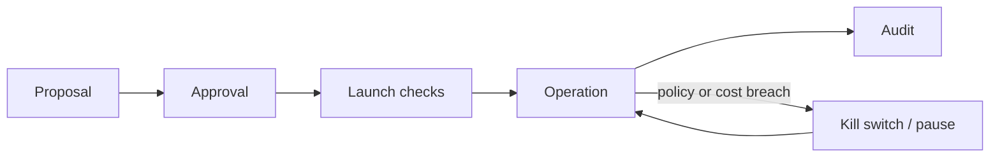
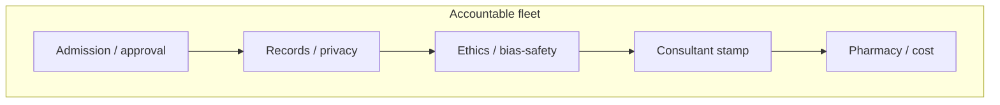

# Governance, Ethical Scaling and Cost Control for Agent Systems

## Context of This Session

In the **previous** session you put agents **live**: **hosting and runtime**, **environments**, **observability**, **structured logging**, **alerts**, and an **incident** playbook. That work answers *can we see what the agent did after go-live?*

This session answers the organisation-level question: *when a fleet runs across desks, who approved it, what data may it touch, who stamps high-impact decisions, and what may it cost?* You will set **governance**, **privacy**, **bias and safety**, **human oversight**, **policies**, **audit trails**, and **cost control**.

**Running story:** **Ananya’s** campus agents did not stay as one support bot. Support, HR screening, campus finance, and admissions marketing each launched a helper. Then a hostel room number leaked in a group thread, internship ranking looked skewed by college name, and the cloud bill tripled. The same week, a retail partner reports the identical three crises on customer data.

**In this session, you will:**

- **Explain** governance principles for **approving**, **monitoring**, and **auditing** autonomous agent workflows
- **Identify** **privacy** and data-handling risks when agents read internal or personal information
- **Propose** **bias**, **safety**, and **human-oversight** controls for high-impact decisions
- **Design** **cost-control** strategies: model selection, caching, limits, budgets, and usage monitoring

---

## From a Working Fleet to an Accountable Organisation

Connecting sentence: Logs prove what one bot did last night. They do not decide who was *allowed* to launch the next four bots.

- **Official Definition:** **AI governance** is the set of rules, roles, and records that decide who may create, run, change, and retire agent workflows — and how those decisions are evidenced.
- **In Simple Words:** Traffic laws for a city of vehicles, not a compliment for one careful driver.
- **Real-Life Example:** A hostel canteen that “just started selling” without a licence can cook well and still be shut down. An agent fleet can demo well and still be unfundable.

**Need:** Ananya built the first support agent carefully. Five other desks copied the idea without copying the discipline. Scaling copied the *demo*, not the *rules*.

**Common doubt:** *“Governance will slow us down.”* Unowned fleets slow you later: a parent complaint, a biased ranking story, a finance freeze. Governance is how you keep speed *fundable*.

The mental shift: treat the fleet as an **accountable organisation**, not a collection of clever chats.

### Activity — Name the missing owner

Write one line: who should have been the **business owner** of the internship-screening agent, and who should have been the **technical owner**. They must not be the same intern.

---

## Governance Lifecycle — Approve, Monitor, Audit

Connecting sentence: Governance is not a poster on the wall. It is a **lifecycle** every new agent walks through.

- **Official Definition:** A **governance lifecycle** is the sequence of **proposal**, **approval**, **launch**, **operation**, and **audit** that an autonomous workflow must pass.
- **In Simple Words:** Register the case, get the stamp, go live with eyes on, keep watching, prove what happened six months later.
- **Real-Life Example:** A hospital does not let a new surgery technique skip ethics review because “the first patient smiled.”

| Stage | Question governance asks | Campus mapping |
|---|---|---|
| **Proposal** | What problem, what data, what tools, what harm if it fails? | “Screen internships” is not a proposal until data sources are listed |
| **Approval** | Did legal/security and the desk owner sign? | Placement cell + IT + registrar for student PII |
| **Launch** | Are guardrails, logs, monitoring, and a kill switch in place? | Previous session’s eyes, plus a named off switch |
| **Operation** | Still in policy? Still in budget? | Weekly review, not “set and forget” |
| **Audit** | Can we reconstruct a specific student’s or vendor’s run? | Trace id + retention policy |



**Policies** are the written standards that make the lifecycle real. Examples you can copy:

- Agents must not store raw **Aadhaar** or **PAN** in logs.
- Rebate or refund suggestions above **₹10,000** require a human stamp.
- No new **production** agent without a regression run on the eval set.
- Each agent has a **named owner** who receives cost alerts.

**Logic:** If a policy is only in Ananya’s head, the next intern cannot follow it. Write it. Date it. Point to the log field that proves it.

**Common error:** Approval as a WhatsApp “ok” with no record of data classes allowed. Six months later nobody knows whether marketing was allowed to search stipend files.

---

## Audit Trails as a Governance Control

Connecting sentence: Approval without proof is a story. **Audit trails** are how you answer a registrar or a regulator without guessing.

- **Official Definition:** An **audit trail** is a time-ordered, tamper-evident (or at least append-only) record of inputs, decisions, tool actions, and outcomes for a workflow.
- **In Simple Words:** The passbook of the agent — who asked, what it retrieved, what it did, what the human stamped.
- **Real-Life Example:** A library issue register shows who borrowed which book. “We are careful” is not a register.

You already designed **trace fields** in the **previous** session. Governance adds **rules about those fields**:

| Governance rule | What the trail must show |
|---|---|
| Data minimisation | Query redacted; identifiers as ticket ids |
| Decision accountability | Path taken: retrieve / tool / escalate |
| Human stamp | Who approved, when, for which ticket |
| Retention | How long logs live; who may search them |
| Access | Interns do not get raw production logs by default |

**Need:** An audit trail that still contains a hostel room number is a **privacy** incident, not a governance success.

**Common doubt:** *“We have CloudWatch / a vendor UI.”* Vendor screens help operations. Your **policy** still names retention, access, and redaction — or you do not actually govern.

### Activity — Write one policy sentence

Complete: *“For the support agent, logs may keep ____ and must never keep ____.”* Use ticket id vs room number as the pair.

---

## Privacy and Data-Handling Risks

Connecting sentence: Agents read **language**, not only database columns. That is why they leak in ways a simple form never did.

- **Official Definition:** **Data privacy** is the practice of collecting, using, storing, and sharing personal information only in ways people expect and the law allows.
- **In Simple Words:** Do not show one student’s hostel facts to another student, and do not park Aadhaar in a debug file.
- **Real-Life Example:** A doctor does not read a neighbour’s file “to be helpful.” An agent must not retrieve the wrong student’s fee row “to be complete.”

**Why agents are special:** they **retrieve chunks**, **quote** them, and **write logs**. A traditional fee portal shows one logged-in student’s data. An agent can paste another student’s address into a group reply if retrieval is sloppy.

| Risk pattern | How it shows up | Control |
|---|---|---|
| **Wrong-chunk quote** | Room number or phone appears in someone else’s answer | Retrieval filters by user/session; refuse to quote identifiers |
| **Folder bleed** | Marketing agent can search finance stipend files | Separate knowledge bases per role |
| **Log over-capture** | Full query with name and account in intern-readable logs | Redaction; role-based log access |
| **Vendor training risk** | Confidential circulars sent to a model with no data-processing terms | Contract + data classification; on-prem for restricted files |
| **Over-collection** | Agent asks for Aadhaar when a ticket id would do | **Minimisation**: smallest slice needed |

**Data classification** (label before you connect a tool):

| Class | Examples | Agent rule |
|---|---|---|
| **Public** | Prospectus dates, mess menu | May retrieve and quote |
| **Internal** | Draft circulars | Staff agents only |
| **Confidential** | Fee dues, hostel allotment | Need-to-know; never in group replies |
| **Restricted** | Aadhaar, medical notes, bank details | Usually **no** agent access; human only |

- **Official Definition:** **Minimisation** means fetching the smallest data slice that still completes the task.
- **In Simple Words:** Bring the one page, not the whole almirah.
- **Real-Life Example:** A KYC desk asks for ID proof. It does not photocopy the entire family album “in case.”

**Common error:** One shared “campus PDF dump” for every agent. That is how admissions marketing “finds” a stipend spreadsheet.

### Activity — Classify four items

Label each as public / internal / confidential / restricted: mess menu, draft exam timetable, student’s fee balance, scanned Aadhaar. Write which **two** the support agent may retrieve.

**Suggested answer:** Menu = public; timetable draft = internal (staff); fee balance = confidential (need-to-know); Aadhaar = restricted (no agent). Support may use menu, not Aadhaar.

---

## Bias, Safety, and High-Impact Decisions

Connecting sentence: Privacy is about *what is seen*. **Bias** and **safety** are about *who is harmed* when the agent decides.

- **Official Definition:** **Bias**, here, is systematic unfairness — similar people treated differently because of patterns that should not matter (region, gender, college brand, language style).
- **In Simple Words:** The ranking bot keeps pushing certain campuses down even when marks match.
- **Real-Life Example:** If old hiring files favoured one city, an agent trained on those files can reject the rest — faster than any tired recruiter.

- **Official Definition:** **Safety** is preventing harm: dangerous advice, illegal assistance, fraudulent approvals, or outputs that violate stated values.
- **In Simple Words:** The agent must not invent a medical dosage, a legal threat, or a payment it cannot own.
- **Real-Life Example:** A chemist does not dispense a controlled medicine because a chatbot “sounded confident.”

High-impact families on campus and in companies:

| Domain | High-impact action | Harm if unsupervised |
|---|---|---|
| **HR / placement** | Rank, reject, email “not selected” | Discriminatory screening at scale |
| **Finance** | Flag fraud, recommend pay | Wrong vendor paid; honest vendor delayed |
| **Support** | Promise a rebate | Fluent wrong money |
| **Marketing** | Personalise from purchase or enquiry history | Creepy or unlawful profiling |

**Controls that belong in the design, not in a hope:**

| Control | Purpose |
|---|---|
| **Pre-deployment testing** | Diverse cases before real users depend on it |
| **Bias checks** | Compare outcomes across groups; flag skewed ranks or refusals |
| **Safety filters** | Block harmful, illegal, or out-of-scope asks and answers |
| **Human-in-the-loop** | Person approves, edits, or rejects before the action ships |
| **Escalation path** | Uncertain or sensitive cases go to a named expert |
| **Kill switch** | Pause the agent when policy is clearly broken |

**Logic:** Historical data repeats itself. If you do not **measure** selection rates by group on a labelled sample, you will not see the HR shock until a newspaper does.

**Common error:** Testing only “happy path” internships from one famous college. That is a demo, not a bias check.

### Activity — Design one bias check

For internship ranking, write **one** comparison you would run before launch (for example: average score by state, holding marks constant). Write **one** action if the gap is large (do not send auto-reject emails).

---

## Human Oversight — Stamps, Not Theatre

Connecting sentence: Filters reduce harm. They do not replace a **named human** where the stakes justify a stamp.

- **Official Definition:** **Human oversight** is a required, recorded human decision at defined points — approve, edit, reject, or take over — with a named role and a time limit.
- **In Simple Words:** The consultant signs before the knife. Not every bandage needs the dean.
- **Real-Life Example:** UPI for ₹200 vs extra confirmation for a large transfer. Same idea as rebate above a rupee threshold.

Oversight fails in two opposite ways:

| Failure | What it looks like | Fix |
|---|---|---|
| **Theatre** | A manager “looks at everything” and rubber-stamps | Thresholds: only high-impact or low-confidence cases |
| **Abandonment** | No human on rejection emails or payments | Mandatory gate + SLA + fallback owner |

**Campus gate examples (write as policy):**

| Condition | Gate | Owner | If ignored |
|---|---|---|---|
| Internship **reject** email | Must stamp | Placement lead | Bias ships at scale |
| Rebate suggestion ≥ **₹10,000** | Must stamp | Accounts | Wrong money promised |
| Marketing message uses **purchase-like** history | Must stamp | Admissions + privacy owner | Profiling complaint |
| Support answer quotes **another student’s** fields | Auto-block + human | Support lead | Privacy incident |

**Need:** Gates need **owners** and **SLAs**. An unowned Slack channel is not oversight. Name the role, the four-hour (or next-business-morning) clock, and who escalates.

**Kill switch:** A documented way to disable the agent in minutes — config flag, n8n workflow off, or stop the HTTP service — with who is allowed to flip it.

### Activity — Set one stamp rule

Your fest reimbursement agent drafts “pay this student.” Propose **one** rupee threshold for faculty stamp, and **one** condition that always needs a stamp even below that amount.

**Suggested direction:** Stamp above ₹5,000; always stamp if GSTIN is missing, even for ₹800.

---

## Think of It Like a Hospital Network

Connecting sentence: The pieces above are easier to remember as one picture.

- **Admission desk** — governance approval; not every visitor walks into theatre.
- **Records room** — privacy; speciality-only files.
- **Ethics board** — bias and safety review before wide rollout.
- **Consultant sign-off** — human oversight on high-impact acts.
- **Pharmacy budget** — cost control by ward, not a surprise annual bill.

The mental shift: **scaling agents is like scaling a hospital** — skill is not enough without records, ethics, stamps, and inventory.



---

## Cost Control for Agent Fleets

Connecting sentence: A fair, private fleet can still die of a bill. **Cost control** is how leadership keeps paying for agents after demo week.

- **Official Definition:** **Cost control** is designing usage so value stays inside agreed **budgets** — through **model selection**, **caching**, **limits**, and **usage monitoring**.
- **In Simple Words:** Do not run a luxury engine to sort hostel FAQs, and do not let five desks each rent the same luxury engine.
- **Real-Life Example:** A household that leaves every AC on “just in case” is not “productive.” It is a shock when the meter is read.

Where agent money actually goes:

| Driver | What inflates it |
|---|---|
| **Model choice** | Largest model on every turn, including “open or closed on Sunday?” |
| **Tokens** | Huge retrieved piles, long chat memory, multi-step loops |
| **Tool calls** | Retries without a cap; paid APIs per click |
| **Runaway loops** | Agent keeps calling tools until the wallet empties |
| **Fleet duplication** | Five “support-like” agents on premium models instead of one shared FAQ service |

| Strategy | What it does |
|---|---|
| **Model selection** | Cheap model for routing and FAQs; larger model only for hard reasoning |
| **Caching** | Reuse embeddings or frequent answers (mess timing) instead of recomputing |
| **Rate and token limits** | Cap per user, per desk, per workflow |
| **Budgets and alerts** | Monthly ceiling; notify the **owner** before breach |
| **Usage monitoring** | Cost by agent, desk, model, tool — trends, not shocks |
| **Shared platforms** | One governed support service; desks do not clone it |

**Logic:** Cost is a **governance** signal. A 400% spend jump is often “three new teams, no cache, largest model,” not “AI got more expensive overnight.”

**Common error:** Tracking only the vendor’s total invoice. You cannot tell whether **HR screening** or **marketing** burned the budget.

---

## A Small Budget and Usage Monitor

Connecting sentence: A cost policy is easier to trust when you can run a tiny version. This script **does not** call a model. It scores fake runs and flags a desk that blows a daily cap.

```python
# fleet_budget.py — run: python fleet_budget.py
from dataclasses import dataclass  # one usage row per agent run


@dataclass  # simple record for monitoring
class RunCost:  # one completed agent run
    desk: str  # support / hr / finance / marketing
    agent: str  # which workflow
    model: str  # small vs large
    tokens: int  # estimated tokens for the run
    cached: bool  # whether an answer cache was hit


INR_PER_1K = {"small": 0.20, "large": 2.50}  # toy rupees per 1k tokens — not a real price list
DAILY_CAP = {"support": 80.0, "hr": 40.0, "finance": 40.0, "marketing": 30.0}  # toy desk budgets


def estimate_inr(run: RunCost) -> float:  # cost of one run
    if run.cached:  # cache hit — almost free
        return 0.02  # tiny lookup cost
    rate = INR_PER_1K[run.model]  # pick the model's toy rate
    return (run.tokens / 1000.0) * rate  # scale tokens to rupees


def desk_totals(runs: list) -> dict:  # spend by desk
    totals = {k: 0.0 for k in DAILY_CAP}  # start at zero
    for run in runs:  # each simulated run
        totals[run.desk] += estimate_inr(run)  # add this run's rupees
    return totals  # for the finance snapshot


def alerts(totals: dict) -> list:  # which desks crossed the cap
    fired = []  # list of warning strings
    for desk, spent in totals.items():  # each desk
        cap = DAILY_CAP[desk]  # agreed ceiling
        if spent > cap:  # breach
            fired.append(f"{desk} spent {spent:.2f} > cap {cap:.2f}")  # owner should be paged
    return fired  # empty means all desks inside budget


if __name__ == "__main__":  # compare a wasteful morning vs a cached one
    wasteful = [  # three desks on the large model, no cache
        RunCost("support", "hostel_faq", "large", 8000, False),  # FAQ should not need large
        RunCost("hr", "screen", "large", 12000, False),  # ranking is heavy
        RunCost("marketing", "campaign", "large", 15000, False),  # personalisation on large
        RunCost("support", "hostel_faq", "large", 8000, False),  # same FAQ again
    ]  # end wasteful list
    disciplined = [  # FAQ on small + cache; HR keeps large
        RunCost("support", "hostel_faq", "small", 800, True),  # cache hit
        RunCost("hr", "screen", "large", 12000, False),  # high-impact stays large
        RunCost("marketing", "campaign", "small", 3000, False),  # draft on small
        RunCost("support", "hostel_faq", "small", 800, True),  # cache hit again
    ]  # end disciplined list
    print("wasteful totals", desk_totals(wasteful))  # likely alerts
    print("wasteful alerts", alerts(desk_totals(wasteful)))  # who breached
    print("disciplined totals", desk_totals(disciplined))  # should be calmer
    print("disciplined alerts", alerts(desk_totals(disciplined)))  # fewer or none
```

**How the code works**

- `RunCost` is one **usage** row — the same idea as a monitoring dashboard line.
- `INR_PER_1K` is **model selection** made visible: `large` is priced far above `small`.
- `cached=True` is **caching**: repeated hostel FAQs should not pay full token cost.
- `DAILY_CAP` is a **budget**. `alerts` is **usage monitoring** that names the **desk**, not a mystery total.
- HR may still use `large` because ranking is high-impact. Support FAQs should not.

Run it. On the wasteful list, **marketing** should breach its cap (large model, no cache).

**Support** spend is high because the same FAQ paid full **large**-model cost twice, but it may still sit under an 80 rupee toy cap. **Disciplined** should fire no alerts. The numbers are toys; the *shape* of the control is real.

### Activity — Change one lever

On paper, pick **one** change that would have stopped Ananya’s triple bill: smaller model for FAQs, a cache, or a daily cap with an owner. Write why the other two still matter.

---

## One Fleet Picture You Can Defend

Connecting sentence: Governance is only real when it fits **one** fleet on one page.

**Scenario:** Campus support + HR screening + finance invoice helper + admissions marketing.

| Control | Example rule |
|---|---|
| Proposal | Written problem, data classes, tools, harm if wrong |
| Approval | Desk owner + IT + (privacy) registrar for student PII |
| Privacy | Separate knowledge stores; no Aadhaar in logs; redaction on |
| Bias / safety | Ranking sample by group before go-live; no auto-reject email |
| Oversight | Human stamp on rejects, high rebates, personalised campaigns |
| Audit | `run_id` retained 180 days; access logged |
| Cost | FAQ on small model + cache; desk daily cap; owner paged |
| Kill switch | Support lead or IT can pause any agent in minutes |

The **retail** twin uses the same grid: customer support, hiring, AP, marketing. Swap “student” for “customer” and “placement lead” for “HR head.” Do not invent a new method.

---

## Approve, Monitor, Audit — Three Different Jobs

Connecting sentence: People say “governance” and mean a meeting. Split the word into **three jobs** so nobody hides.

| Job | What “good” looks like | What “fake” looks like |
|---|---|---|
| **Approve** | Written data classes, tools, harm, named owners, dated sign-off | A thumbs-up in a group chat |
| **Monitor** | Policy and budget still true this week; kill switch tested | A dashboard nobody opens |
| **Audit** | Reconstruct ticket X from logs + stamps, within retention | “The vendor portal probably has it” |

- **Official Definition:** **Ethical scaling** is growing the number of agents and users *without* growing unowned risk — privacy leaks, biased decisions, and surprise bills included.
- **In Simple Words:** More bots is not success if more people get hurt or the director freezes spend.
- **Real-Life Example:** Adding hospital wards without adding records staff is not “growth.” It is a future inquiry.

**Need:** Monitoring in the **previous** session watched **latency and errors**. Governance monitoring also watches **policy**: are reject emails still gated? Did marketing gain access to a finance folder? Is the desk still inside budget?

**Common error:** Auditing only when there is a complaint. By then the log retention window may have closed. Write retention **before** launch (for example 180 days for support traces).

---

## Tie Policies to Logs You Already Know How to Write

Connecting sentence: A policy with no field is a wish. Connect each rule to a **log column** from the previous session’s discipline.

| Policy | Field that proves it |
|---|---|
| No raw Aadhaar in logs | `query` redacted; `pii_redacted=true` |
| High rebate needs a stamp | `decision=escalate` + `human_stamp_id` |
| Ranking not auto-emailed | `outcome=queued_for_human` on reject path |
| FAQ must use small model | `model_version` on the support agent |
| Marketing cannot search stipends | Retrieval `index` name is `admissions-public` only |
| Someone can pause the bot | Change record: who flipped `enabled=false`, when |

**Retention and access** belong in the same table. Interns debug on **redacted** copies. Full production logs need a ticket and a time-limited grant. That is how you avoid a second leak while investigating the first.

**India-facing note:** Personal data on campus (contact, hostel, fees) is not “just internal.” Treat it as something a parent or a court could ask about. You do not need a law degree — you need a **classification** and a **trail**.

**Who sits on the approval board (keep it small):**

| Seat | Why they are there |
|---|---|
| **Desk owner** | Knows the real process (placement, accounts, admissions) |
| **Technical owner** | Knows runtime, logs, kill switch |
| **Privacy / registrar (or legal)** | Knows what student or customer data is allowed |
| **Finance (for fleet spend)** | Knows whether the budget can bear another large-model desk |

If marketing wants an agent “by Friday” and two seats are empty, the answer is **not yet** — not “Ananya will watch it.” That is ethical scaling in one sentence.

### Activity — Wire three policies

Pick support, HR, or marketing. Write **three** policies and the **one log field** each would need. If you cannot name the field, the policy is not ready.

**Upcoming** work turns these rules into a **business design** canvas — roles, handoffs, tools, gates, metrics — ready for capstone. Governance is the law. That canvas is the **desk map** those rules protect.

---

## Key Takeaways

- **Governance** is a lifecycle (propose, approve, launch, operate, audit) plus **written policies** and **named owners** — not a slogan.
- **Privacy** needs classification, boundaries, minimisation, and redaction, because agents quote and log language.
- **Bias**, **safety**, and **human oversight** belong on high-impact paths (hire, pay, promise money, publish); stamps need owners and SLAs.
- **Cost control** is model choice, caching, limits, budgets, and **per-desk** monitoring so a fleet stays fundable.

Carry this into **upcoming** business design and capstone: a workflow that cannot name its data class, its stamp, or its budget is not ready to build.

---

## Important Commands, Libraries, and Terminologies Used

| Term / item | Meaning |
|---|---|
| AI governance | Who may launch, change, and retire agents, with evidence |
| Governance lifecycle | Proposal → approval → launch → operation → audit |
| Policy | Written standard (no Aadhaar in logs; stamp above a threshold) |
| Audit trail | Append-only record of inputs, decisions, tools, outcomes, stamps |
| Data privacy | Lawful, expected use of personal information |
| Data classification | Public / internal / confidential / restricted labels |
| Minimisation | Fetch the smallest slice needed |
| Redaction | Mask identifiers before storage or replies |
| Folder bleed | One agent searching another desk’s files |
| Bias | Systematic unfairness across groups |
| Safety | Preventing harmful or out-of-scope actions |
| Human oversight | Required recorded human decide/edit/reject |
| Human-in-the-loop | Person on the path before the action ships |
| Kill switch | Fast disable of a live agent |
| Cost control | Budgets, model choice, cache, limits, monitoring |
| Model selection | Match model size to task difficulty |
| Caching | Reuse frequent answers or embeddings |
| Usage monitoring | Spend by agent, desk, model, tool |
| Fleet | Many agents across desks sharing risk and budget |
| `fleet_budget.py` | Toy per-desk cost and cap alerts |
| `dataclass` / `RunCost` | One usage row for the monitor |
| Owner | Named human who receives policy and cost alerts |
| Ethical scaling | Grow agents without growing unowned privacy, bias, or bill risk |
| Approval board | Desk + technical + privacy (+ finance) seats before go-live |
| Retention | How long traces live; set before the first complaint |
| Personal-data habit | Treat campus PII as askable later — classify it and keep a trail |
