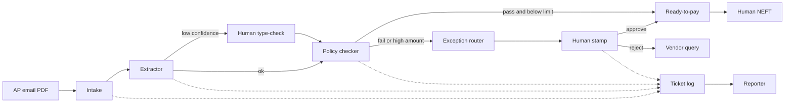

# Designing a Multi-Agent System for Business

## Introduction

In the **previous** session you set **governance** for agent fleets: **privacy**, **bias** and **safety**, **human oversight**, **policies**, **audit trails**, and **cost control**. Those rules answer *who may run an agent, on which data, and at what spend*.

This session turns those rules into a **design you can take into the capstone**. You will map one real business problem onto a **multi-agent workflow** with **roles**, **handoffs**, **tools**, **data sources**, **human approval gates**, **risks**, and **success metrics**.

**Running story:** **Ananya** maps a retail **Accounts Payable** desk the same way she mapped campus ops. **Nimbus Retail** is a 40-store Indian chain buried in vendor invoices — clean bills sit with wrong GST, missing POs, and amounts above a clerk’s limit. Leadership wants speed without losing control of money.

**What you will learn:**

- Map a business problem to a multi-agent workflow with explicit **roles**, **tasks**, and **handoff points**
- Specify **data sources**, **tools**, and **human approval gates** for a trustworthy solution
- Produce a **workflow diagram** and a **narrative** that both engineers and business heads can follow
- Identify **risks**, **limitations**, and **evaluation metrics** before anyone writes production code


---

## Why Design Comes Before Code

You already know how to *build* agents, *deploy* them, *monitor* them, and *govern* them. Ananya now applies that campus-ops discipline to Nimbus. Capstone work fails when teams jump to tools (CrewAI, n8n, LangChain) before they can explain the **business flow** on a whiteboard.

- **Official Definition:** A **multi-agent business design** is a documented plan that names the problem, the specialist agents, the packets they pass, the systems they touch, the human stops, and the measures of success.
- **In Simple Words:** Before you hire a team of clerks, you draw who sits where, what each person reads, when the manager stamps, and how you know the desk is working.
- **Real-Life Example:** Opening a **passport seva** counter without a token system, document checklist, and supervisor desk creates queues and wrong passports. Agents without a design do the same with money and HR data.

**Common doubt:** “Is this only for large companies?” No. A campus club reimbursing event bills has the same pattern: collect proof, check policy, get a faculty stamp, pay. Scale changes volume, not the need for a map.

---

## The Six-Box Design Canvas

Use the same six boxes for finance, HR, or content. If a box is empty, the design is not capstone-ready.

| Box | Question it answers | Nimbus example |
|---|---|---|
| **1. Problem** | What pain, for whom, if we do nothing? | Invoices wait 9 days; vendors chase stores |
| **2. Roles** | Which specialist agents exist, and what is *not* their job? | Intake vs extract vs policy vs report |
| **3. Handoffs** | What packet moves, in what format, at which point? | JSON slip: vendor, GSTIN, amount, confidence |
| **4. Tools and data** | Where does truth live, and what may an agent call? | Email, ERP, GST lookup, policy PDFs |
| **5. Human gates** | When must a person decide — and when must they not? | Amount ≥ ₹50,000 or GST mismatch |
| **6. Risks and metrics** | What can go wrong, and how will we prove it is better? | Wrong GST vs cycle time and first-pass rate |

- **Official Definition:** A **design canvas** is a one-page contract between builders and stakeholders. It is not a prompt dump and not a tool list.
- **In Simple Words:** Six labelled boxes stop the meeting from becoming “let us just add another agent.”
- **Real-Life Example:** A wedding planner’s sheet (guest count, hall, catering, backup rain plan, budget) is a canvas. Missing “backup rain plan” is how a lawn wedding fails in July.

Keep this canvas nearby. Every later heading fills one box.

---

## Choosing a Business Problem Worth Splitting

Not every task needs many agents. Split work when **roles differ**, **data sources differ**, or **a human must stop a high-impact step**.

| Fit test | Prefer **single-agent** | Prefer **multi-agent** |
|---|---|---|
| Steps | One skill, one source | Several skills and systems |
| Failure cost | Easy to undo (draft email) | Hard to undo (wrong payment, biased hire) |
| Oversight | Optional review | Mandatory stamp on some paths |
| Change | One prompt tweak | Policy, extract, and report change separately |

**Three course-ready scenarios** (you will design **one** in depth and compare the other two):

| Scenario | Business pain | Why multiple agents |
|---|---|---|
| **Finance — invoice exception desk** | Slow, error-prone vendor bills | Extract ≠ policy ≠ payment authority |
| **HR — onboarding packet** | New joiner waits for laptop, ID, policy ack | IT, HRIS, and compliance are different desks |
| **Content — campaign pack** | Marketing publishes unreviewed claims | Research, draft, brand, and legal are different hats |

Nimbus Retail is the **worked example**. HR and content reuse the same six boxes later so your capstone can pick any of the three without inventing a new method.

### Activity — Apply the Fit Test

A neighbourhood kirana wants a bot that answers “Are you open on Sunday?” from a Google review. Should this be multi-agent? Write **one sentence**.

**Suggested answer:** No — one FAQ source, low failure cost, no payment or hire decision. A single agent with a shop-hours doc is enough.

---

## Mapping Nimbus Retail: Problem, Scope, Success Picture

Write the problem so a **CFO** and an **engineer** both nod.

**Problem statement (copy this style):**

> Nimbus Retail’s Accounts Payable team takes **9 days** on average to clear a vendor invoice, and about **30%** of bills need a human because GST, PO, or amount looks wrong. Vendors call store managers. The CFO wants **faster clearing** without paying a wrong GSTIN or skipping a high-value stamp.

**Scope (what is in / out):**

- **In:** Email PDF invoices, GSTIN check, PO match, exception routing, weekly summary
- **Out:** Actually releasing NEFT from the bank (finance still clicks pay after the desk recommends)
- **Why out matters:** Agents that *move money* without a human gate fail the governance you just learned

- **Official Definition:** **Scope** is the boundary of work the system is allowed to complete. Everything outside scope is a **handoff to a human or another system**, not “the agent will figure it out.”
- **In Simple Words:** The desk prepares the file. The cashier still signs the cheque.
- **Real-Life Example:** A hospital lab *reports* a blood test. The doctor *prescribes*. Mixing those jobs is unsafe.

**Success picture (not yet numbers):** A clean invoice reaches “ready to pay” the same day. A dirty invoice reaches a named human with a reason, not a silent drop.

---

## Agent Roles: Who Owns Which Task

Roles fail when two agents share the same job, or one agent wears every hat.

- **Official Definition:** An **agent role** is a named specialist with a **goal**, a **task**, allowed **tools**, and a clear **non-goal** (what it must not do).
- **In Simple Words:** The extractor reads the bill. The policy agent does not rewrite the bill. The reporter does not approve payment.
- **Real-Life Example:** At a **bank branch**, the cashier, the KYC desk, and the branch manager are not the same person — on purpose.

| Agent | Goal | Main task | Must not |
|---|---|---|---|
| **Intake** | Create one ticket per invoice | Pull PDF from AP email, assign `INV-id` | Judge GST or pay |
| **Extractor** | Structured fields from the bill | Vendor, GSTIN, amount, PO, date, line items | Change policy rules |
| **Policy checker** | Compare fields to rules and ERP | GST format, PO match, duplicate bill | Invent a missing PO |
| **Exception router** | Send dirty cases to the right human | Queue + reason + evidence pack | Quietly “fix” GST |
| **Reporter** | Weekly picture for the CFO | Counts, cycle time, cost, open exceptions | Approve invoices |

**Why five, not two?** Intake and extract fail for different reasons (empty mailbox vs unreadable scan). Policy and routing fail for different reasons (rule miss vs wrong Slack channel). Splitting makes **debugging** and **governance** possible.

**Common mistake:** One “Invoice GPT” that extracts, judges, and emails the vendor. When GST is wrong, you cannot tell whether the PDF was misread or the rule was skipped.


### Activity — Name the Missing Role

A student design has only Extractor and Reporter. Invoices with GST mismatch go straight to “ready to pay.” Which two roles are missing, and what goes wrong?

**Suggested answer:** **Policy checker** and **exception router** (plus a **human gate**). Without them, bad GST becomes a payment recommendation.

---

## Handoffs: The Packet Between Desks

A role without a **handoff contract** is a hallway conversation — details get lost.

- **Official Definition:** A **handoff** is the moment one agent’s **output** becomes the next agent’s **input**, at a named **handoff point**, using an agreed **schema** (usually JSON).
- **In Simple Words:** The next clerk should not re-read the whole PDF if the previous clerk already filled the form — unless confidence is low.
- **Real-Life Example:** A **pathology lab** sends a structured report (patient id, test, value, range), not a WhatsApp voice note, to the doctor.

**Handoff points on the Nimbus line:**

1. Intake → Extractor: `ticket_id`, PDF path, received time
2. Extractor → Policy: structured fields + **confidence** + source page
3. Policy → Router **or** Ready-queue: `pass` / `fail` + rule ids
4. Router → Human: evidence pack + suggested owner (AP lead vs tax)
5. Human → Ready-queue or Reject: stamp, comment, timestamp
6. Reporter reads logs only — it does not sit on the payment path

**Minimum JSON packet (learn this shape):**

```json
{
  "ticket_id": "INV-1042",
  "vendor": "Kaveri Packaging Pvt Ltd",
  "gstin": "29AAAAA0000A1Z5",
  "amount_inr": 18600,
  "po_number": "PO-7781",
  "confidence": 0.91,
  "status": "needs_policy",
  "reasons": []
}
```

**Why `confidence` exists:** If extract confidence is below **0.80**, skip auto-policy and send a human a “please type the GSTIN from page 1” task. Guessing a GSTIN is how you pay the wrong vendor.

**Common doubt:** “Can agents chat in free English?” They can *inside* a step. Across steps, use JSON so logs, audits, and tests stay possible — the same discipline as governance audit trails.

---

## Tools and Data Map

Agents are only as trustworthy as the **systems they are allowed to touch**.

- **Official Definition:** A **tool and data map** lists every **source of truth**, every **tool** (API, search, send), who may call it, and whether the call is **read** or **write**.
- **In Simple Words:** A pantry list plus a rule: who may open the fridge, who may throw food away.
- **Real-Life Example:** A hospital EMR is readable by many roles; only a doctor **writes** a prescription. Your invoice desk should treat **payment** the same way.

| System | What it holds | Agent access | Read / write |
|---|---|---|---|
| **AP mailbox** | Vendor PDFs | Intake | Read (+ move to processed) |
| **Policy PDF / wiki** | GST, PO, duplicate rules | Policy (RAG) | Read |
| **ERP / Tally** | Vendors, POs, paid bills | Policy | Read |
| **GST lookup** | GSTIN status | Policy | Read |
| **Ticket log** | Status history | All (append-only) | Write log |
| **Slack / email** | Human alerts | Router | Write message |
| **Bank / NEFT** | Actual payment | **None** | Human only |

**Need:** If Policy cannot *read* ERP, it will approve a bill for a cancelled PO. If Router cannot *write* Slack, exceptions die in a log nobody opens.

**Data you must not dump into prompts:** full vendor PAN, employee salary (HR scenario), unpublished campaign customer lists (content scenario). Pass **ids** and **need-to-know fields**. That is privacy from the previous session, applied as a design rule.


---

## Human Approval Gates

A **human-in-the-loop** is not “a manager looks at everything.” That recreates the 9-day queue.

- **Official Definition:** A **human approval gate** is a **required stop** when a rule fires (amount, risk, low confidence, policy fail). Below the threshold, the workflow may continue without a person.
- **In Simple Words:** The manager stamps big or weird bills. Clean small bills should not wait in the same line.
- **Real-Life Example:** UPI lets you pay ₹200 without a second PIN dance; a ₹2 lakh bank transfer asks for extra confirmation. Same idea, different threshold.

**Nimbus gate rules (write them as policy, not as a vibe):**

| Condition | Gate | Owner | If ignored |
|---|---|---|---|
| Amount ≥ **₹50,000** | Must stamp | AP lead | Large wrong pay |
| GSTIN mismatch or inactive | Must stamp | Tax desk | GST notice |
| Extract confidence < **0.80** | Must type-check | AP clerk | Wrong vendor |
| Duplicate invoice id | Must stamp | AP lead | Double pay |
| Else, PO matches, GST ok | **No gate** | — | Speed |

**Need:** Gates without owners become orphan Slack messages. Name the **role**, the **SLA** (for example 4 business hours), and the **fallback** (escalate to finance head).

### Activity — Set One Threshold

Your college fest committee reimburses student bills. Propose **one** rupee threshold for faculty stamp, and **one** condition that always needs a stamp even below that amount.

**Suggested direction:** Stamp above ₹5,000; always stamp if the vendor GSTIN is missing, even for ₹800.

---

## Workflow Diagram and Stakeholder Narrative

A diagram without a story confuses business heads. A story without a diagram confuses engineers. Produce **both**.

```text
Email PDF
  → Intake (ticket)
  → Extractor (JSON + confidence)
  → if confidence low → Human type-check
  → Policy (ERP + GST + rules)
  → if fail or amount high → Exception router → Human stamp
  → Ready-to-pay queue (human pays)
  → Reporter (weekly counts from logs)
```



**Narrative for a non-technical stakeholder (CFO):**

- Every vendor bill becomes a ticket; one specialist reads the numbers; another checks GST and the purchase order.
- Small clean bills reach the pay queue the same day; big or broken bills stop for a named person with a reason.
- No chatbot sends money. Every week you get counts, not surprises.

**Narrative for a technical stakeholder:**

- Sequential pipeline with two **conditional** human gates, a JSON schema between agents, and read-only ERP/GST tools.
- Append-only audit log; payment is out of scope.
- Reporter is a batch job on logs, not a chatty extra agent on the hot path.

- **Official Definition:** A **stakeholder narrative** is the same workflow told at the right altitude — outcomes and controls for business, schemas and branches for engineering.
- **In Simple Words:** Same railway line; station names for passengers, signal diagrams for the control room.
- **Real-Life Example:** IRCTC’s passenger view is “PNR and seat.” The ops view is waitlists, RAC, and charting. Both must match.

**Common mistake:** A 40-box diagram with framework logos (CrewAI, n8n) and no GST gate. Stakeholders cannot approve logos. They can approve *when a human must stop the train*.

---

## A Runnable Design Spec (Not a Payment App)

A diagram is easier to trust when you can also run a tiny version of the same rules. The script below uses fake invoices so you can see **roles**, **handoffs**, and **gates** without an API key or ERP.

Production would replace each function with a real agent and a real tool call.

```python
# nimbus_invoice_desk.py — run: python nimbus_invoice_desk.py
from dataclasses import dataclass  # structured packet for each handoff


@dataclass  # turns the class below into a simple data record
class Packet:  # one invoice ticket moving along the desk
    ticket_id: str  # unique id from intake
    vendor: str  # name printed on the bill
    gstin: str  # GST number extracted from the PDF
    amount_inr: int  # taxable value in rupees
    po_number: str  # purchase order claimed on the bill
    confidence: float  # extractor's self-score 0 to 1
    status: str  # current desk status
    reasons: list  # why a gate fired, if any


ERP_POS = {"PO-7781", "PO-8802"}  # purchase orders that exist in ERP
VALID_GST = {"29AAAAA0000A1Z5"}  # dummy GSTIN treated as active (not a real firm)
LIMIT = 50000  # rupee threshold for mandatory AP-lead stamp
MIN_CONF = 0.80  # below this, a human must type-check fields


def intake(raw: dict) -> Packet:  # role 1: create a ticket, do not judge
    return Packet(**raw, status="needs_extract", reasons=[])  # packet starts empty of reasons


def extract(p: Packet) -> Packet:  # role 2: fields already filled in this mock
    p.status = "needs_policy" if p.confidence >= MIN_CONF else "needs_typecheck"  # branch on confidence
    if p.status == "needs_typecheck":  # low-confidence path
        p.reasons.append("low_confidence")  # tell the human why
    return p  # handoff to policy or human


def policy(p: Packet) -> Packet:  # role 3: compare fields to rules and ERP
    if p.gstin not in VALID_GST:  # GST must be known-active
        p.reasons.append("gst_mismatch")  # do not invent a correction
    if p.po_number not in ERP_POS:  # PO must exist
        p.reasons.append("po_missing")  # missing PO is an exception
    if p.amount_inr >= LIMIT:  # high-value always stops
        p.reasons.append("amount_gate")  # even if GST and PO look fine
    p.status = "ready_to_pay" if not p.reasons else "needs_human"  # pass vs gate
    return p  # handoff to queue or router


def route(p: Packet) -> str:  # role 4: pick the human owner from reasons
    if "gst_mismatch" in p.reasons:  # tax problem
        return "tax_desk"  # GST owner
    if "amount_gate" in p.reasons:  # money problem
        return "ap_lead"  # amount owner
    return "ap_clerk"  # default owner


def human_stamp(p: Packet, approve: bool) -> Packet:  # named human, not an LLM agent
    p.status = "ready_to_pay" if approve else "rejected"  # stamp or send back
    p.reasons.append("human_approved" if approve else "human_rejected")  # audit line
    return p  # payment still happens outside this script


def reporter(packets: list) -> dict:  # role 5: counts only, never pays
    return {  # weekly-style snapshot
        "total": len(packets),  # how many tickets
        "ready": sum(x.status == "ready_to_pay" for x in packets),  # clean plus stamped
        "rejected": sum(x.status == "rejected" for x in packets),  # stopped after a gate
    }


if __name__ == "__main__":  # demo two invoices: clean small vs dirty high-value
    clean_raw = {"ticket_id": "INV-1", "vendor": "Kaveri", "gstin": "29AAAAA0000A1Z5", "amount_inr": 18600, "po_number": "PO-7781", "confidence": 0.91}  # happy path
    dirty_raw = {"ticket_id": "INV-2", "vendor": "Unknown", "gstin": "99INVALID", "amount_inr": 90000, "po_number": "PO-0000", "confidence": 0.60}  # fail path
    out = []  # collect for reporter
    for raw in (clean_raw, dirty_raw):  # sequential pipeline
        p = extract(intake(raw))  # roles 1 then 2
        if p.status == "needs_typecheck":  # gate A: clerk retypes fields from the PDF
            p.confidence = 0.85  # mock: numbers are now readable
            p.reasons = [r for r in p.reasons if r != "low_confidence"]  # type-check done
        p = policy(p)  # role 3
        if p.status == "needs_human":  # gate B
            print(p.ticket_id, "routed_to", route(p))  # role 4 chooses the desk
            p = human_stamp(p, approve=False)  # tax/AP rejects the dirty bill
        out.append(p)  # log
        print(p.ticket_id, p.status, p.reasons)  # visible handoff result
    print("report", reporter(out))  # CFO snapshot
```

**How the code works**

- `Packet` is the **handoff schema** — the same idea as the JSON slip.
- `intake` → `extract` → `policy` is the **sequential** line; `route` only runs when a gate fires.
- `VALID_GST` and `ERP_POS` stand in for **read-only tools**. In production these are API calls, not Python sets.
- `human_stamp` is a **role**, not an LLM. `reporter` reads outcomes and cannot trigger NEFT.
- Duplicate-bill checks belong in Policy against ERP; they are omitted here so the mock stays short.

Run it. You should see **INV-1** as `ready_to_pay` with empty reasons, and **INV-2** routed to `tax_desk` then `rejected` with GST, PO, and amount reasons.

---

## Risks, Limitations, and Evaluation Metrics

Design is unfinished until you can say **how it fails** and **how you will measure** it.

- **Official Definition:** A **risk** is a plausible harm (money, privacy, fairness, downtime). A **limitation** is something the design **cannot** honestly claim. A **success metric** is a number you can collect from logs without arguing.
- **In Simple Words:** Risks are the accidents. Limitations are the speed breakers you accept. Metrics are the scoreboard.
- **Real-Life Example:** A local train can be *fast* or *stop at every station*. You pick metrics (on-time %, overcrowding) instead of saying “the train is good.”


### Risks for the Nimbus desk

| Risk | How it shows up | Control already in the design |
|---|---|---|
| **Wrong GSTIN / vendor** | Pay a lookalike GSTIN | Confidence gate + GST lookup + human on mismatch |
| **Double pay** | Same bill, two tickets | Duplicate check vs ERP paid list |
| **Privacy leak** | Full PAN in Slack | Log ids; alert with ticket link, not the PDF |
| **Silent skip of stamp** | High amount auto-queued | Amount gate cannot be overridden by Policy |
| **Cost blow-up** | LLM on every page of every PDF | Cache identical hashes; cheaper model for extract |
| **Bias (HR twin)** | Certain colleges ranked down | Not on this finance path — still list it if you pick HR |

### Honest limitations

- The desk **does not pay**. If NEFT is in your capstone demo, keep it a **simulated** pay button with an audit line.
- Extract will fail on **stamps covering numbers** and **Hindi-English mixed scans**. Plan a type-check path, not 100% automation.
- GST lookup can be **down**. Policy must **fail closed** (send to human), not “assume valid.”

### Success metrics (start here)

| Metric | Definition | Target (example) | How you log it |
|---|---|---|---|
| **Cycle time** | Email received → ready-to-pay or reject | Median < **2 days** (from 9) | Ticket timestamps |
| **First-pass rate** | Share that never hit a human gate | **60–70%** if mail is clean | Gate flags |
| **Gate precision** | Humans agree the stop was needed | **> 85%** | Stamp reason vs clerk feedback |
| **Missed-gate rate** | High-amount or GST-fail that skipped stamp | **0** | Audit query |
| **Cost per invoice** | Model tokens + tools / ticket | Cap vs baseline month | Token counters from ops |
| **Exception SLA** | Time sitting in human queue | **< 4 business hours** | Router timestamp → stamp |

**Common doubt:** “Can accuracy be 100%?” No. Publish **missed-gate rate = 0** as a **safety** metric, and **first-pass** as a **speed** metric. Mixing them makes teams hide exceptions.

### Activity — Write Two Metrics

For an **HR onboarding** multi-agent flow (offer letter → laptop → ID card), write **one speed metric** and **one safety metric**.

**Suggested answer:** Speed — hours from offer accept to “laptop assigned.” Safety — **zero** accounts created for a candidate whose ID check failed.

---

## Same Canvas: HR and Content (So You Can Switch)

Capstone teams often pick HR or marketing. Do not change method. Change the **contents of the six boxes**.

| Canvas box | HR onboarding | Content campaign pack |
|---|---|---|
| Problem | Joiner waits 10 days for access | Brand publishes unreviewed claims |
| Roles | Docs intake, eligibility, IT provision, compliance, reporter | Research, writer, brand, legal, publisher |
| Handoffs | Candidate id, role, device request JSON | Brief → draft → claims list → approval packet |
| Tools / data | HRIS, IT ticket, policy PDF | CMS, brand guide, source URLs |
| Human gates | Background fail; salary fields; admin access | Legal claims; celebrity/IP; medical claims |
| Metrics | Time-to-productive; **zero** access if ID fail | Cycle time; **zero** unapproved publish |

**Need:** Finance taught you **money gates**; HR adds **fairness and privacy**; content adds **brand and legal**. Your capstone should name which of those three harm types is in play.

---

## Capstone-Ready Checklist

Before you pick a framework in the **upcoming** capstone work, your one-pager should answer yes to all of these:

- Problem is one sentence plus **in/out scope**
- Every agent has a **non-goal**
- Every arrow has a **JSON field list**
- Every tool is **read or write** with an owner
- Every high-impact path has a **named human** and SLA
- Risks include **privacy** and **cost**, not only “model might hallucinate”
- Metrics include at least one **safety** number that must stay at zero

If a teammate only has a CrewAI screenshot, they are not designed yet. If they have this canvas, they can implement in any tool.

---

## Key Takeaways

- A business multi-agent system is a **six-box design**: problem, roles, handoffs, tools/data, human gates, risks and metrics — not a pile of prompts.
- **Handoffs** need a schema and **confidence**; **tools** need read/write limits; **payment, hiring, and publish** stay behind **named gates**.
- Draw one **diagram** and tell two **narratives** (CFO vs engineer) so both groups can approve the same flow.
- Measure **speed** and **safety** separately; a missed GST or ID gate is not “almost accurate.”
- The Nimbus invoice desk, HR onboarding, and content packs share the canvas — that is what you carry into **upcoming** capstone planning.

---

## Important Commands, Libraries, Terminologies Used

| Term / item | Meaning |
|---|---|
| Multi-agent business design | Documented roles, packets, tools, gates, metrics for one workflow |
| Design canvas | Six boxes: problem, roles, handoffs, tools/data, gates, risks/metrics |
| Role / non-goal | What an agent owns — and what it must not do |
| Handoff / handoff point | Named pass of output → next input |
| JSON packet / schema | Agreed fields (`ticket_id`, `gstin`, `confidence`, `status`) |
| Confidence threshold | Score below which a human type-checks extract |
| Tool and data map | Systems, access, read vs write |
| Source of truth | ERP, HRIS, GST lookup, policy store — not the LLM’s memory |
| Human approval gate | Required stop by rule (amount, mismatch, low confidence) |
| Fail closed | If a tool is down, send to human — do not assume pass |
| Stakeholder narrative | Same flow, business altitude vs technical altitude |
| Cycle time | Start timestamp → ready or reject |
| First-pass rate | Share of tickets with no human gate |
| Missed-gate rate | Safety metric; target **0** for high-impact skips |
| Exception SLA | Time an item may sit with a human |
| Scope | In vs out (Nimbus: recommend pay, do not NEFT) |
| `nimbus_invoice_desk.py` | Runnable mock of roles, gates, reporter |
| `dataclass` / `Packet` | Python stand-in for the handoff schema |
| Capstone-ready | Canvas complete before choosing a framework |
