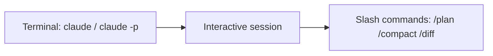

# Claude: Necessary Commands for Engineers, PMs, and Other Roles

## Context of This Session

In **Module 9** you compared hosted agent builders with code-first crews. Those products still live *outside* your repository. **Claude Code** lives *inside* the working tree: it reads files, runs shell commands, and keeps a conversation that can last hours.

This session is the **command map**. You do not need every flag. You need the small set that Engineers, Product Managers, Designers, and Campus Ops actually type every week.

**In this session, you will:**

- Distinguish **CLI launch commands** (`claude`, `claude -p`, `claude -c`) from **in-session slash commands** (`/plan`, `/compact`)
- Pick a **permission mode** instead of blindly skipping safety prompts
- Use a **role-based cheat sheet** — engineer vs PM vs reviewer — without memorising the full command list
- Run a **first-session ritual** that works in any Greenfield (or company) repo

Official reference: [Claude Code CLI](https://code.claude.com/docs/en/cli-reference) and [in-session commands](https://code.claude.com/docs/en/commands).

---

## Two Families of Commands

Connecting sentence: People mix these up and then think “Claude is broken.”

- **Official Definition:** **CLI commands** start or control the Claude Code process from the shell. **Slash commands** are typed *inside* an already-running session and start with `/`.
- **In Simple Words:** The shell key is how you *enter the office*. Slash commands are the *buttons on the desk* once you are inside.
- **Real-Life Example:** Ananya opens a terminal and types `claude`. Meera, already inside the session, types `/plan draft the leave-desk FAQ` — she did not leave the office.



**Common mistake:** Typing `/plan` in zsh. Slash commands only work **inside** Claude Code.

---

## Install, Sign In, Health Check

Connecting sentence: Before the cheat sheet, confirm the binary actually runs.

Typical install paths (pick one your org supports):

```bash
# Native installer — see Anthropic's current install page for your OS
claude --version
claude auth status
claude doctor
```

| Command | Who uses it | Meaning |
| --- | --- | --- |
| `claude --version` | Everyone | Confirm the CLI is on `PATH` |
| `claude auth login` | First-time users | Sign in (subscription or Console API billing with `--console`) |
| `claude auth status` | Everyone | JSON status; exit `0` if logged in |
| `claude doctor` | Engineers / IT | Read-only install and settings diagnostics **without** starting a chat |
| `claude update` | Everyone | Update the CLI |

Inside a session, `/doctor` is the **setup checkup** that can also *apply* fixes after it shows findings. `claude doctor` from the shell stays read-only.

> **[ Student Activity ]**
>
> **Desk check**
>
> Run `claude --version` and `claude auth status`. Write one line: *logged in or not*. Do not paste tokens or emails into notes you will commit.

---

## Launch Commands You Will Actually Use

Connecting sentence: Ninety percent of launches are four patterns.

```bash
cd your-repo
claude                          # interactive session in this folder
claude "explain this project"   # same, with a first message
claude -c                       # continue the most recent chat in this directory
claude -r "auth-refactor" "Finish this PR"   # resume a named / ID session
claude -p "summarise README.md" # print mode: answer, then exit (scripts / CI)
```

| Pattern | Engineer | PM / designer | Why |
| --- | --- | --- | --- |
| `claude` | Daily coding | Exploring a repo, drafting copy from files | Full back-and-forth |
| `claude -c` | After lunch | After a meeting | Same thread, same directory |
| `claude -r …` | Long features | Spec threads you named | Do not lose the named conversation |
| `claude -p "…"` | Scripts, evals, one-shot summaries | “Explain this PR in three bullets” from a pipeline | No TUI |

Pipe logs into print mode:

```bash
cat logs.txt | claude -p "What failed and what should we try next?"
```

**Common mistake:** Using `claude -p` for a multi-hour refactor. Print mode is a **one-shot**. Use interactive `claude` for work that needs plan → edit → test.

### Permission modes at launch

- **Official Definition:** A **permission mode** controls when Claude may run tools (edit files, run bash) without asking you.
- **In Simple Words:** How much of the kitchen Claude may use without calling you over.
- **Real-Life Example:** Meera starts in **plan** so Claude can read the leave policy but cannot rewrite `main.py` until she approves a plan.

```bash
claude --permission-mode plan
claude --permission-mode acceptEdits     # auto-accept edits in the working tree
claude --permission-mode default         # ask on first use of each tool (Manual)
```

| Mode | Typical user | Behaviour (short) |
| --- | --- | --- |
| `default` / `manual` | First week, production repos | Prompt on first use of each tool |
| `plan` | PMs, architects, risky changes | Explore; do not edit source until you leave plan mode |
| `acceptEdits` | Trusted local feature work | File edits in the project are accepted more readily |
| `auto` | Power users who opted in | Classifier-backed auto-approve with extra checks |
| `bypassPermissions` | Isolated VMs / sandboxes only | Skips most prompts — **not** for a shared laptop |

`Shift+Tab` cycles modes in the TUI (`default` → `acceptEdits` → `plan`, plus extras you enabled). Do **not** start with `--dangerously-skip-permissions` on Greenfield student laptops.

---

## In-Session Commands — Shared Core

Connecting sentence: Type `/` and filter. You do not memorise the hundred-row table.

### First hour in a new repo

| Command | Meaning |
| --- | --- |
| `/help` | List commands available **to you** (plan and platform change the list) |
| `/init` | Generate or improve project `CLAUDE.md` |
| `/memory` | Edit memory files; toggle auto-memory |
| `/permissions` | Allow / ask / deny tool rules |
| `/mcp` | Connect Model Context Protocol servers (Jira, Slack, browsers, …) |
| `/status` | Version, model, account, connectivity |

### During the task

| Command | Meaning |
| --- | --- |
| `/plan [task]` | Enter **plan mode**; optional task starts immediately |
| `/model` | Switch Sonnet / Opus / Haiku (and effort, where supported) |
| `/effort` | How hard the model thinks this session |
| `/context` | See what is filling the context window |
| `/compact [focus]` | Summarise history to free space; keep the same conversation |
| `/btw [question]` | Side question that **does not** pollute the main thread |
| `/clear` | New conversation; project memory files still load |

`/compact` is “clean the whiteboard, keep the meeting.” `/clear` is “new meeting, same building rules.”

### Before you ship

| Command | Meaning |
| --- | --- |
| `/diff` | Interactive view of uncommitted and per-turn diffs |
| `/code-review` | Review the current diff (optional `--fix`) |
| `/review [PR]` | Fast read-only review of a GitHub PR |
| `/security-review` | Diff vs default branch for common security issues |
| `/verify` | Build/run the app and **observe** behaviour, not only unit tests |
| `/usage` | Cost / plan usage (`/cost` and `/stats` are aliases) |

### When something goes wrong

| Command | Meaning |
| --- | --- |
| `/rewind` | Roll conversation and/or files back to a checkpoint |
| `/doctor` | Setup checkup; can fix after confirmation |
| `/debug` | Capture and read session debug logs |
| `/feedback` or `/bug` | Report with explicit consent |

---

## Role-Based Cheat Sheets

Connecting sentence: Same CLI. Different jobs. Different **default** commands.

### Software engineer

**Need:** Change code safely, keep context, prove the change.

Daily loop:

1. `claude` in the repo (or `claude -c`).
2. `/plan` for anything that touches more than one package.
3. Implement; `/diff` before commit.
4. `/code-review` then tests; `/verify` if the bug is “it compiles but the screen is wrong.”
5. `/compact` when `/context` looks full — do not wait for a silent quality drop.

Also useful: `/tasks` (background subagents), `/subtask` (forked helper that reports back), `claude -w feature-name` (isolated git **worktree**).

```text
You are in plan mode. Map the files for refund policy RAG, then stop.
Do not edit until I approve the plan.
```

### Product manager

**Need:** Understand the product from the repo, draft specs, review PRs without pretending to be a compiler.

Daily loop:

1. `claude --permission-mode plan` — read-only by default.
2. “Explain how leave requests flow from the form to the sheet. Cite file paths.”
3. `/review 184` on an open PR — ask for **user-visible** risk, not style nits.
4. `/insights` after a week of sessions — where the team actually spends tokens.
5. `/team-onboarding` — pasteable guide for the next PM joining the squad.

**Common doubt:** *“Do I need to know Python?”* — You need to **read** file names and accept/reject plans. You do not need to write the parser.

### Designer / content / Campus Ops

**Need:** Copy, FAQs, screenshots of behaviour, no surprise file writes.

- Start in **plan** mode.
- Point at specific files: “Only use `greenfield_leave_policy.txt`.”
- `/btw` for a wording question so the main spec thread stays clean.
- `/export notes.md` to save the conversation as text for Confluence.

### Tech lead / reviewer

- `/code-review ultra` (cloud, heavier) vs `/review` (fast, single pass).
- `/usage` when a feature branch is burning the team plan.
- `claude --safe-mode` when a broken `CLAUDE.md` or plugin is hijacking every session.

### Data / ML engineer

- `claude -p` for batch summaries of eval traces.
- `/mcp` to attach experiment trackers or warehouse tools **after** `/permissions` is sane.
- Never paste production keys into chat; use `.env` and MCP auth flows.

---

## Keyboard Habits (Interactive Session)

| Shortcut / habit | Meaning |
| --- | --- |
| Type `/` then filter | Discover commands |
| `Shift+Tab` | Cycle permission modes |
| `/compact` vs `/clear` | Same meeting vs new meeting |
| Name sessions (`/rename` or `claude -n`) | You can `/resume` them on Monday |

**Common mistake:** Letting one chat cover “fix auth” **and** “rewrite the homepage.” Split with `/clear` or `/branch` so compaction does not mash two jobs into one blurry summary.

---

## A 15-Minute First-Session Ritual (Any Role)

Connecting sentence: Greenfield’s rule: same ritual, fewer surprises.

1. `cd` into the repo. `claude --permission-mode plan`.
2. `/help` — skim what your plan and install actually expose.
3. Ask: “List the top-level folders and what each is for. Do not edit.”
4. `/init` if there is no `CLAUDE.md` (engineers); PMs skip if the team already has one.
5. One real question in-domain (policy, README, or ticket).
6. `/compact keep the file map and the unanswered questions`.
7. `/clear` before the next unrelated ticket.

> **[ Student Activity ]**
>
> **Role card**
>
> Pick **engineer** or **PM**. Write the five commands you would use on day one in *this* notes repo. Then swap cards with a neighbour and strike any command that would **write files** without a plan.

---

## Key Takeaways

- **CLI commands** start the process; **slash commands** steer a live session. Mixing them is the most common beginner error.
- Engineers live in `/plan` → edit → `/diff` → `/code-review`. PMs live in **plan mode**, `/review`, and “cite the file.”
- `/compact` saves the meeting. `/clear` starts a new one. `/rewind` undoes a bad turn.
- Permission mode is a **product decision**, not a speed hack. Plan mode is the default for anyone who should not commit code by accident.
- You will not memorise every command. You **will** memorise `/help`, `/plan`, `/context`, `/compact`, and `/usage`.

**Upcoming:** Topic 51 — how Claude **remembers** a project (`CLAUDE.md`, auto memory) and the **folder layout** a team should commit.

---

## Quick Reference — Important Commands and Terminologies

| Term / command | Type | Meaning |
| --- | --- | --- |
| `claude` | CLI | Start interactive session in cwd |
| `claude -p` | CLI | One-shot print mode, then exit |
| `claude -c` / `--continue` | CLI | Continue last session in this directory |
| `claude -r` / `--resume` | CLI | Resume by ID or name |
| `claude doctor` | CLI | Read-only diagnostics |
| `claude auth login` | CLI | Sign in |
| `--permission-mode` | Flag | `default`, `plan`, `acceptEdits`, `auto`, … |
| `/help` | Slash | List available commands |
| `/init` | Slash | Create / improve `CLAUDE.md` |
| `/memory` | Slash | Memory files + auto-memory toggle |
| `/plan` | Slash | Read-first planning mode |
| `/compact` | Slash | Summarise to free context |
| `/clear` | Slash | New conversation |
| `/context` | Slash | What fills the window |
| `/diff` | Slash | Review local changes |
| `/code-review` | Slash / skill | Review current diff |
| `/review` | Slash | Fast GitHub PR review |
| `/permissions` | Slash | Tool allow / deny |
| `/usage` | Slash | Cost and limits |
| `/rewind` | Slash | Checkpoint undo |
| **Print mode** | Concept | Non-interactive `-p` run |
| **Plan mode** | Concept | Explore without editing source |
| **Slash command** | Concept | `/` command inside the session |
