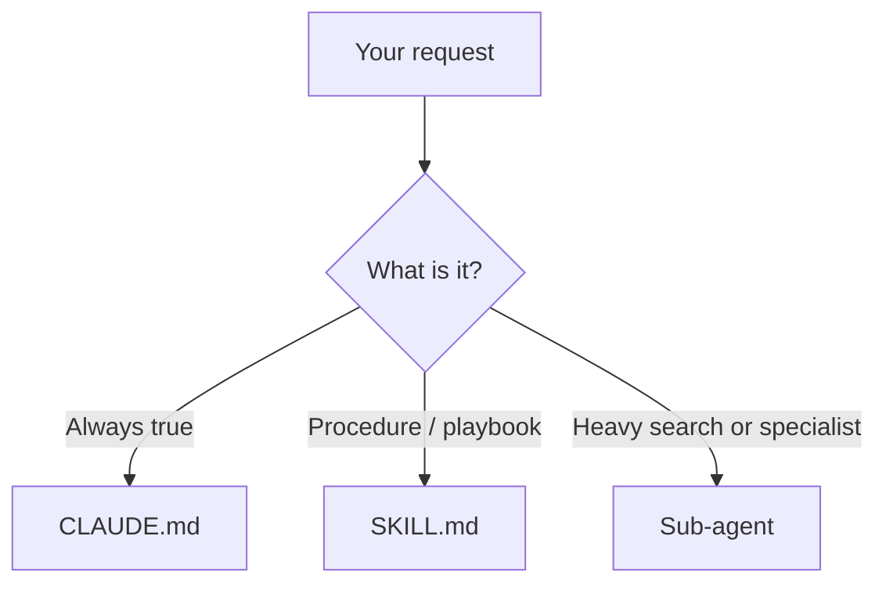

# Claude Code: SKILL.md, Commands, Managed Agents, and Sub-agents

## Context of This Session

In the **previous** session you put **facts** in `CLAUDE.md` and left **procedures** out of it on purpose. Today those procedures become **skills**. Custom **slash commands** are the same family. Then you split work across **sub-agents**, and you meet two different meanings of **managed agents**: org-deployed Claude Code agents, and Anthropic’s hosted **Managed Agents** API.

**In this session, you will:**

- Author a `SKILL.md` with YAML frontmatter and a body that loads **only when used**
- See how `.claude/commands/` still maps to `/name` after the merge into skills
- Delegate to **built-in and custom sub-agents** without flooding the main context window
- Contrast **managed sub-agents** (IT) with **Claude Managed Agents** (hosted sandbox + API)
- Choose **CLAUDE.md vs skill vs sub-agent** for a Greenfield task

---

## The Decision Table (Put This on a Sticky Note)

Connecting sentence: Four drawers. One item per drawer.

| Put it here | When | Why |
| --- | --- | --- |
| **CLAUDE.md / rules** | Always-true facts, build commands, “never do X” | Loaded every session — keep short |
| **Skill (`SKILL.md`)** | Repeatable procedure or domain pack | Body loads on demand; can be `/name` |
| **Slash command file** | Same as a skill for `/name` | `.claude/commands/foo.md` still works |
| **Sub-agent** | Research or a specialist that would dump noise into the main chat | Own context window; returns a summary |

- **Official Definition:** A **skill** is a directory (or command markdown file) that teaches Claude a capability. A **sub-agent** is a nested assistant with its own context, tools, and prompt.
- **In Simple Words:** A skill is a **recipe card**. A sub-agent is a **specialist you send to the archive room**.
- **Real-Life Example:** “How we format lecture notes” is a skill. “Search all 49 topic READMEs for RAG eval mentions and return a table” is an **Explore** sub-agent job.



---

## Skills and SKILL.md

Connecting sentence: If you keep pasting the same checklist, you are already writing a skill — badly, in chat.

### Where skills live

| Location | Path | Who gets it |
| --- | --- | --- |
| Enterprise / managed | Org managed-settings skills dir | Whole company |
| Personal | `~/.claude/skills/<name>/SKILL.md` | All your projects |
| Project | `.claude/skills/<name>/SKILL.md` | This repo (commit it) |
| Plugin | Plugin `skills/` | Where the plugin is on |
| Nested package | `packages/web/.claude/skills/` | Loads when Claude works in that tree |

**Precedence (same name):** enterprise beats personal beats project. A skill beats a `.claude/commands/` file with the same name. Plugin skills are namespaced (`/plugin:skill`). Nested skills can appear as `apps/web:deploy`.

The folder name **`synced`** is reserved (claude.ai sync).

### Anatomy

```text
.claude/skills/summarize-changes/
├── SKILL.md          # required
├── template.md       # optional
├── examples/
└── scripts/
    └── validate.sh
```

`SKILL.md` = YAML frontmatter + markdown body.

```markdown
---
name: summarize-changes
description: Summarizes uncommitted changes and flags risky diffs. Use when the user asks what changed, wants a commit message, or reviews a local diff.
---

## Current changes

!`git diff HEAD`

## Instructions

Summarize in two or three bullets, then list risks (missing tests, hardcoded secrets, huge files).
If the diff is empty, say so.
```

| Frontmatter idea | Meaning |
| --- | --- |
| `description` | **Gate** — Claude uses this to auto-load. Write *when* as well as *what*. |
| `disable-model-invocation: true` | Only you run it with `/name` — Claude will not auto-trigger |
| `context: fork` | Run the skill in an isolated sub-agent; skill body becomes that agent’s prompt |
| Dynamic `!`cmd`` | Claude Code **runs the command** and inlines output before Claude sees the skill |

**Description quality** is the whole product. Vague descriptions → skill never fires, or fires on grocery lists.

Invoke:

- Automatically: “What did I change?”
- Manually: `/summarize-changes`
- List: `/skills` (filter, token counts, visibility)

**Live reload:** edits under `~/.claude/skills/` and project `.claude/skills/` are picked up in-session. A **brand-new** top-level skills directory may need a restart.

**Bundled skills** (examples): `/doctor`, `/code-review`, `/debug`, `/batch`, `/verify`, `/claude-api`. Disable with `disableBundledSkills` (except `/doctor` stays available unless you hide it separately).

> **[ Student Activity ]**
>
> **Description gate**
>
> Write a `description:` for a skill that formats a Greenfield student activity block. Include two trigger phrases and one **negative** (“Do not use for Python debugging”).

---

## Commands — The Merge You Need to Know

Connecting sentence: Old blog posts say “custom slash commands.” They still work. Skills are the superset.

- `.claude/commands/deploy.md` → `/deploy`
- `.claude/skills/deploy/SKILL.md` → also `/deploy`
- If **both** exist, the **skill wins**

Command files support most of the same frontmatter; `name` and `paths` are ignored on command files (the **filename** is the `/` name). Prefer skills when you need extra files, scripts, or auto-invocation.

`/claude-api` is a bundled skill: API reference plus `/claude-api managed-agents-onboard` for hosted agents (below).

---

## Sub-agents

Connecting sentence: The main chat is a small table. Do not dump the entire library onto it.

- **Official Definition:** A **sub-agent** is a nested Claude Code agent with its own context window, system prompt, tool allow-list, and optional memory.
- **In Simple Words:** You stay in the meeting. Someone else reads the 200-page appendix and brings back a one-pager.
- **Real-Life Example:** In **plan mode**, Claude often sends **Explore** or **Plan** to scan the repo so your main thread stays read-only and short.

### Built-ins you will see

| Agent | Role | Tools (typical) |
| --- | --- | --- |
| **Explore** | Search / explain the codebase | Read-only (no Write/Edit) |
| **Plan** | Research while you are in plan mode | Read-only |
| **general-purpose** | Multi-step work that needs edits | Broader tool set |
| **claude-code-guide** | Questions about Claude Code itself | Haiku-class helper |

Explore and Plan **skip** your `CLAUDE.md` and git status on purpose (cheaper, smaller). Other sub-agents usually **load** them.

As of recent CLI versions, `/agents` **does not** open a wizard — you **ask Claude** to write the file or you edit `.claude/agents/` yourself.

### Custom sub-agent file

Project: `.claude/agents/code-improver.md`  
Personal: `~/.claude/agents/code-improver.md`

```markdown
---
name: code-improver
description: Suggests readability and performance improvements. Use after writing or modifying code.
tools: Read, Grep, Glob
model: sonnet
---

You are a code improvement specialist. For each issue, explain it, show current code, and show a better version. Do not edit files.
```

Ask: “Use the code-improver agent on `Coding-Examples/rag_pipeline`.”

### Scope and precedence (same `name`)

| Priority | Location |
| --- | --- |
| 1 highest | **Managed** settings (org) |
| 2 | `--agents` JSON on the CLI (this session only) |
| 3 | `.claude/agents/` (project) |
| 4 | `~/.claude/agents/` (user) |
| 5 | Plugin `agents/` |

```bash
claude --agents '{
  "debugger": {
    "description": "Finds root causes in test failures.",
    "prompt": "You are an expert debugger. Cite files.",
    "tools": ["Read", "Grep", "Glob", "Bash"],
    "model": "sonnet"
  }
}'
```

Useful fields: `tools`, `disallowedTools`, `model`, `permissionMode`, `skills` (preload skill **bodies**), `memory` (`user` | `project` | `local`), `isolation: worktree`, `maxTurns`.

**Preload skills** into a sub-agent:

```yaml
skills:
  - api-conventions
```

That injects those skill files at sub-agent start. Inverse: a skill with `context: fork` **is** the prompt that drives a chosen agent type.

**Sub-agent memory** (if auto memory is on):

| `memory:` | Directory |
| --- | --- |
| `user` | `~/.claude/agent-memory/<name>/` |
| `project` | `.claude/agent-memory/<name>/` (share via git) |
| `local` | `.claude/agent-memory-local/<name>/` (gitignore) |

The **main** conversation’s auto memory is **not** copied into sub-agents (forks are the exception — they inherit the parent thread).

`isolation: worktree` gives the sub-agent a **copy** of the repo so it can edit without trampling your dirty tree.

Keep `description` fields short — they sit in the parent context. A huge roster of sub-agents burns tokens before anyone types.

> **[ Student Activity ]**
>
> **Delegate or don’t**
>
> For each task, pick skill, sub-agent, or main chat only: (1) “Rename the leftover Session 36 screenshot captions.” (2) “Find every mention of Chroma across the repo.” (3) “Explain LCEL in one analogy.” Write one sentence of why.

---

## “Managed Agents” — Two Products, Same English Words

Connecting sentence: If a slide says managed agents, ask **which stack**.

### 1) Managed sub-agents in Claude Code (enterprise)

IT deploys markdown agents into the **managed settings** directory (same frontmatter as project agents). **Same name** → org file wins. This is how a bank ships a `security-reviewer` everyone gets, even if a intern writes a weaker one in the repo.

### 2) Claude Managed Agents (API / Console, beta)

- **Official Definition:** **Claude Managed Agents** is a **hosted** agent runtime: you define a reusable **agent** (model, system prompt, tools, skills), an **environment** (sandbox), and then **sessions** that run the loop inside Anthropic’s (or self-hosted) container.
- **In Simple Words:** Claude Code is the intern at *your* desk. Managed Agents is an intern in *Anthropic’s* locked workshop. You send jobs; you do not babysit bash on your laptop.
- **Real-Life Example:** Campus Ops wants a nightly “summarise new GitHub issues” worker. That is a **session** against a versioned **agent ID**, not Ananya leaving `claude` open overnight on a lab Mac.

Mental model (mandatory order):

```text
Create Agent (once)  →  Create Environment (once)  →  Create Session (every run)
```

`model`, `system`, `tools`, `mcp_servers`, and `skills` live on **`POST /v1/agents`**, not on the session. The session points at `agent` + `environment_id`.

In Claude Code, run:

```text
/claude-api managed-agents-onboard
```

That bundled skill interviews you and emits SDK/cURL for your language. Requires the Managed Agents beta (SDKs send `anthropic-beta: managed-agents-2026-04-01` for you). **Not** on Bedrock / Vertex / Foundry — those stay on the Messages API + your own loop.

Skills on Managed Agents: upload `SKILL.md` packs to the Skills API, attach by `skill_id`, **or** mount a GitHub repo and let `.claude/skills/*/SKILL.md` be discovered in the sandbox (needs the `read` tool).

| Lens | Claude Code sub-agent | Claude Managed Agents |
| --- | --- | --- |
| Where it runs | Your machine / worktree | Hosted sandbox (or self-hosted worker) |
| Who starts it | You, or parent Claude | `sessions.create` / Console |
| Best for | Dev inner loop | Productized workers, CI-like agents |
| Config | Markdown in `.claude/agents/` | Versioned agent + environment IDs |

**Common mistake:** Putting `model` on the session in API examples copied from chat completions. Managed Agents will reject that shape.

---

## End-to-End Mini Lab (This Notes Repo)

Connecting sentence: Proof is a file on disk, not a screenshot of `/help`.

1. Create `.claude/skills/lecture-activity/SKILL.md` with a strict student-activity template and `disable-model-invocation: true`.
2. Invoke `/lecture-activity` and ask it to draft one activity for Topic 50.
3. Create `.claude/agents/notes-navigator.md` — read-only, description: use when searching module READMEs.
4. Ask the main session to **delegate** “list every module README title” to `notes-navigator`.
5. Confirm the main transcript stays short (summary only).

Do not commit secrets. Do commit the skill and the navigator agent if the team wants them.

---

## Key Takeaways

- **Skills** are on-demand playbooks; **`description` is the on-switch.**
- **Commands merged into skills**; old `.claude/commands/` files still create `/name`.
- **Sub-agents** protect the main context window. Explore/Plan are the built-in librarians.
- **Managed** in Claude Code means **org-enforced agent files**. **Managed Agents** on the API means **hosted sessions** in a sandbox.
- If it is a fact, it is `CLAUDE.md`. If it is a recipe, it is a skill. If it is a pile of search results, it is a sub-agent.

**Upcoming:** Topic 53 — MCP servers, tool names, and permission modes as a **security** design, not as a convenience toggle.

---

## Quick Reference — Important Commands, Files, and Terminologies

| Term / item | Meaning |
| --- | --- |
| `SKILL.md` | Skill entrypoint (YAML + markdown) |
| `description` | Auto-invocation gate |
| `disable-model-invocation` | Manual `/name` only |
| `context: fork` | Run skill inside a sub-agent |
| `!`command`` | Inline shell output into the skill |
| `.claude/skills/` | Project skills |
| `.claude/commands/` | Legacy `/` command files |
| `/skills` | List / filter skills |
| `/claude-api managed-agents-onboard` | Guided Managed Agents setup |
| `.claude/agents/` | Project sub-agent markdown |
| `~/.claude/agents/` | Personal sub-agents |
| `--agents '{...}'` | Session-only JSON sub-agents |
| Explore / Plan | Built-in read-only sub-agents |
| `memory: project` | Persistent sub-agent notebook in git |
| `isolation: worktree` | Isolated git copy for the sub-agent |
| Managed sub-agent | Org-deployed Claude Code agent |
| Managed Agents API | Hosted agent + environment + session |
| Agent vs Session | Config once vs run every time |
