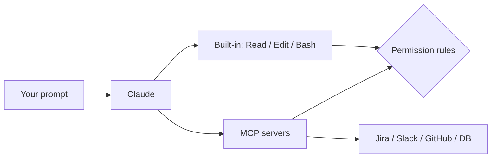

# Claude Code: MCP, Tools, and Permission Modes

## Context of This Session

In the **previous** session you packaged playbooks as **skills** and specialists as **sub-agents**. Those specialists still need **tools**: file edits, bash, and **MCP** servers (Jira, Slack, browsers, internal APIs).

This session treats tools as a **permission design**, not as “turn everything on.”

**In this session, you will:**

- Map built-in tools (`Read`, `Edit`, `Bash`, …) vs **MCP** tools
- Use `/mcp`, `/permissions`, and `--permission-mode`
- Write allow / ask / deny rules that a PM can explain
- Connect a first MCP server without pasting secrets into chat

Official reference: [Permissions](https://code.claude.com/docs/en/permissions), [MCP](https://code.claude.com/docs/en/mcp), [Tools](https://code.claude.com/docs/en/tools-reference.md).

---

## Two Kinds of Tools

Connecting sentence: Claude does not “just know Jira.” Something must expose a named tool.

- **Official Definition:** A **tool** is a named action Claude Code can call (read a file, run a shell command, fetch a URL). **MCP (Model Context Protocol)** is an open standard for plugging **external** tools and data into that same loop as servers.
- **In Simple Words:** Built-in tools are the intern’s own hands. MCP is a **USB port** — Jira is a printer; the browser is a camera.
- **Real-Life Example:** Ananya asks Claude to implement Jira `ENG-4521`. Without MCP she pastes the ticket. With an MCP Jira server, Claude can **read the issue** (and maybe comment) as a tool call.

| Family | Examples | Where the name appears |
| --- | --- | --- |
| Built-in | `Read`, `Edit`, `Write`, `Bash`, `Grep`, `Glob`, `WebFetch`, `Agent`, `Skill` | Permission rules, sub-agent `tools:`, hook matchers |
| MCP | `mcp__github__get_issue`, `mcp__puppeteer__puppeteer_navigate` | Same places, after you connect a server |

Built-in tools are always *there* (unless you deny them). MCP tools appear only when a server is connected and approved.

**Common mistake:** Treating `CLAUDE.md` (“never read `.env`”) as a lock. Markdown is advice. **Deny rules and hooks** are enforcement.



---

## Permission Modes (The Kitchen Key)

Connecting sentence: Topic 50 introduced the modes. Here they are a **security** choice.

Set at launch, with `Shift+Tab` in the TUI, or as `permissions.defaultMode` in settings.

```bash
claude --permission-mode plan
claude --permission-mode acceptEdits
claude --permission-mode default
```

| Mode | Typical user | What happens |
| --- | --- | --- |
| `default` / `manual` | First week, production repos | Prompt on first use of each tool |
| `plan` | PMs, architects, risky changes | Read files and read-only shell; **no source edits** until you leave plan |
| `acceptEdits` | Trusted local feature work | Auto-accepts edits (and common `mkdir` / `mv` / `cp`) **inside** the working tree |
| `auto` | Power users who opted in | Classifier-backed auto-approve with extra checks |
| `dontAsk` | Locked scripts | Auto-**deny** unless the tool is already on `permissions.allow` |
| `bypassPermissions` | Isolated VMs / containers only | Skips most prompts — **not** for a shared laptop |

`bypassPermissions` still prompts for org-forced `ask` tools, MCP tools marked `requiresUserInteraction`, and circuit-breakers like `rm -rf /`. IT can set `permissions.disableBypassPermissionsMode` (and `disableAutoMode`) so students cannot turn those modes on.

**Common mistake:** Starting Greenfield laptops with `--dangerously-skip-permissions`. Use **plan** until the team has deny rules.

---

## Allow / Ask / Deny — Rules a PM Can Read

Connecting sentence: Three lists. One evaluation order. Specificity does **not** beat a deny.

Open the UI with `/permissions`. Rules live in `settings.json` (user, project, local, or **managed**).

- **Allow** — run without asking
- **Ask** — always confirm
- **Deny** — block (a **bare** tool name like `Bash` also **hides** the tool from Claude’s context)

**Order:** deny, then ask, then allow. First match in that order wins.

A broad deny `Bash(aws *)` blocks `aws s3 ls` even if you also allow that exact command. There is no “deny with exceptions” inside one rule.

```json
{
  "permissions": {
    "allow": [
      "Bash(npm run *)",
      "Bash(git diff *)",
      "mcp__github__get_*"
    ],
    "ask": [
      "mcp__github__create_issue"
    ],
    "deny": [
      "Read(./.env)",
      "Read(./.env.*)",
      "Read(./secrets/**)",
      "Bash(curl *)",
      "mcp__github__delete_issue"
    ]
  }
}
```

Syntax is `Tool` or `Tool(specifier)`:

| Rule | Effect |
| --- | --- |
| `Bash` | All bash (as deny: tool disappears from context) |
| `Bash(npm run *)` | Glob on the command |
| `Read(./.env)` | That path |
| `Edit(/src/**)` | Edits under `/src` |
| `WebFetch(domain:example.com)` | Fetches to that host |
| `mcp__puppeteer__*` | All tools on the `puppeteer` server |
| `mcp__*` | Every MCP tool (deny / ask; **not** a valid unrestricted allow glob) |

Allow globs after `mcp__` must name a **specific server** (`mcp__github__get_*`). A bare `"*"` allow is skipped with a warning.

`/fewer-permission-prompts` is a convenience for *you* this session. It is not a substitute for a written deny list the team can review.

> **[ Student Activity ]**
>
> **Explain the rule**
>
> Write one sentence a PM would understand for each: (1) `Read(./.env)` in **deny**, (2) `mcp__jira__create_issue` in **ask**, (3) `Bash(git push *)` in **deny**. Which one is missing if the intern can still `cat .env` via Bash?

---

## Built-in Tools You Will Name in Rules

Connecting sentence: You rarely type these names in chat. You type them in **settings**.

| Tool | Permission? | Use |
| --- | --- | --- |
| `Read`, `Grep`, `Glob` | Usually no (inside the working tree) | Explore |
| `Edit`, `Write`, `NotebookEdit` | Yes | Change files |
| `Bash` / `PowerShell` | Yes (except a small read-only set) | Shell |
| `WebFetch`, `WebSearch` | Yes | Network |
| `Agent` | No | Spawn a sub-agent |
| `Skill` | Yes | Run a skill |

Reads **outside** the project (and `additionalDirectories`) still go through permissions. Deny `Read` on secret globs **and** deny `Bash(cat *)` / `Bash(curl *)` if those are how leaks happen.

---

## MCP: Connect Without Pasting Secrets

Connecting sentence: If you keep copying dashboards into chat, you wanted MCP six weeks ago.

### Scopes

| Scope | Stored in | Shared? |
| --- | --- | --- |
| **local** (default) | `~/.claude.json` for this project path | No |
| **project** | `.mcp.json` at repo root | Yes, via git — **no tokens** |
| **user** | `~/.claude.json` | Your laptop, all projects |
| **managed** | Org policy | IT |

“Local MCP scope” is **not** `.claude/settings.local.json`. It is a server entry in `~/.claude.json`.

### Add a server

Remote HTTP is the usual cloud transport. Stdio is a process on **your** machine.

```bash
# Remote HTTP (example shape — use your org’s real URL)
claude mcp add --transport http notion https://mcp.notion.com/mcp

# Stdio: env goes on Claude’s flags; server argv after --
claude mcp add --env AIRTABLE_API_KEY=YOUR_KEY --transport stdio airtable \
  -- npx -y airtable-mcp-server

claude mcp list
claude mcp get notion
```

Inside a session: `/mcp` (status, auth, enable/disable). `! Needs authentication` means complete OAuth **in that UI**, not by pasting a refresh token into the chat.

**Workspace trust:** a cloned `.mcp.json` stays `⏸ Pending approval` until someone runs `claude` in the folder and accepts the trust dialog. A repo **cannot** auto-approve its own servers via committed `enableAllProjectMcpServers`.

**Prompt injection:** any server that fetches **untrusted** web or ticket text can smuggle instructions. Treat MCP like installing a browser extension — fewer, reviewed servers.

Project `.mcp.json` (placeholders only):

```json
{
  "mcpServers": {
    "github": {
      "type": "http",
      "url": "https://api.githubcopilot.com/mcp/"
    }
  }
}
```

Put secrets in the environment, OS keychain, or `/mcp` OAuth — never in git.

---

## Scripts: `--allowedTools` vs `--tools`

Connecting sentence: Print mode (`claude -p`) still obeys permissions unless you say otherwise.

```bash
claude -p "summarise README.md" \
  --allowedTools "Read" "Bash(git log *)" \
  --disallowedTools "mcp__*"
```

| Flag | Meaning |
| --- | --- |
| `--allowedTools` | Extra **allow** rules for this run |
| `--disallowedTools` | Extra **deny** rules |
| `--tools "Read,Grep"` | Restrict **built-in** tools (MCP is separate; deny with `mcp__*`) |

> **[ Student Activity ]**
>
> **First MCP (safe)**
>
> In this notes repo, run `/mcp` and list connected servers. Add **nothing** that needs a production token. If the classroom has a dummy HTTP server, add it at **local** scope and write the tool names you see. If not, write the `claude mcp add` command you *would* use, with `YOUR_TOKEN` as a placeholder — do not paste a real key.

---

## End-to-End Mini Lab (This Notes Repo)

1. Start `claude --permission-mode plan`.
2. `/permissions` — note which file each rule comes from.
3. Draft a **deny** list for `.env`, `.env.*`, and `secrets/**` (do not commit real secrets).
4. `/mcp` — screenshot-level notes: connected / pending / failed (no tokens).
5. Ask Claude: “Which tools would you use to summarise Topic 50? Do not edit.” Confirm it stays on `Read` / `Grep`.

---

## Key Takeaways

- **Built-in tools** vs **MCP tools** are the same permission language: `Tool` and `mcp__server__tool`.
- **Deny → ask → allow.** Markdown cannot override that.
- **Plan mode** is the default kitchen key for anyone who should not write files by accident.
- **MCP scopes** decide who inherits the server. **Trust** decides whether a cloned `.mcp.json` actually connects.
- Never put OAuth tokens in chat or in committed `.mcp.json`.

**Upcoming:** Topic 54 — **hooks** (what *must* run around a tool) and **plugins** (shipping skills + MCP + hooks as a pack).

---

## Quick Reference — Important Commands, Files, and Terminologies

| Term / item | Meaning |
| --- | --- |
| MCP | Standard for external tool servers |
| `/mcp` | Connect, auth, health of servers |
| `/permissions` | Allow / ask / deny UI |
| `--permission-mode` | `default`, `plan`, `acceptEdits`, `auto`, `dontAsk`, `bypassPermissions` |
| `permissions.allow` / `ask` / `deny` | Rule lists in settings |
| `mcp__server__tool` | MCP tool name in rules |
| `.mcp.json` | Project-scoped servers (commit placeholders) |
| `claude mcp add` | Register a server |
| `--scope local\|project\|user` | Where the server config lives |
| `--allowedTools` | Extra allows for `claude -p` |
| `--disallowedTools` | Extra denials |
| Workspace trust | Gate before project MCP approvals apply |

⬅️ [Back to module](../)
