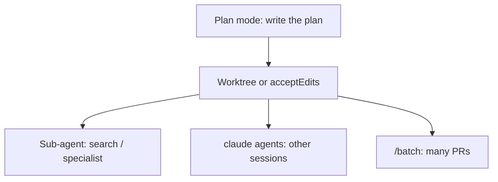

# Claude Code: Plan Mode, Worktrees, and Parallel Agents

## Context of This Session

In the **previous** session one agent shipped one PR. Real work is often **several** streams: plan first, then implement in an isolated **worktree**, then fan out with `/batch` or `claude agents`.

**In this session, you will:**

- Start and stay in **plan mode** until a written plan exists
- Use `claude -w` / `isolation: worktree` so experiments do not trash `main`
- Monitor background sessions with `claude agents`, `/tasks`, `/background`, `/fork`
- Know when `/batch` is worth the extra PRs — and when it is chaos

Official reference: [Plan workflows](https://code.claude.com/docs/en/common-workflows), [Worktrees](https://code.claude.com/docs/en/worktrees), [Parallel agents](https://code.claude.com/docs/en/agents).

---

## Four Ways to “Go Parallel”

Connecting sentence: If two Claudes edit `README.md` in the same folder, you invented a merge conflict factory.

| Style | Who coordinates | Isolation |
| --- | --- | --- |
| **Sub-agents** | Parent Claude, result returns **here** | Same tree unless `isolation: worktree` |
| **Agent view** (`claude agents`) | **You** dispatch sessions and check later | Each dispatched session can get a worktree |
| **`/batch`** | Bundled skill splits a large change | 5–30 worktree sub-agents, often one PR each |
| **Agent teams** | Lead + teammates, shared task list | Experimental; **off** unless you set an env flag |

- **Official Definition:** A **git worktree** is a second checkout of the same repo on its own branch, sharing history with the main clone. **Plan mode** lets Claude read and propose without editing source until you approve.
- **In Simple Words:** Plan mode is the whiteboard. A worktree is a **second desk** with its own papers. Sub-agents are specialists who report back to *this* meeting. Agent view is a **wall of CCTV** for sessions you started and walked away from.
- **Real-Life Example:** Ananya plans the RAG eval refactor on `main`’s dirty tree (read-only), then `claude -w eval-harness` so a second session can edit without touching her uncommitted lecture notes.



---

## Plan Mode Until There Is a Plan

Connecting sentence: Implementation without a file list is how Topic 52’s context window dies.

```bash
claude --permission-mode plan
```

Or inside a session: `/plan [task]`, or `Shift+Tab` until the bar shows plan mode.

Claude may spawn **Explore** / **Plan** sub-agents so the main thread stays small and read-only (Topic 52). You approve with `ExitPlanMode` (a permissioned tool): then switch to `acceptEdits` or stay manual.

**Habit:** if the first implementation turn goes sideways, **re-enter plan** instead of stacking patches.

> **[ Student Activity ]**
>
> **Whiteboard**
>
> In this repo, `/plan` “Add a one-line session goal to Topic 50 only.” Write the files-in-scope list Claude proposes. If it includes `Coding-Examples/`, the plan is too wide — send it back.

---

## Worktrees — A Second Desk

Connecting sentence: Dirty `main` + two features = tears at 6pm.

```bash
claude --worktree feature-auth
# short flag:
claude -w feature-auth
```

Default location: `.claude/worktrees/<name>/` on a branch like `worktree-<name>`. Gitignore `.claude/worktrees/`. First time in a repo: accept **workspace trust** before `-w` (interactive), or it errors.

A worktree is a **fresh checkout**. Reinstall deps there. To copy gitignored files (`.env`) into every new worktree, use `.worktreeinclude` (never commit real secrets; the include file only names paths).

You can also ask: “work in a worktree.” Claude uses `EnterWorktree`. Leaving uses `ExitWorktree`.

**Cleanup:** on exit, clean unnamed worktrees may be removed; named ones with commits/files prompt keep vs delete. `claude -p --worktree` does **not** auto-clean — `git worktree remove` yourself.

Sub-agent frontmatter:

```yaml
isolation: worktree
```

That clone usually branches from the **default** branch, not necessarily your dirty `HEAD`. Good for “try a rewrite”; bad if you needed uncommitted parent files.

---

## `/subtask` vs `/fork` vs `/background`

Connecting sentence: Same English word “fork.” Three products. Check your CLI version (split around v2.1.212).

| Command | What you get |
| --- | --- |
| `/subtask [prompt]` | In-session **sub-agent**; result **returns to this chat** |
| `/fork [prompt]` | **Copy** of this conversation as a **new background session** (agent view). This chat keeps going |
| `/background` (`/bg`) | **This** session detaches; terminal frees; watch with `claude agents` |
| `/branch` | You **switch into** a copy (you leave this thread) |
| `/tasks` | Background work **in this session** (including finished sub-agents) |

`claude agents` = **agent view** (all sessions). `/agents` = sub-agent panel **in this session**. The names rhyme on purpose. Do not mix them up on a quiz.

---

## `/batch` and Cost

Connecting sentence: Thirty PRs is a product decision, not a flex.

`/batch` interviews you, then fans a migration across **worktree-isolated** sub-agents. Each typically tests and opens a PR.

**Use when:** mechanical, file-partitioned work (rename an API across 40 callers).

**Skip when:** one design decision, one shared module, or a student laptop on a metered plan.

Parallel agents **multiply** `/usage`. Sub-agents can hit a per-session cap (default on the order of hundreds; `/clear` resets). Watch `/usage` before `/batch`.

---

## Agent Teams (Optional, Experimental)

Connecting sentence: Mention so you are not surprised by a blog post.

Set `CLAUDE_CODE_EXPERIMENTAL_AGENT_TEAMS=1`. A **lead** plus teammates share a task list and messages. **Disabled by default.** Known rough edges on resume and shutdown. For class, prefer sub-agents + worktrees.

---

## End-to-End Mini Lab (This Notes Repo)

1. `claude --permission-mode plan` — plan a **two-file** notes tweak. Do not implement yet.
2. In another terminal: `claude -w notes-try` (after trust). Implement **only** the plan.
3. From the original session: `/subtask` “list README titles under `10-Claude-Code/`” — confirm a short summary returns here.
4. `/tasks` — see the finished helper.
5. Do **not** run `/batch` on this notes repo in class (it will open a storm of PRs). Write three bullets on when you *would*.

---

## Key Takeaways

- **Plan mode** writes the map. **Worktrees** stop maps from colliding.
- **`/subtask`** reports back. **`/fork`** is another session. **`claude agents`** is the CCTV wall.
- **`/batch`** is for partitioned migrations. It is expensive and noisy.
- Isolation is not free: new checkouts need install, `.env` copy, and `/usage` discipline.

**Upcoming:** Topic 57 — the same CLI for **PMs, designers, and Campus Ops** (plan-first working agreement).

---

## Quick Reference — Important Commands, Files, and Terminologies

| Term / item | Meaning |
| --- | --- |
| Plan mode | Read-first; no source edits until exit |
| `/plan` | Enter plan mode; optional task |
| `Shift+Tab` | Cycle permission modes |
| `claude -w` / `--worktree` | Isolated git checkout session |
| `.claude/worktrees/` | Default worktree parent (gitignore) |
| `.worktreeinclude` | Gitignored files to copy into worktrees |
| `isolation: worktree` | Sub-agent gets its own checkout |
| `/subtask` | Helper whose answer returns here |
| `/fork` | Background **session** copy (current CLI) |
| `/background` | Detach this session |
| `/tasks` | This session’s background jobs |
| `claude agents` | Agent view across sessions |
| `/agents` | Sub-agents in **this** session |
| `/batch` | Many worktree agents + PRs |
| Agent teams | Experimental multi-session crew |

⬅️ [Back to module](../)
